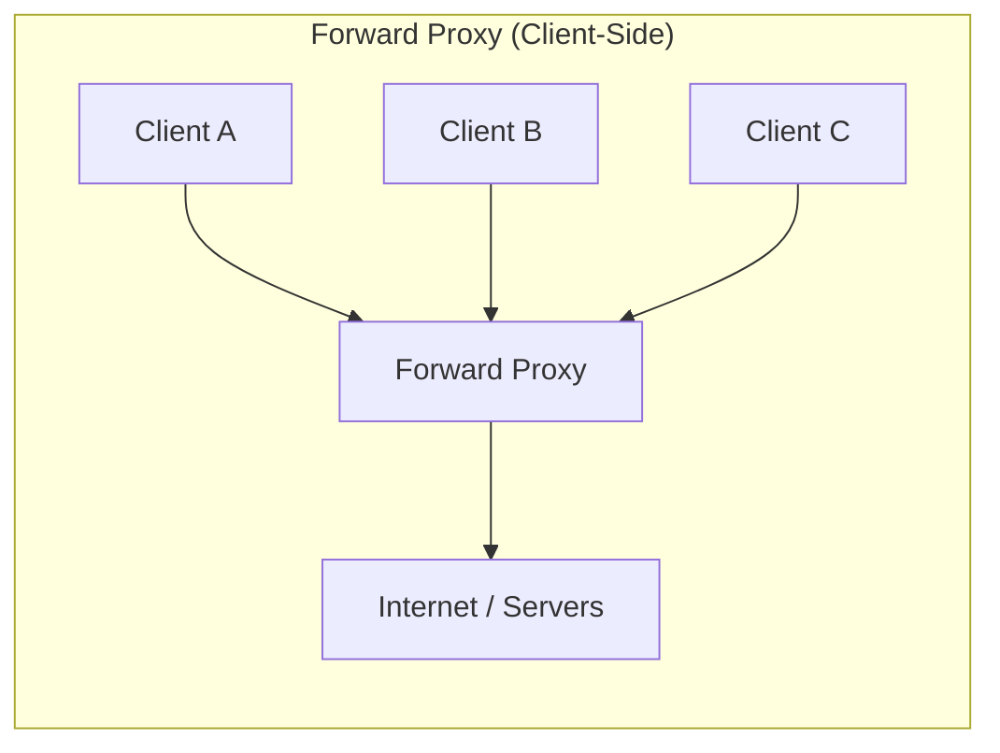
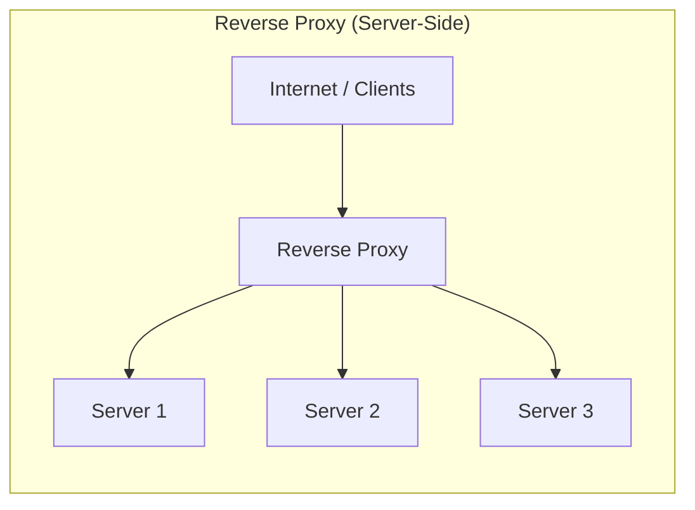
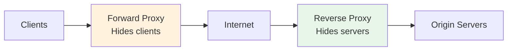
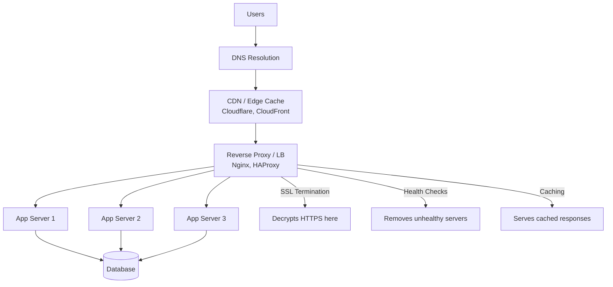

# Proxy vs Reverse Proxy

## What / Why

Both proxies sit between clients and servers as intermediaries, but they serve opposite purposes depending on **which side** they protect.

**Analogy:**

- **Forward Proxy** = A personal assistant who makes calls on your behalf. The person you're calling doesn't know who you really are — they only see your assistant.
- **Reverse Proxy** = A receptionist at a company. You call the company, but the receptionist decides which department handles your request. You never directly reach the internal staff.

---

## Traffic Flow Diagram





### Combined View — Where Each Sits



---

## Forward Proxy (Client-Side)

### What It Does

Sits in front of **clients** and makes requests on their behalf. The destination server sees the proxy's IP, not the client's.

### Use Cases

| Use Case                   | How It Works                                                                 |
| -------------------------- | ---------------------------------------------------------------------------- |
| **Anonymity / Privacy**    | Hides client IP from destination servers                                     |
| **Corporate Filtering**    | Company blocks access to social media, enforces policies                     |
| **Geo-restriction Bypass** | Proxy in another country accesses region-locked content                      |
| **Caching**                | Cache frequently accessed resources for all clients (e.g., software updates) |
| **Bandwidth Control**      | Compress or limit traffic for corporate networks                             |
| **Access Logging**         | Monitor what employees are accessing                                         |

### How Clients Use It

- Client must be **configured** to send traffic through the proxy
- Browser settings, system proxy config, or transparent proxy (intercepts without config)

### Examples

- Squid Proxy
- Corporate HTTP proxies
- VPN services (act as forward proxies)
- `http_proxy` / `https_proxy` environment variables

---

## Reverse Proxy (Server-Side)

### What It Does

Sits in front of **servers** and handles incoming client requests. Clients think they're talking to one server, but the proxy distributes work to many.

### Use Cases

| Use Case                | How It Works                                                |
| ----------------------- | ----------------------------------------------------------- |
| **Load Balancing**      | Distributes requests across multiple backend servers        |
| **SSL/TLS Termination** | Handles encryption/decryption so backends don't have to     |
| **Caching**             | Cache static assets and API responses at the edge           |
| **Security / WAF**      | Shield origin servers from direct exposure, DDoS protection |
| **Compression**         | Compress responses (gzip/brotli) before sending to clients  |
| **Request Routing**     | Route `/api/*` to API servers, `/static/*` to CDN           |
| **Rate Limiting**       | Limit requests per IP/user at the proxy level               |
| **A/B Testing**         | Route percentage of traffic to different backends           |

### How It Works

- Client connects to the **reverse proxy's public IP/domain**
- Proxy decides which backend server handles the request
- Backend servers are on a **private network** (not publicly accessible)

---

## Comparison Table

| Aspect                | Forward Proxy                            | Reverse Proxy                                 |
| --------------------- | ---------------------------------------- | --------------------------------------------- |
| **Position**          | In front of clients                      | In front of servers                           |
| **Hides**             | Client identity from servers             | Server identity from clients                  |
| **Who configures it** | Client/network admin                     | Server/infrastructure admin                   |
| **Client awareness**  | Client knows about the proxy             | Client doesn't know (transparent)             |
| **Primary purpose**   | Privacy, filtering, caching for clients  | Load balancing, security, caching for servers |
| **Typical user**      | Corporate networks, VPNs                 | Web applications, APIs                        |
| **SSL handling**      | Can inspect/decrypt (MITM for filtering) | Terminates SSL (offloads from backends)       |

---

## Detailed Architecture: Reverse Proxy in Production



---

## Tools Comparison

| Tool            | Type                       | Best For                                 | Key Features                                        |
| --------------- | -------------------------- | ---------------------------------------- | --------------------------------------------------- |
| **Nginx**       | Reverse Proxy / Web Server | General-purpose reverse proxy            | High performance, static file serving, config-based |
| **HAProxy**     | Reverse Proxy / LB         | High-performance TCP/HTTP load balancing | Advanced health checks, connection draining         |
| **Cloudflare**  | Reverse Proxy / CDN        | DDoS protection, edge caching, WAF       | Global network, easy setup, free tier               |
| **Traefik**     | Reverse Proxy              | Container/microservices environments     | Auto-discovery (Docker/K8s), dynamic config         |
| **AWS ALB/NLB** | Reverse Proxy / LB         | AWS infrastructure                       | Managed, auto-scaling, integrates with ECS/EKS      |
| **Envoy**       | Service Proxy (Sidecar)    | Service mesh (Istio)                     | Observability, circuit breaking, gRPC support       |
| **Squid**       | Forward Proxy              | Corporate caching/filtering              | Content filtering, bandwidth management             |

---

## Nginx as Reverse Proxy — Config Example

```nginx
upstream backend_servers {
    server 10.0.0.1:3000 weight=3;   # Gets 3x traffic
    server 10.0.0.2:3000 weight=1;
    server 10.0.0.3:3000 backup;      # Only if others fail
}

server {
    listen 443 ssl;
    server_name api.example.com;

    # SSL Termination
    ssl_certificate     /etc/ssl/cert.pem;
    ssl_certificate_key /etc/ssl/key.pem;

    # Caching
    proxy_cache_path /tmp/cache levels=1:2 keys_zone=api_cache:10m;

    location /api/ {
        proxy_pass http://backend_servers;
        proxy_cache api_cache;
        proxy_cache_valid 200 5m;

        # Headers
        proxy_set_header X-Real-IP $remote_addr;
        proxy_set_header X-Forwarded-For $proxy_add_x_forwarded_for;
    }

    location /static/ {
        root /var/www/static;
        expires 30d;
    }
}
```

---

## When to Use Each

### Use a Forward Proxy When:

- Corporate network needs content filtering
- You need to anonymize outbound traffic
- Caching shared resources for many clients (e.g., OS updates)
- Monitoring/logging employee internet usage
- Bypassing geographic restrictions (VPN-like behavior)

### Use a Reverse Proxy When:

- You have multiple backend servers that need load balancing
- You want to terminate SSL at one point
- You need DDoS protection / WAF
- You want to cache responses close to the client
- Your backend servers shouldn't be publicly exposed
- You need request routing based on path/header/domain

---

## Best Practices

1. **Always use a reverse proxy in production** — Never expose application servers directly to the internet.
2. **Terminate SSL at the proxy** — Simpler certificate management, offloads crypto work from backends.
3. **Set proper headers** — Forward `X-Real-IP` and `X-Forwarded-For` so backends know the real client IP.
4. **Health checks** — Configure active health checks so the proxy stops routing to dead backends.
5. **Connection timeouts** — Set appropriate timeouts for proxy-to-backend connections (avoid hanging requests).
6. **Cache at the proxy layer** — Reduce backend load for static/semi-static content.
7. **Rate limit at the proxy** — First line of defense against abuse and DDoS.
8. **Use CDN as outermost reverse proxy** — Cloudflare/CloudFront handles global distribution and DDoS at the edge.

---

## Summary

- **Forward Proxy** = Client-side intermediary. Hides client identity, used for filtering, caching, privacy.
- **Reverse Proxy** = Server-side intermediary. Hides servers, used for load balancing, SSL termination, security, caching.
- In modern web architecture, **reverse proxies are mandatory** — they're your security boundary, load distributor, and SSL handler.
- **Nginx** is the most common reverse proxy for web applications. **Cloudflare** adds edge/CDN capabilities on top.
- Forward proxies are less common in modern architecture (VPNs have largely replaced them for privacy use cases).
