# High-Level Design (HLD)

## What is High-Level Design?

High-Level Design is the architectural blueprint of a system. Think of it like the master plan for a city — you decide where the roads go, where the power grid connects, and how water flows to every building _before_ you build individual houses.

HLD answers: **How do the major components of a system interact to meet requirements at scale?**

---

## Scalability

Scalability is the system's ability to handle increased load without degrading performance.

### Vertical Scaling (Scale Up)

Add more power (CPU, RAM, SSD) to an existing machine.

**Analogy:** Making a single delivery truck bigger instead of buying more trucks.

```
Before: 4 CPU cores, 8 GB RAM
After:  32 CPU cores, 128 GB RAM
```

### Horizontal Scaling (Scale Out)

Add more machines to distribute the load.

**Analogy:** Hiring more delivery trucks instead of making one truck bigger.

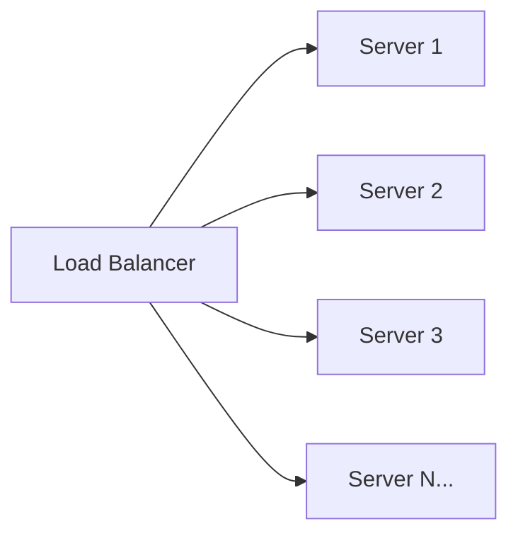

### Comparison

| Aspect           | Vertical Scaling            | Horizontal Scaling                 |
| ---------------- | --------------------------- | ---------------------------------- |
| Cost             | Expensive (hardware limits) | Cost-effective (commodity servers) |
| Downtime         | Requires restart            | Zero downtime (add nodes live)     |
| Ceiling          | Physical hardware limit     | Virtually unlimited                |
| Complexity       | Simple (one machine)        | Complex (distributed systems)      |
| Data Consistency | Easy (single node)          | Hard (distributed state)           |
| Failure Impact   | Single point of failure     | Fault-tolerant                     |

**Rule of thumb:** Start vertical (simpler), move horizontal when you hit limits or need fault tolerance.

---

## Load Balancing

A load balancer distributes incoming traffic across multiple servers so no single server becomes overwhelmed.

**Analogy:** A restaurant host who seats guests evenly across all available tables instead of filling one section first.

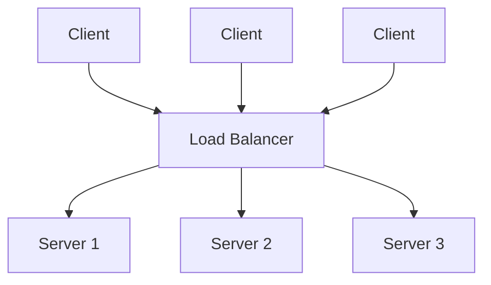

### L4 vs L7 Load Balancing

| Feature           | Layer 4 (Transport)            | Layer 7 (Application)           |
| ----------------- | ------------------------------ | ------------------------------- |
| Operates on       | TCP/UDP packets                | HTTP headers, URL, cookies      |
| Speed             | Faster (no content inspection) | Slower (deep packet inspection) |
| Routing decisions | IP + Port                      | URL path, headers, body         |
| SSL Termination   | No                             | Yes                             |
| Use case          | Simple TCP distribution        | Content-based routing           |
| Example           | AWS NLB                        | AWS ALB, NGINX                  |

**L7 example:** Route `/api/*` to backend servers, `/static/*` to CDN, `/ws/*` to WebSocket servers.

### Load Balancing Algorithms

#### Round Robin

Distributes requests sequentially across servers.

```
Request 1 → Server A
Request 2 → Server B
Request 3 → Server C
Request 4 → Server A  (cycle repeats)
```

**Best for:** Servers with equal capacity and stateless requests.

#### Weighted Round Robin

Servers with more capacity get more traffic.

```
Server A (weight: 3) → gets 3 out of every 6 requests
Server B (weight: 2) → gets 2 out of every 6 requests
Server C (weight: 1) → gets 1 out of every 6 requests
```

#### Least Connections

Sends new requests to the server with the fewest active connections.

```
Server A: 12 active connections
Server B: 5 active connections  ← next request goes here
Server C: 9 active connections
```

**Best for:** Requests with varying processing times (e.g., database-heavy operations).

#### IP Hash

Hashes the client's IP to determine which server handles the request. The same IP always goes to the same server.

```javascript
server_index = hash(client_ip) % number_of_servers;
```

**Best for:** Session persistence without sticky sessions (e.g., shopping carts).

### Health Checks

Load balancers periodically ping servers to check if they are alive:

```
LB → GET /health → Server A → 200 OK ✓
LB → GET /health → Server B → timeout ✗ (remove from pool)
```

---

## Caching Strategies

Caching stores frequently accessed data in a faster storage layer to reduce load on the origin.

**Analogy:** Keeping your most-used tools on your desk instead of walking to the storage room every time.

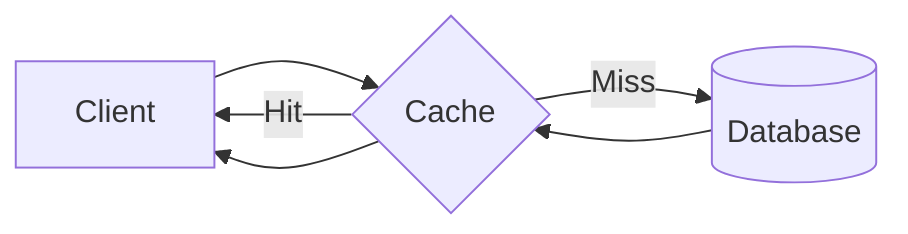

### Cache Levels

| Level             | Technology         | Latency  | Use Case                           |
| ----------------- | ------------------ | -------- | ---------------------------------- |
| Browser Cache     | HTTP headers       | ~0ms     | Static assets (JS, CSS, images)    |
| CDN               | CloudFront, Akamai | ~10-50ms | Geographically distributed content |
| Application Cache | Redis, Memcached   | ~1-5ms   | Session data, API responses        |
| Database Cache    | Query cache        | ~5-10ms  | Repeated queries                   |

### Redis Caching

Redis is an in-memory key-value store used as a cache layer.

```javascript
const Redis = require("ioredis");
const redis = new Redis();

async function getUser(userId) {
  // 1. Check cache first
  const cached = await redis.get(`user:${userId}`);
  if (cached) {
    return JSON.parse(cached); // Cache HIT
  }

  // 2. Cache MISS — fetch from DB
  const user = await db.query("SELECT * FROM users WHERE id = ?", [userId]);

  // 3. Store in cache with TTL (Time To Live)
  await redis.set(`user:${userId}`, JSON.stringify(user), "EX", 3600); // 1 hour

  return user;
}
```

### Cache Invalidation Strategies

| Strategy            | How It Works                            | Pros                               | Cons                         |
| ------------------- | --------------------------------------- | ---------------------------------- | ---------------------------- |
| Cache-Aside (Lazy)  | App checks cache, loads from DB on miss | Simple, only caches what is needed | First request is always slow |
| Write-Through       | Write to cache AND DB simultaneously    | Cache always fresh                 | Write latency increases      |
| Write-Behind (Back) | Write to cache, async write to DB later | Fast writes                        | Risk of data loss            |
| TTL-Based           | Cache expires after set time            | Simple, self-healing               | Stale data during TTL window |

### CDN (Content Delivery Network)

CDNs cache static content at edge locations worldwide.

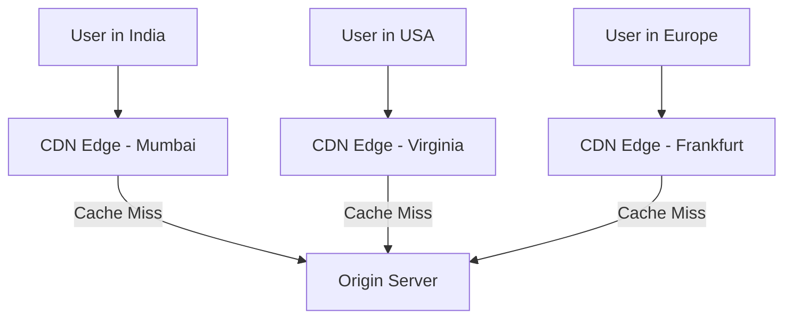

### Browser Caching (HTTP Headers)

```http
Cache-Control: public, max-age=31536000    # Cache for 1 year
Cache-Control: no-cache                     # Always revalidate with server
Cache-Control: no-store                     # Never cache (sensitive data)
ETag: "abc123"                              # Fingerprint for conditional requests
```

---

## Database Design

### SQL vs NoSQL

| Feature        | SQL (PostgreSQL, MySQL)        | NoSQL (MongoDB, DynamoDB)              |
| -------------- | ------------------------------ | -------------------------------------- |
| Structure      | Fixed schema (tables, rows)    | Flexible schema (documents, key-value) |
| Relationships  | JOINs, foreign keys            | Embedded documents, denormalization    |
| Scaling        | Vertical (primarily)           | Horizontal (built-in sharding)         |
| ACID           | Full support                   | Eventual consistency (usually)         |
| Query Language | SQL                            | Varies (MQL, DynamoDB API)             |
| Best for       | Complex queries, relationships | High write throughput, flexible data   |

**Choose SQL when:** Relationships matter, data integrity is critical (banking, e-commerce).
**Choose NoSQL when:** Schema changes often, scale is massive, data is hierarchical (social feeds, IoT).

### Database Sharding

Sharding splits data across multiple database instances by a **shard key**.

**Analogy:** Instead of one giant filing cabinet, you have 26 cabinets — one for each letter of the alphabet.

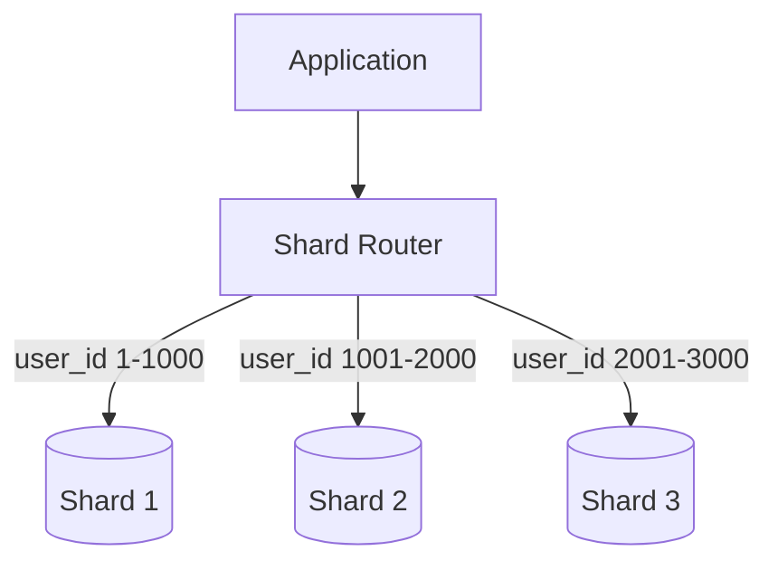

**Sharding strategies:**

- **Range-based:** user_id 1–1000 on Shard A, 1001–2000 on Shard B.
- **Hash-based:** `shard = hash(user_id) % num_shards` — even distribution.
- **Geographic:** Users in India on Shard-Asia, users in US on Shard-US.

### Database Replication

Replication copies data to multiple nodes for fault tolerance and read scaling.

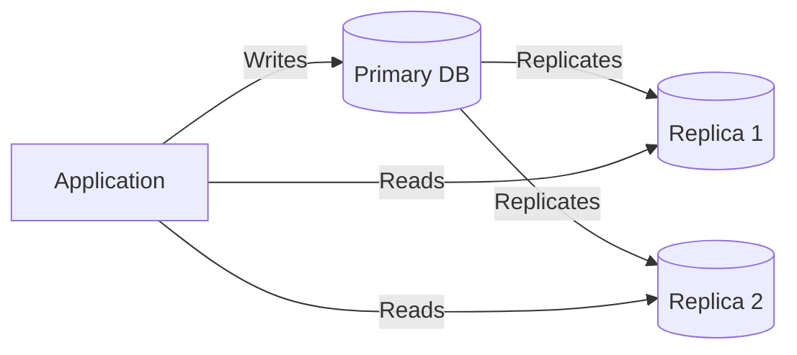

- **Primary-Replica:** One node handles writes, replicas handle reads.
- **Multi-Primary:** Multiple nodes accept writes (conflict resolution needed).

### Indexing

Indexes speed up queries by creating a sorted lookup structure (like a book index).

```sql
-- Without index: Full table scan O(n)
SELECT * FROM orders WHERE customer_id = 42;

-- With index: B-tree lookup O(log n)
CREATE INDEX idx_orders_customer ON orders(customer_id);

-- Composite index for common query patterns
CREATE INDEX idx_orders_customer_date ON orders(customer_id, created_at);
```

**Trade-off:** Indexes speed up reads but slow down writes (index must be updated on every INSERT/UPDATE).

---

## Message Queues & Event-Driven Architecture

Message queues decouple services by allowing them to communicate asynchronously.

**Analogy:** Instead of calling someone on the phone and waiting for them to pick up, you leave a voicemail — they process it when they are ready.

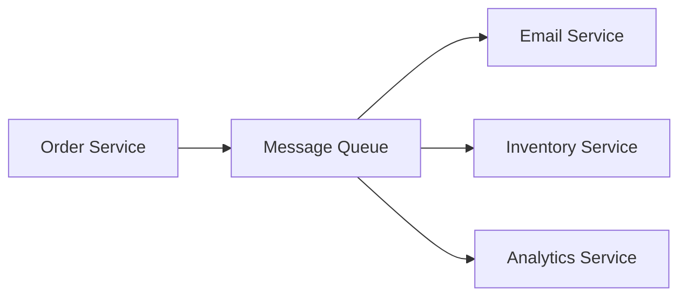

### RabbitMQ (Traditional Message Broker)

- **Model:** Producer → Exchange → Queue → Consumer
- **Delivery:** Messages are removed from queue once consumed.
- **Best for:** Task queues, RPC, work distribution.

```javascript
// Producer
const amqp = require("amqplib");
const connection = await amqp.connect("amqp://localhost");
const channel = await connection.createChannel();

await channel.assertQueue("order_processing");
channel.sendToQueue(
  "order_processing",
  Buffer.from(
    JSON.stringify({
      orderId: "123",
      action: "process_payment",
    }),
  ),
);

// Consumer
channel.consume("order_processing", (msg) => {
  const order = JSON.parse(msg.content.toString());
  processPayment(order);
  channel.ack(msg); // Acknowledge processing
});
```

### Apache Kafka (Event Streaming Platform)

- **Model:** Producer → Topic (partitioned log) → Consumer Group
- **Delivery:** Messages are retained (replay possible).
- **Best for:** Event sourcing, real-time analytics, log aggregation.

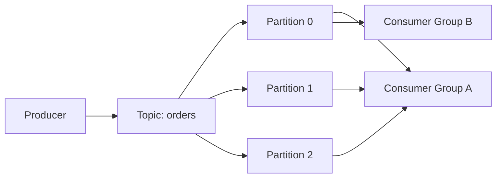

### RabbitMQ vs Kafka

| Feature           | RabbitMQ                  | Kafka                      |
| ----------------- | ------------------------- | -------------------------- |
| Model             | Message queue (push)      | Event log (pull)           |
| Message Retention | Deleted after consumption | Retained (configurable)    |
| Ordering          | Per-queue                 | Per-partition              |
| Throughput        | ~50K msgs/sec             | ~1M+ msgs/sec              |
| Replay            | Not possible              | Possible (offset-based)    |
| Best for          | Task distribution, RPC    | Event streaming, analytics |

---

## API Gateway & Rate Limiting

### API Gateway

An API Gateway is a single entry point for all client requests. It handles cross-cutting concerns.

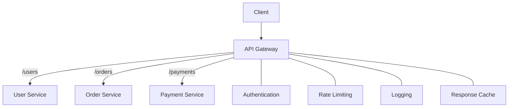

**Responsibilities:**

- Authentication & Authorization
- Rate limiting & Throttling
- Request/Response transformation
- Load balancing
- Circuit breaking
- API versioning

**Tools:** AWS API Gateway, Kong, NGINX, Express Gateway.

### Rate Limiting

Rate limiting controls how many requests a client can make in a given time window.

#### Token Bucket Algorithm

```
Bucket capacity: 10 tokens
Refill rate: 1 token/second

Request arrives:
  - If tokens > 0: allow request, remove 1 token
  - If tokens = 0: reject with 429 Too Many Requests
```

#### Sliding Window Algorithm

```javascript
// Simple rate limiter with Redis
async function rateLimit(clientId, limit = 100, windowSec = 60) {
  const key = `rate:${clientId}`;
  const current = await redis.incr(key);

  if (current === 1) {
    await redis.expire(key, windowSec);
  }

  if (current > limit) {
    return { allowed: false, retryAfter: await redis.ttl(key) };
  }

  return { allowed: true, remaining: limit - current };
}
```

#### Rate Limit HTTP Headers

```http
HTTP/1.1 429 Too Many Requests
X-RateLimit-Limit: 100
X-RateLimit-Remaining: 0
X-RateLimit-Reset: 1672531200
Retry-After: 30
```

---

## Service Discovery

In a microservices architecture, services need to find each other dynamically (IPs and ports change with scaling/deployments).

**Analogy:** Instead of memorizing everyone's phone number, you look them up in a directory that is always up to date.

### Client-Side Discovery

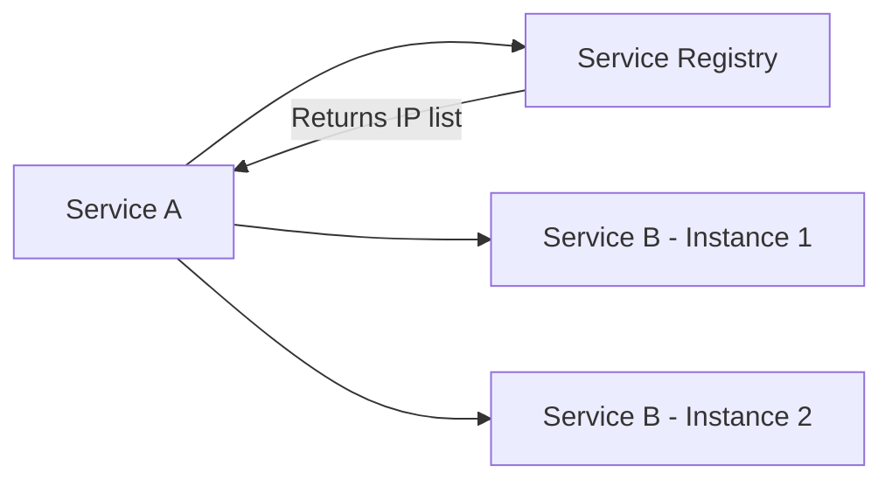

The client queries the registry and decides which instance to call.
**Tools:** Netflix Eureka, Consul (client mode).

### Server-Side Discovery

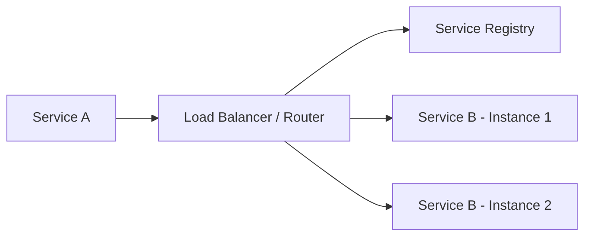

The load balancer queries the registry and routes the request.
**Tools:** AWS ALB, Kubernetes Services, Consul (server mode).

### DNS-Based Discovery

Services register themselves under DNS names. Kubernetes does this natively:

```
http://user-service.default.svc.cluster.local:3000/users
```

---

## Disaster Recovery & Backup

### Recovery Objectives

| Metric                             | Definition               | Example                              |
| ---------------------------------- | ------------------------ | ------------------------------------ |
| **RTO** (Recovery Time Objective)  | Max acceptable downtime  | "System must recover within 4 hours" |
| **RPO** (Recovery Point Objective) | Max acceptable data loss | "We can lose at most 1 hour of data" |

### Disaster Recovery Strategies

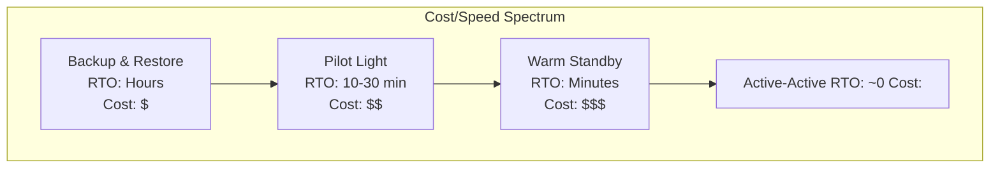

| Strategy         | Description                                | RTO       | Cost      |
| ---------------- | ------------------------------------------ | --------- | --------- |
| Backup & Restore | Periodic backups, restore on failure       | Hours     | Low       |
| Pilot Light      | Minimal infra running, scale up on failure | 10-30 min | Medium    |
| Warm Standby     | Scaled-down replica always running         | Minutes   | High      |
| Active-Active    | Full capacity in multiple regions          | Near-zero | Very High |

### Backup Strategies

- **Full Backup:** Complete copy of all data (weekly).
- **Incremental Backup:** Only changes since last backup (daily).
- **Differential Backup:** Changes since last full backup.

```
Week Schedule:
  Sunday    → Full Backup (50 GB)
  Mon–Sat   → Incremental Backups (1-3 GB each)
```

### The 3-2-1 Rule

- **3** copies of your data
- **2** different storage media
- **1** offsite (different geographic location)

---

## Best Practices

1. **Design for failure** — assume any component can fail at any time. Use redundancy and graceful degradation.
2. **Cache aggressively, invalidate carefully** — stale data is often better than no data, but know when freshness matters.
3. **Choose the right database for the job** — not everything needs to be in one database. Polyglot persistence is valid.
4. **Rate limit everything public** — protect your services from abuse and cascading failures.
5. **Use async communication where possible** — message queues decouple services and absorb traffic spikes.
6. **Automate disaster recovery** — if you haven't tested your backup restore, you don't have a backup.
7. **Monitor and alert** — you cannot fix what you cannot see. Use metrics, logs, and distributed tracing.
8. **Start simple, scale incrementally** — do not build for 10 million users on day one. Optimize when data tells you to.

---

## Common Mistakes

| Mistake                                | Why It Is Wrong                                                           | Fix                                          |
| -------------------------------------- | ------------------------------------------------------------------------- | -------------------------------------------- |
| Scaling vertically forever             | Hardware limits hit, single point of failure                              | Plan horizontal scaling early                |
| Caching without invalidation strategy  | Stale data served indefinitely                                            | Use TTLs + event-based invalidation          |
| Sharding too early                     | Adds complexity without proven need                                       | Shard only when single DB cannot handle load |
| No health checks on load balancer      | Traffic sent to dead servers                                              | Configure active health checks               |
| Synchronous calls between all services | One slow service cascades failures                                        | Use async queues + circuit breakers          |
| Ignoring CAP theorem                   | Expecting consistency + availability + partition tolerance simultaneously | Decide trade-offs per service                |
| Backup without restore testing         | Backups may be corrupt or incomplete                                      | Schedule regular restore drills              |

---

## Summary

- **Scalability** comes in two forms: vertical (bigger machine) and horizontal (more machines). Horizontal wins long-term.
- **Load balancers** distribute traffic using algorithms like Round Robin, Least Connections, and IP Hash. Choose L4 for speed, L7 for intelligence.
- **Caching** (Redis, CDN, browser) reduces latency and database load — but demands careful invalidation.
- **Database design** requires choosing between SQL and NoSQL based on your data model, then applying sharding, replication, and indexing for scale.
- **Message queues** (RabbitMQ, Kafka) decouple services, enable async processing, and absorb traffic spikes.
- **API Gateways** centralize cross-cutting concerns; rate limiting protects services from overload.
- **Service discovery** lets microservices find each other dynamically as instances scale up and down.
- **Disaster recovery** requires defined RTO/RPO targets, tested backups, and a strategy that matches your budget.
