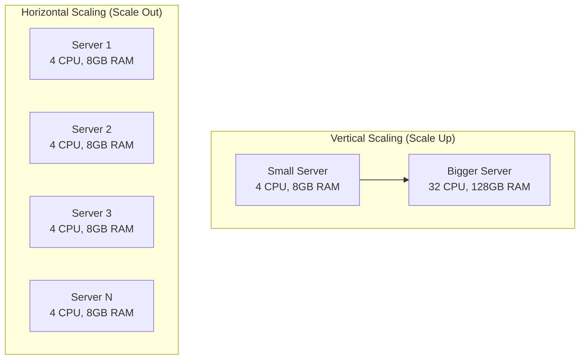
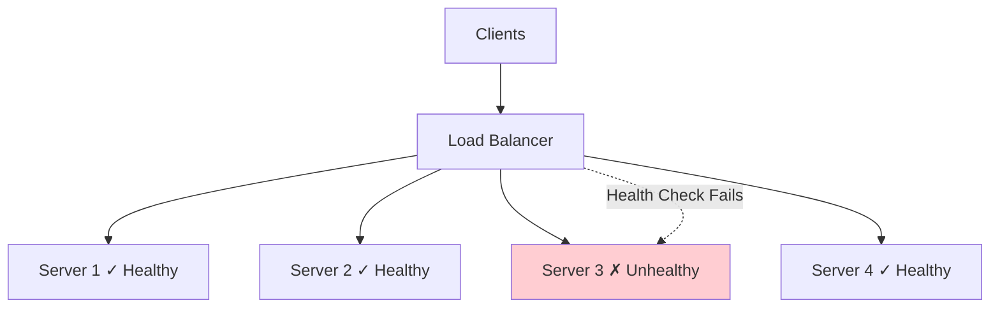
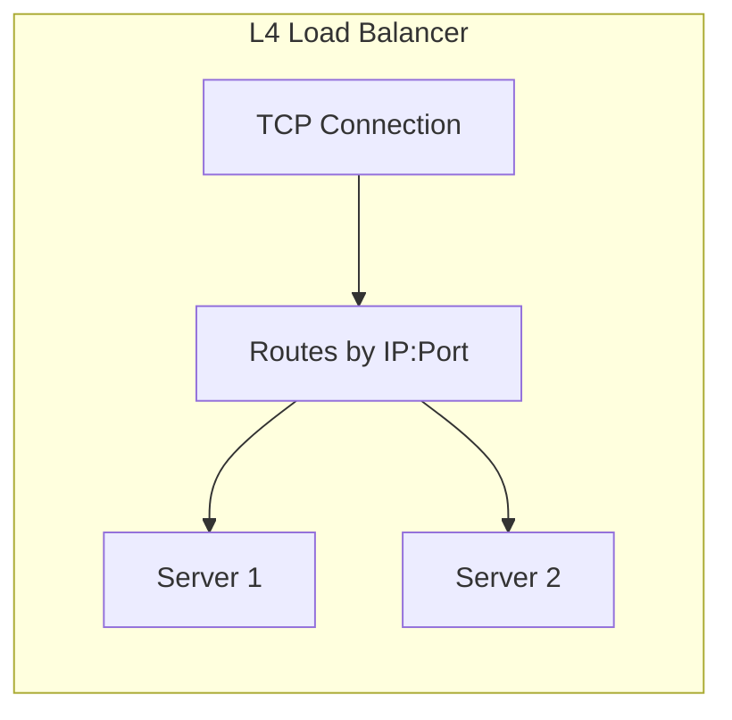
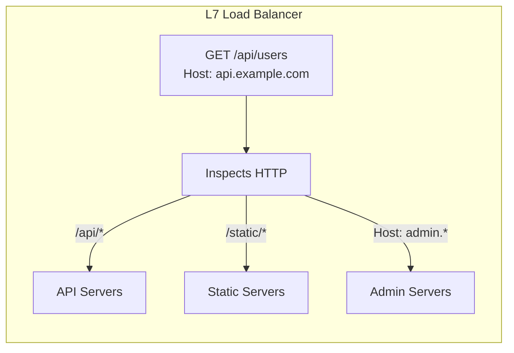
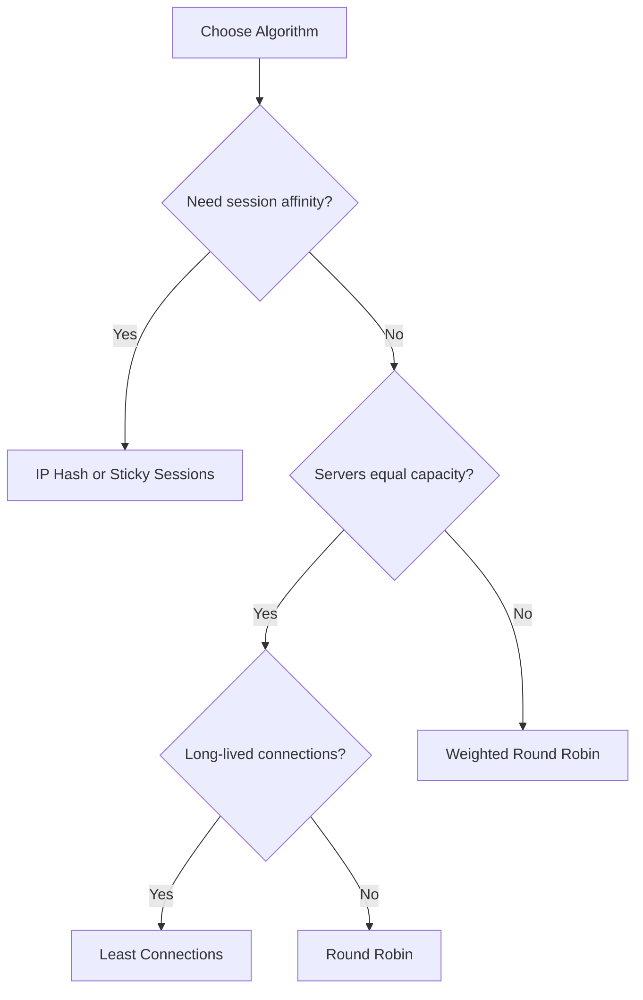
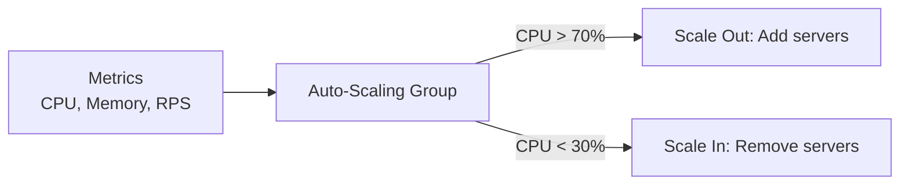

# Scalability & Load Balancing

## What / Why

**Scalability** = A system's ability to handle increased load by adding resources. The goal is linear (or near-linear) growth in capacity as you add resources.

**Load Balancing** = Distributing incoming traffic across multiple servers so no single server becomes a bottleneck.

**Analogy:** Scalability is like a restaurant — you can either get a bigger kitchen (vertical) or open more locations (horizontal). Load balancing is the host at the front who distributes guests evenly across waiters.

---

## Vertical vs Horizontal Scaling

### Comparison

| Aspect               | Vertical Scaling (Scale Up)                             | Horizontal Scaling (Scale Out)                |
| -------------------- | ------------------------------------------------------- | --------------------------------------------- |
| **How**              | Add more CPU/RAM/Disk to one machine                    | Add more machines                             |
| **Limit**            | Hardware ceiling (can't buy infinite RAM)               | Virtually unlimited                           |
| **Downtime**         | Usually requires restart                                | No downtime (add servers live)                |
| **Cost**             | Exponential (high-end hardware is expensive)            | Linear (commodity hardware)                   |
| **Complexity**       | Simple — same code, bigger machine                      | Complex — distributed systems problems        |
| **Data Consistency** | Easy — single machine                                   | Hard — need replication, sync                 |
| **Failure Impact**   | Single point of failure                                 | One server down = others handle load          |
| **Use Case**         | Databases, legacy apps                                  | Stateless web/API servers                     |
| **Example**          | Upgrade RDS instance from db.t3.medium to db.r5.4xlarge | Add more EC2 instances behind a load balancer |

### When to Use Which

- **Vertical first** — Simpler. Works until hardware limits are hit. Good for databases.
- **Horizontal for stateless services** — Web servers, API servers, workers.
- **Often you need both** — Vertically scale your database while horizontally scaling your API layer.

---

## Load Balancing

### Architecture

### L4 vs L7 Load Balancing

| Layer                | What It Sees                           | Routing Based On                         | Performance                       | Use Case                           |
| -------------------- | -------------------------------------- | ---------------------------------------- | --------------------------------- | ---------------------------------- |
| **L4 (Transport)**   | TCP/UDP packets — IP + Port            | Source/destination IP, port numbers      | Very fast (no content inspection) | Raw TCP traffic, databases, gaming |
| **L7 (Application)** | Full HTTP request — headers, URL, body | URL path, headers, cookies, content type | Slower (inspects content)         | Web apps, API routing, A/B testing |

---

## Load Balancing Algorithms

| Algorithm                      | How It Works                                                    | Best For                                             | Drawback                                           |
| ------------------------------ | --------------------------------------------------------------- | ---------------------------------------------------- | -------------------------------------------------- |
| **Round Robin**                | Requests distributed 1→2→3→1→2→3...                             | Equal-capacity servers, stateless                    | Ignores server load; slow server gets same traffic |
| **Weighted Round Robin**       | Same as above but servers get proportional shares (e.g., 3:2:1) | Servers with different capacities                    | Static weights; doesn't adapt to real-time load    |
| **Least Connections**          | Routes to server with fewest active connections                 | Long-lived connections (WebSocket, DB)               | Doesn't account for connection "weight"            |
| **Weighted Least Connections** | Least connections adjusted by server weight                     | Mixed-capacity servers with varying connection times | More complex to configure                          |
| **IP Hash**                    | Hash client IP → always routes to same server                   | Session affinity without sticky sessions             | Uneven distribution if IP ranges cluster           |
| **Least Response Time**        | Routes to server with fastest response time                     | Performance-sensitive APIs                           | Requires constant monitoring                       |
| **Random**                     | Randomly pick a server                                          | Large server pools (law of large numbers)            | Can be uneven with small pools                     |

### Algorithm Selection Guide

---

## Health Checks

The load balancer must know which servers are healthy:

| Type                  | How It Works                          | Example                                |
| --------------------- | ------------------------------------- | -------------------------------------- |
| **TCP Check**         | Can I open a TCP connection?          | Connect to port 3000                   |
| **HTTP Check**        | Does a specific endpoint return 200?  | `GET /health` → 200 OK                 |
| **Deep Health Check** | Does the app + its dependencies work? | Check DB connection, cache, disk space |

**Configuration Parameters:**

- **Interval** — How often to check (e.g., every 10s)
- **Timeout** — How long to wait for response (e.g., 5s)
- **Healthy threshold** — Consecutive successes to mark healthy (e.g., 3)
- **Unhealthy threshold** — Consecutive failures to mark unhealthy (e.g., 2)

---

## Sticky Sessions (Session Affinity)

**Problem:** If a user's session is stored on Server 1, and the next request goes to Server 2, the session is lost.

**Solutions:**

| Approach                 | How                                            | Tradeoff                                               |
| ------------------------ | ---------------------------------------------- | ------------------------------------------------------ |
| **Sticky Sessions**      | LB routes same user to same server (cookie/IP) | Uneven load, server failure loses sessions             |
| **Shared Session Store** | Store sessions in Redis/Memcached              | Extra infrastructure, but stateless servers            |
| **JWT / Stateless Auth** | All state in the token itself                  | Best for horizontal scaling, no server affinity needed |

> **Best Practice:** Make servers stateless. Use shared session stores or JWTs. Avoid sticky sessions when possible.

---

## Tools Comparison

| Tool                  | Type                     | Layer   | Best For                                     |
| --------------------- | ------------------------ | ------- | -------------------------------------------- |
| **Nginx**             | Software LB + Web Server | L7      | General-purpose, reverse proxy, static files |
| **HAProxy**           | Software LB              | L4 + L7 | High-performance, TCP/HTTP, detailed metrics |
| **AWS ALB**           | Managed LB               | L7      | AWS HTTP/HTTPS workloads, path-based routing |
| **AWS NLB**           | Managed LB               | L4      | AWS TCP/UDP workloads, ultra-low latency     |
| **AWS ELB (Classic)** | Managed LB               | L4 + L7 | Legacy (prefer ALB/NLB)                      |
| **Google Cloud LB**   | Managed LB               | L4 + L7 | Global anycast, GCP workloads                |
| **Traefik**           | Software LB              | L7      | Kubernetes, Docker, auto-discovery           |
| **Envoy**             | Service Proxy            | L7      | Service mesh (Istio sidecar)                 |

---

## Auto-Scaling

Auto-scaling automatically adjusts the number of servers based on demand.

### Key Concepts

| Concept                | Description                                                                  |
| ---------------------- | ---------------------------------------------------------------------------- |
| **Scaling Policy**     | Rules that trigger scaling (e.g., "if CPU > 70% for 5 min, add 2 instances") |
| **Cooldown Period**    | Time to wait after scaling before evaluating again (prevents flapping)       |
| **Min/Max Instances**  | Bounds on how small/large the group can get                                  |
| **Target Tracking**    | Maintain a target metric value (e.g., keep avg CPU at 50%)                   |
| **Scheduled Scaling**  | Pre-schedule scale-ups for known traffic patterns (Black Friday)             |
| **Predictive Scaling** | ML-based prediction of upcoming load                                         |

### Scaling Metrics

| Metric              | When to Use                                  |
| ------------------- | -------------------------------------------- |
| CPU Utilization     | CPU-bound workloads (compute, rendering)     |
| Memory Utilization  | Memory-intensive apps (caching, ML)          |
| Request Count (RPS) | Web servers, APIs                            |
| Queue Depth         | Worker services processing async jobs        |
| Custom Metrics      | Business-specific (active users, orders/min) |

---

## Best Practices

1. **Stateless > Stateful** — Design app servers to be stateless so any instance can handle any request. Store state externally (Redis, DB).
2. **Scale horizontally for compute, vertically for data** — Web servers scale out easily. Databases often need bigger machines first.
3. **Use L7 load balancing for web traffic** — Enables path-based routing, header inspection, and smarter distribution.
4. **Health checks are mandatory** — Unhealthy servers should be removed from rotation automatically.
5. **Set conservative auto-scaling cooldowns** — Prevent thrashing (adding/removing instances repeatedly).
6. **Over-provision slightly** — Don't run at 95% capacity. Leave headroom for traffic spikes.
7. **Test failover** — Regularly kill instances to verify the system handles it gracefully.
8. **Global load balancing for multi-region** — Use DNS-based (Route53) or anycast for geographic distribution.
9. **Connection draining** — When removing a server, finish existing requests before taking it offline.

---

## Summary

- **Vertical scaling** = bigger machine (simple, limited). **Horizontal scaling** = more machines (complex, unlimited).
- **Load balancers** distribute traffic. L4 for raw TCP performance, L7 for intelligent HTTP routing.
- **Algorithms:** Round Robin for simplicity, Least Connections for long-lived connections, IP Hash for affinity.
- **Health checks** keep the pool healthy. **Sticky sessions** are a crutch — prefer stateless servers.
- **Auto-scaling** adjusts capacity dynamically based on metrics. Set proper cooldowns and bounds.
- **Make everything stateless** — the golden rule for horizontal scalability.
