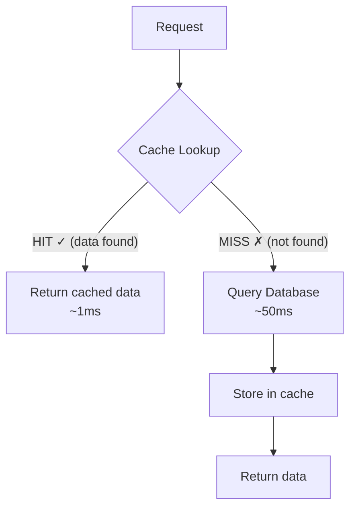
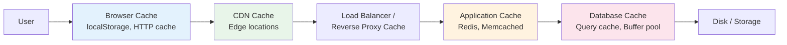
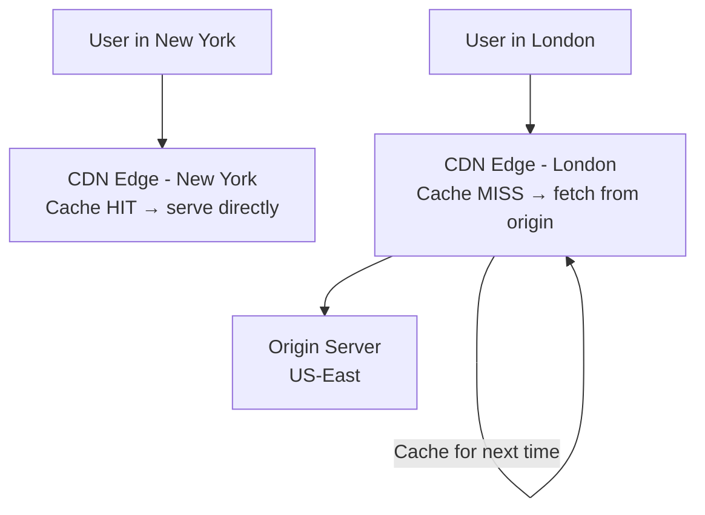
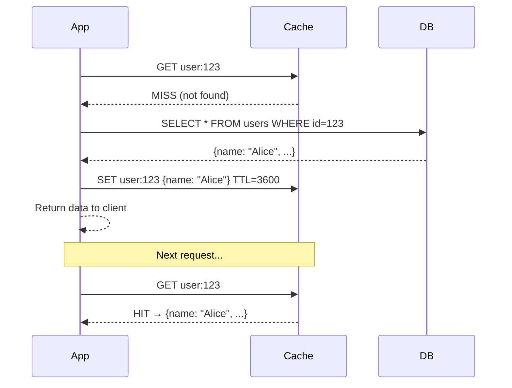
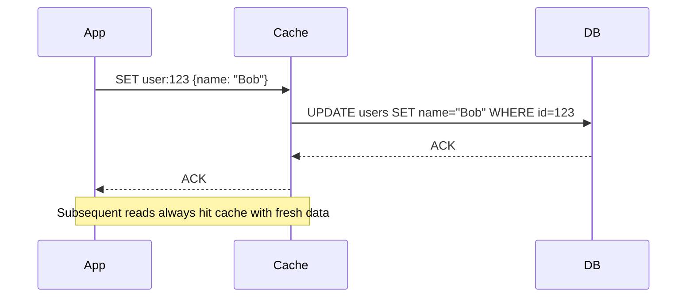
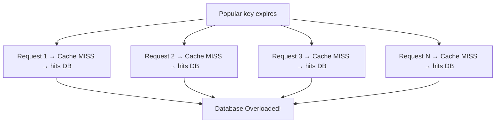

# Caching Strategies

## What / Why

**Caching** = Storing frequently accessed data in a faster storage layer to reduce latency and backend load.

**Why cache?**

- Database queries are expensive (10-100ms). Cache reads are cheap (< 1ms).
- Reduce load on databases and downstream services.
- Improve user experience with faster responses.
- Save money by reducing compute/database costs.

**Analogy:** A cache is like keeping your most-used tools on your desk instead of walking to the tool shed every time. The desk is small (limited capacity), so you only keep what you use most.

---

## Cache Hit vs Cache Miss

| Metric                 | Definition                                   | Good Target                     |
| ---------------------- | -------------------------------------------- | ------------------------------- |
| **Cache Hit Ratio**    | hits / (hits + misses)                       | > 90% for read-heavy systems    |
| **Cache Miss Penalty** | Extra latency when cache doesn't have data   | Should be tolerable (< 100ms)   |
| **Time to Live (TTL)** | How long data stays in cache before expiring | Depends on data freshness needs |

---

## Caching Layers

| Layer                 | What's Cached                             | TTL                  | Example                                      |
| --------------------- | ----------------------------------------- | -------------------- | -------------------------------------------- |
| **Browser Cache**     | Static assets, API responses              | Hours to months      | `Cache-Control: max-age=86400`               |
| **CDN**               | Static files, HTML pages                  | Minutes to days      | CloudFront, Cloudflare                       |
| **Reverse Proxy**     | API responses, HTML                       | Seconds to minutes   | Nginx proxy_cache, Varnish                   |
| **Application Cache** | DB query results, computed data, sessions | Seconds to hours     | Redis, Memcached                             |
| **Database Cache**    | Query plans, buffer pool, result cache    | Managed by DB engine | PostgreSQL shared_buffers, MySQL query cache |

---

## Redis — In-Memory Cache

Redis is the most common application-level cache. It's an in-memory key-value store with rich data structures.

### Key Features

| Feature             | Description                                        |
| ------------------- | -------------------------------------------------- |
| **Data Structures** | Strings, Hashes, Lists, Sets, Sorted Sets, Streams |
| **TTL**             | Set expiration per key (`EXPIRE key 3600`)         |
| **Persistence**     | Optional — RDB snapshots or AOF log                |
| **Pub/Sub**         | Built-in message broker                            |
| **Cluster Mode**    | Horizontal scaling with automatic sharding         |
| **Single-threaded** | No lock contention, predictable performance        |

### Eviction Policies (When Memory is Full)

| Policy           | Behavior                                    |
| ---------------- | ------------------------------------------- |
| `noeviction`     | Return error on writes when memory full     |
| `allkeys-lru`    | Evict least recently used key (most common) |
| `allkeys-lfu`    | Evict least frequently used key             |
| `volatile-lru`   | Evict LRU key among those with TTL set      |
| `volatile-ttl`   | Evict key with shortest TTL remaining       |
| `allkeys-random` | Randomly evict any key                      |

> **Best practice:** Use `allkeys-lru` for general caching. Use `volatile-ttl` if only some keys should be evictable.

---

## CDN (Content Delivery Network)

### How CDN Works

### What CDNs Cache

| Content Type  | Examples                    | TTL                |
| ------------- | --------------------------- | ------------------ |
| Static assets | JS, CSS, images, fonts      | Days to months     |
| HTML pages    | Marketing pages, blog posts | Minutes to hours   |
| API responses | Public data, search results | Seconds to minutes |
| Video/media   | Streaming content           | Long-lived         |

### CDN Providers

| Provider           | Strengths                                          |
| ------------------ | -------------------------------------------------- |
| **Cloudflare**     | Free tier, DDoS protection, Workers (edge compute) |
| **AWS CloudFront** | Tight AWS integration, Lambda@Edge                 |
| **Fastly**         | Instant purge, VCL config, real-time logs          |
| **Akamai**         | Largest network, enterprise-focused                |

---

## Cache Invalidation Strategies

> "There are only two hard things in Computer Science: cache invalidation and naming things." — Phil Karlton

| Strategy                       | How It Works                                         | Consistency                        | Performance                    | Use Case                                          |
| ------------------------------ | ---------------------------------------------------- | ---------------------------------- | ------------------------------ | ------------------------------------------------- |
| **TTL-based**                  | Data expires after fixed time                        | Eventual (stale until expiry)      | Excellent                      | Data that can be slightly stale (product catalog) |
| **Cache-Aside (Lazy Loading)** | App checks cache → miss → reads DB → writes to cache | Eventual (stale until miss or TTL) | Good reads, cache miss penalty | General purpose, read-heavy                       |
| **Write-Through**              | Every write goes to cache AND DB simultaneously      | Strong (always fresh)              | Slower writes                  | Data that's read immediately after write          |
| **Write-Behind (Write-Back)**  | Write to cache immediately, async write to DB later  | Eventual (risk of data loss)       | Fast writes                    | Write-heavy, loss-tolerant (analytics)            |
| **Write-Around**               | Write directly to DB, skip cache                     | Eventual (stale until TTL/miss)    | Good for infrequent reads      | Data rarely re-read after write                   |

### Cache-Aside Pattern (Most Common)

### Write-Through Pattern

---

## Cache Stampede (Thundering Herd)

### The Problem

When a popular cache key expires, hundreds of requests simultaneously miss the cache and hit the database.

### Solutions

| Solution                             | How It Works                                                                     |
| ------------------------------------ | -------------------------------------------------------------------------------- |
| **Locking (Mutex)**                  | First request acquires a lock and rebuilds cache. Others wait or get stale data. |
| **Early Expiration (Probabilistic)** | Randomly refresh cache before TTL expires (some requests refresh early)          |
| **Background Refresh**               | Background job refreshes cache before expiry. Requests never see a miss.         |
| **Stale-While-Revalidate**           | Serve stale data immediately, refresh in background                              |
| **Request Coalescing**               | Multiple concurrent cache misses for same key → only one DB query                |

---

## Common Caching Patterns

### What to Cache

| Cache This               | Why                                    |
| ------------------------ | -------------------------------------- |
| Database query results   | Expensive queries, frequently accessed |
| Computed/aggregated data | Dashboards, analytics summaries        |
| Session data             | Low-latency auth checks                |
| API responses (external) | Rate-limited third-party APIs          |
| HTML fragments           | Server-side rendered partials          |
| Configuration            | Rarely changes, read on every request  |

### What NOT to Cache

| Don't Cache This                            | Why                             |
| ------------------------------------------- | ------------------------------- |
| Highly personalized data (for shared cache) | Low hit ratio, privacy concerns |
| Rapidly changing data                       | Cache always stale              |
| Large objects with low reuse                | Wastes memory                   |
| Write-heavy data                            | Constant invalidation overhead  |

---

## Best Practices

1. **Cache the right layer** — Cache at the highest level possible (CDN > app cache > DB cache). The closer to the user, the better.
2. **Set appropriate TTLs** — Balance freshness vs performance. Start short, increase as you understand access patterns.
3. **Use cache-aside for most cases** — Simple, handles cache failures gracefully (falls back to DB).
4. **Plan for cache failure** — Your app must work (slower) without cache. Never make cache the source of truth for durable data.
5. **Monitor hit ratios** — Below 80% means your cache isn't helping much. Investigate miss patterns.
6. **Prevent cache stampede** — Use locking or background refresh for hot keys.
7. **Namespace your keys** — `user:123:profile` not just `123`. Prevents collisions and enables bulk invalidation.
8. **Size your cache appropriately** — Know your working set size. Under-sized cache = constant evictions = poor hit ratio.
9. **Use appropriate serialization** — JSON is debuggable. MessagePack/Protobuf is faster and smaller.
10. **Warm the cache** — Pre-populate cache after deployments or cold starts.

---

## Summary

- **Caching reduces latency and backend load** by serving from fast storage (memory).
- **Layers:** Browser → CDN → Reverse Proxy → Application (Redis) → Database buffer.
- **Redis** is the standard application cache: in-memory, sub-millisecond, rich data structures.
- **CDN** caches static assets globally at edge locations near users.
- **Strategies:** Cache-aside (most common), Write-through (strong consistency), Write-behind (fast writes).
- **Cache invalidation** is the hard problem. Use TTL as a safety net, active invalidation for critical freshness.
- **Cache stampede** can take down your DB. Protect hot keys with locking or background refresh.
- Always design systems to **survive cache failure** — cache is an optimization, not a requirement.
