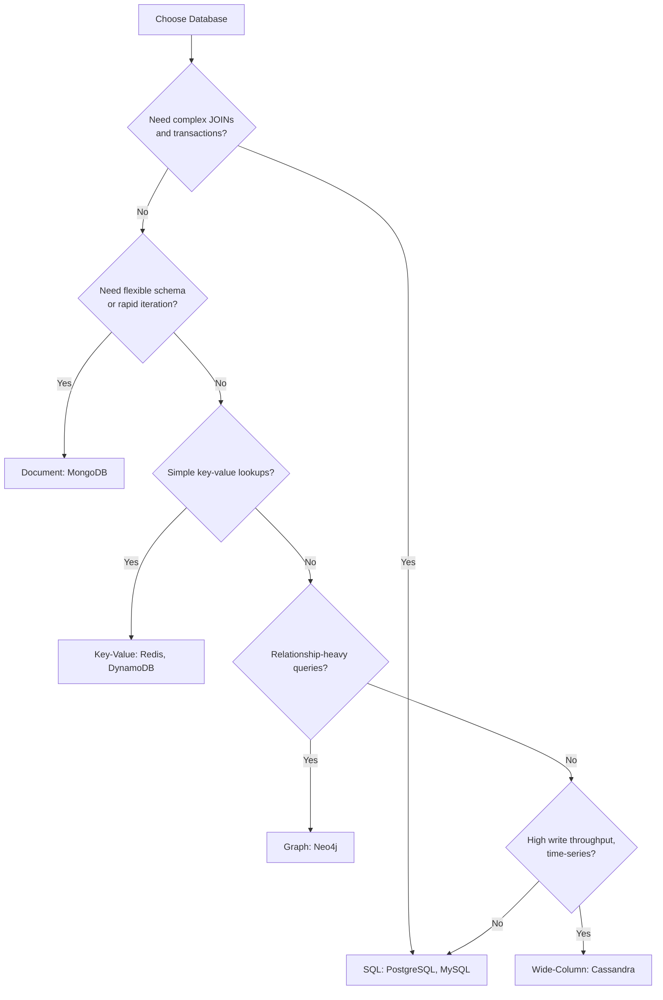
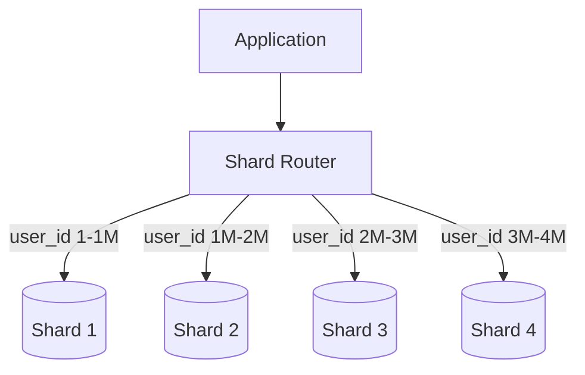
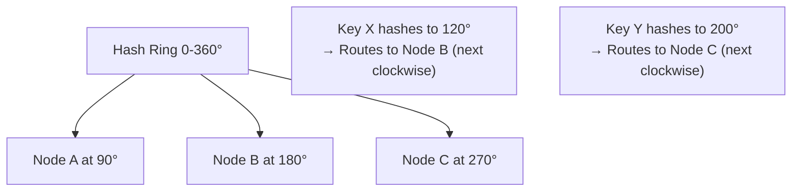
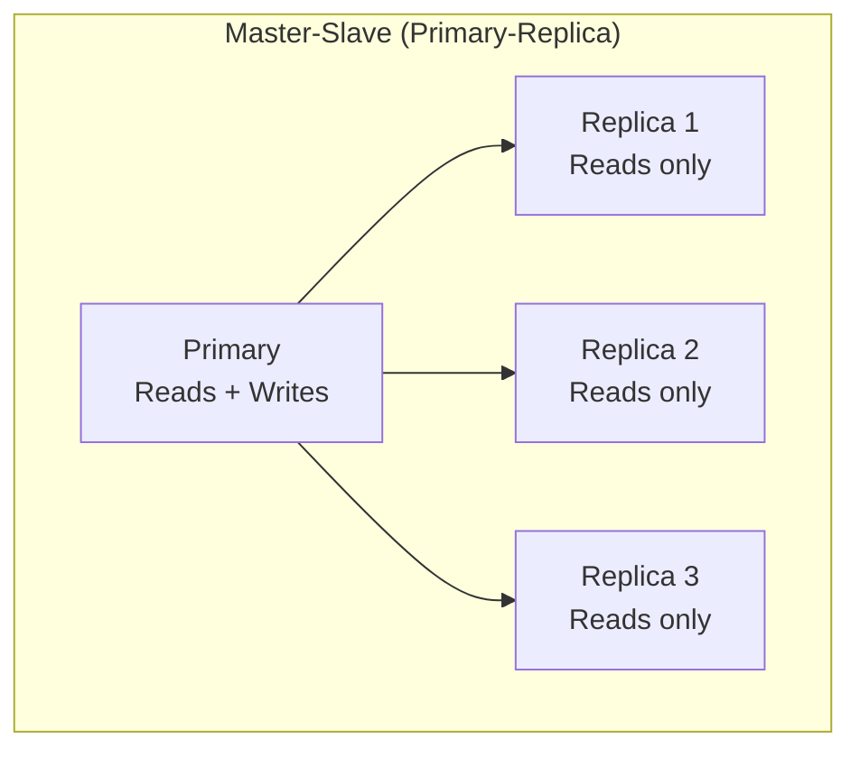
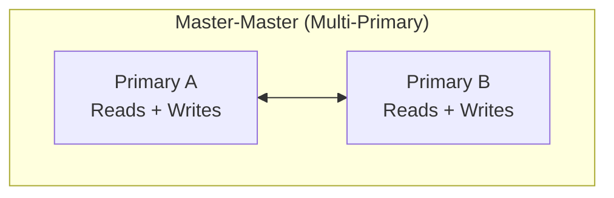
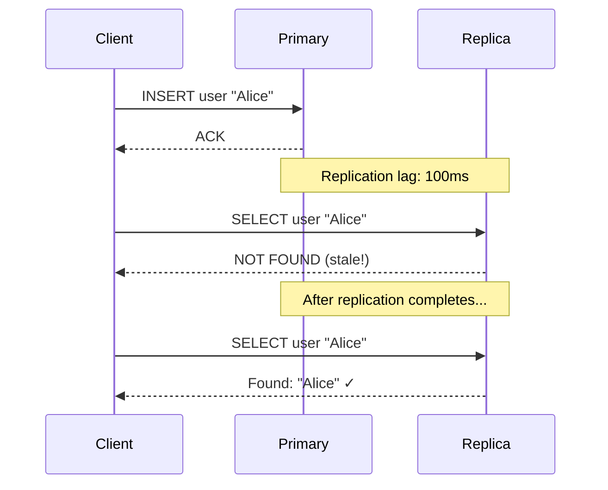

# Database Design

## What / Why

Database design decisions are among the most consequential in system architecture. They determine how data is stored, queried, scaled, and maintained. Changing your database strategy later is significantly harder than changing application code.

**The core questions:**

- SQL or NoSQL?
- How to handle growth? (Sharding, Replication)
- How to make queries fast? (Indexing)
- Normalize or denormalize?

---

## SQL vs NoSQL

### SQL (Relational Databases)

Structured data with predefined schemas, relationships enforced via foreign keys, and ACID transactions.

**Examples:** PostgreSQL, MySQL, Oracle, SQL Server

### NoSQL (Non-Relational Databases)

Flexible schemas, horizontal scalability, optimized for specific access patterns.

**Types of NoSQL:**

| Type            | Data Model                | Examples                    | Use Case                                          |
| --------------- | ------------------------- | --------------------------- | ------------------------------------------------- |
| **Document**    | JSON-like documents       | MongoDB, CouchDB, Firestore | Flexible schemas, nested data                     |
| **Key-Value**   | Simple key → value pairs  | Redis, DynamoDB, Riak       | Caching, sessions, simple lookups                 |
| **Wide-Column** | Rows with dynamic columns | Cassandra, HBase, ScyllaDB  | Time-series, IoT, high write throughput           |
| **Graph**       | Nodes + Edges             | Neo4j, Amazon Neptune       | Social networks, recommendations, fraud detection |

### Comparison Table

| Aspect             | SQL                                          | NoSQL                                          |
| ------------------ | -------------------------------------------- | ---------------------------------------------- |
| **Schema**         | Fixed, predefined (ALTER TABLE to change)    | Flexible, schema-on-read                       |
| **Scaling**        | Primarily vertical (sharding is complex)     | Designed for horizontal scaling                |
| **Relationships**  | JOINs, foreign keys, referential integrity   | Denormalized, embedded documents, no JOINs     |
| **Transactions**   | Full ACID                                    | Limited (some support per-document ACID)       |
| **Query Language** | SQL (standardized, powerful)                 | Varies per database (no standard)              |
| **Consistency**    | Strong by default                            | Tunable (often eventually consistent)          |
| **Best For**       | Complex queries, transactions, relationships | High throughput, flexible schemas, scalability |

### When to Choose Which



---

## Sharding (Horizontal Partitioning)

### What is Sharding?

Splitting a large database across multiple machines, each holding a **subset** of the data.

**Analogy:** Instead of one massive filing cabinet with all records, you have 4 cabinets — Cabinet 1 holds A-F, Cabinet 2 holds G-L, etc.



### Sharding Strategies

| Strategy            | How It Works                                  | Pros                       | Cons                                     |
| ------------------- | --------------------------------------------- | -------------------------- | ---------------------------------------- |
| **Range-based**     | Shard by value range (user_id 1-1M → Shard 1) | Simple, range queries work | Hot spots (new users all hit last shard) |
| **Hash-based**      | hash(shard_key) % num_shards                  | Even distribution          | Range queries span all shards            |
| **Geographic**      | Shard by region (US → Shard 1, EU → Shard 2)  | Data locality, compliance  | Uneven sizes, cross-region queries hard  |
| **Directory-based** | Lookup table maps keys to shards              | Flexible                   | Lookup table is bottleneck/SPOF          |

### Shard Key Selection

The shard key determines which shard a record lives on. Choose poorly and you get:

- **Hot spots** — One shard gets all the traffic
- **Cross-shard queries** — Queries spanning multiple shards are expensive

| Good Shard Keys               | Bad Shard Keys                                |
| ----------------------------- | --------------------------------------------- |
| user_id (evenly distributed)  | timestamp (all recent writes to one shard)    |
| order_id (random-ish)         | country (uneven sizes — US shard overwhelmed) |
| tenant_id (multi-tenant SaaS) | status (few values, massive hot spots)        |

### Consistent Hashing

Traditional `hash % N` breaks when adding/removing shards (all data must redistribute). Consistent hashing minimizes this:



When a new node is added, only keys between the new node and its predecessor are rehashed — not everything.

---

## Replication

### What is Replication?

Copying data across multiple database instances for availability, durability, and read scalability.

### Replication Topologies





### Comparison

| Topology            | Writes         | Reads                        | Consistency                            | Complexity | Use Case                                |
| ------------------- | -------------- | ---------------------------- | -------------------------------------- | ---------- | --------------------------------------- |
| **Primary-Replica** | Single primary | Distributed across replicas  | Strong (primary) / Eventual (replicas) | Low        | Most applications, read-heavy workloads |
| **Multi-Primary**   | Any node       | Any node                     | Conflict resolution needed             | High       | Multi-region writes, high availability  |
| **Read Replicas**   | Primary only   | Replicas handle read traffic | Replication lag (ms to seconds)        | Low        | Reporting, analytics, read scaling      |

### Replication Lag



**Solutions for replication lag:**

- Read-your-writes: After a write, read from primary for that user
- Causal consistency: Track which writes a read depends on
- Synchronous replication (sacrifices write performance)

---

## Indexing

### What is an Index?

A data structure that speeds up data retrieval at the cost of slower writes and extra storage.

**Analogy:** A book's index at the back lets you find topics without reading every page. The index takes up space and must be updated when content changes, but makes lookups instant.

### Index Types

| Type                         | How It Works                         | Best For                              | Example                            |
| ---------------------------- | ------------------------------------ | ------------------------------------- | ---------------------------------- |
| **B-Tree**                   | Balanced tree, sorted keys           | Range queries, equality, ORDER BY     | Default for most SQL DBs           |
| **Hash Index**               | Hash table, O(1) lookup              | Exact match (equality) only           | `WHERE email = 'x@y.com'`          |
| **Composite (Multi-column)** | Index on multiple columns together   | Queries filtering on multiple columns | `INDEX (country, city, zip)`       |
| **Covering Index**           | Index includes all needed columns    | Queries answered entirely from index  | No need to read actual table row   |
| **Full-Text Index**          | Inverted index of words              | Text search, LIKE queries             | `MATCH(title) AGAINST('database')` |
| **Partial Index**            | Index only rows matching a condition | Queries on subsets of data            | `WHERE status = 'active'`          |
| **GiST / GIN**               | Generalized search trees             | Geospatial, JSON, arrays              | PostGIS queries, JSONB search      |

### B-Tree Index Visualization

```
                    [50]
                   /    \
            [20, 35]    [65, 80]
           /   |   \    /  |   \
       [10,15] [25,30] [40,45] [55,60] [70,75] [85,90]
```

- Queries like `WHERE id > 30 AND id < 60` traverse the tree efficiently
- O(log n) lookup, range scans follow leaf pointers

### Composite Index — Column Order Matters

```sql
-- Index on (country, city, zip)
-- ✓ Uses index: WHERE country = 'US'
-- ✓ Uses index: WHERE country = 'US' AND city = 'NYC'
-- ✓ Uses index: WHERE country = 'US' AND city = 'NYC' AND zip = '10001'
-- ✗ Cannot use: WHERE city = 'NYC' (leftmost prefix rule violated)
-- ✗ Cannot use: WHERE zip = '10001'
```

> **Leftmost Prefix Rule:** A composite index `(A, B, C)` can serve queries on `(A)`, `(A, B)`, or `(A, B, C)` — but NOT `(B)`, `(C)`, or `(B, C)`.

---

## Normalization vs Denormalization

### Normalization

Organizing data to reduce redundancy and maintain integrity through separate related tables.

| Normal Form | Rule                               | Example                                               |
| ----------- | ---------------------------------- | ----------------------------------------------------- |
| **1NF**     | No repeating groups, atomic values | One phone number per cell (not comma-separated)       |
| **2NF**     | 1NF + no partial dependencies      | All non-key columns depend on entire primary key      |
| **3NF**     | 2NF + no transitive dependencies   | Non-key columns don't depend on other non-key columns |

### Denormalization

Intentionally adding redundancy to speed up reads by reducing JOINs.

### Comparison

| Aspect                | Normalized                    | Denormalized                      |
| --------------------- | ----------------------------- | --------------------------------- |
| **Redundancy**        | None (single source of truth) | Intentional duplication           |
| **Write Performance** | Fast (update one place)       | Slower (update multiple places)   |
| **Read Performance**  | Slower (JOINs required)       | Fast (data pre-combined)          |
| **Storage**           | Less                          | More                              |
| **Data Integrity**    | Easy to maintain              | Risk of inconsistency             |
| **Use Case**          | OLTP (transactions)           | OLAP (analytics), read-heavy apps |

### Example

**Normalized:**

```
Orders: [order_id, user_id, product_id, quantity]
Users:  [user_id, name, email]
Products: [product_id, name, price]

-- Query needs 3-way JOIN
SELECT o.*, u.name, p.price
FROM orders o JOIN users u JOIN products p ...
```

**Denormalized:**

```
Orders: [order_id, user_id, user_name, user_email, product_id, product_name, price, quantity]

-- Single table scan, no JOINs
SELECT * FROM orders WHERE order_id = 123
```

---

## Best Practices

1. **Start with SQL** unless you have a specific reason for NoSQL. PostgreSQL handles most workloads excellently.
2. **Shard only when necessary** — Vertical scaling + read replicas first. Sharding adds massive complexity.
3. **Choose shard keys carefully** — They're nearly impossible to change later. Optimize for your most common query pattern.
4. **Index your queries, not your tables** — Look at slow query logs, add indexes for actual access patterns.
5. **Don't over-index** — Each index slows writes and uses storage. Remove unused indexes.
6. **Normalize for writes, denormalize for reads** — Use both strategically. Materialized views can bridge the gap.
7. **Composite indexes: most selective column first** — Reduces the dataset fastest.
8. **Use read replicas before sharding** — They solve 80% of read scaling problems with minimal complexity.
9. **Monitor query performance** — Use EXPLAIN ANALYZE, slow query logs, and query planners.
10. **Plan for data growth** — Estimate data volume in 1-3 years. Design accordingly.

---

## Summary

- **SQL** for complex queries, transactions, relationships. **NoSQL** for scale, flexibility, specific access patterns.
- **Sharding** splits data across machines. Choose shard keys wisely — consistent hashing helps with rebalancing.
- **Replication** copies data for availability and read scaling. Primary-Replica is the standard pattern.
- **Indexing** makes reads fast at the cost of write performance. B-Tree for ranges, Hash for equality, Composite for multi-column queries.
- **Normalization** reduces redundancy (good for writes). **Denormalization** reduces JOINs (good for reads).
- The scaling ladder: Vertical scaling → Read replicas → Caching → Sharding. Only move to the next step when the current one isn't enough.
