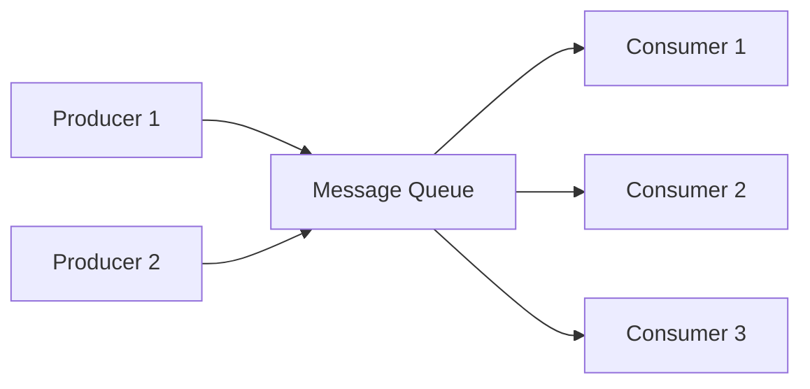
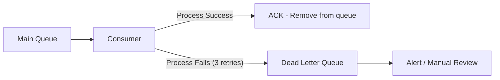
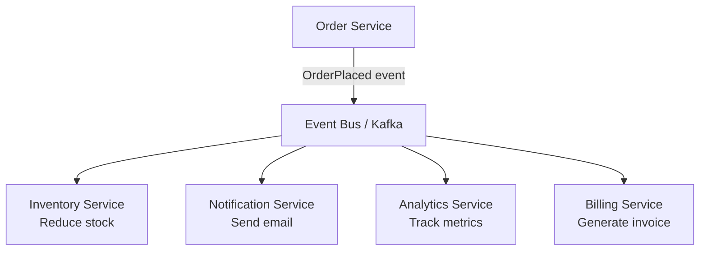
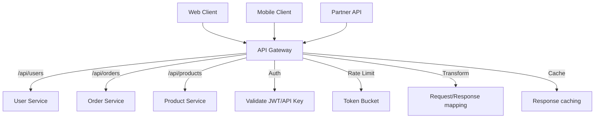
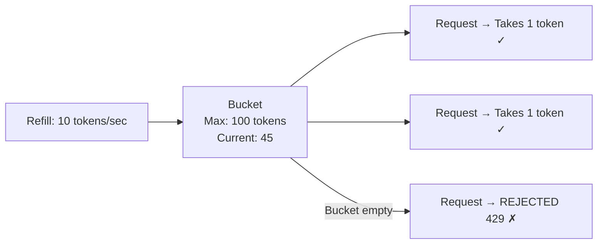
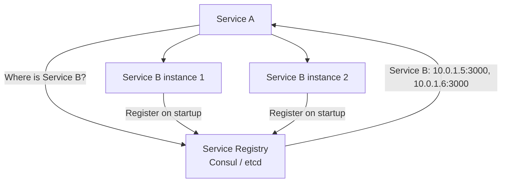
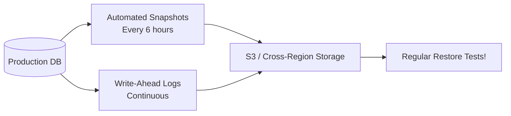

# Message Queues, Event-Driven Architecture, API Gateway & Rate Limiting

## What / Why

Modern distributed systems need ways to decouple services, handle asynchronous work, expose unified APIs, and protect against abuse. This covers the glue that holds microservices together.

**Analogy:**

- **Message Queue** = A post office. Senders drop letters, recipients pick them up when ready. Neither needs to be online at the same time.
- **API Gateway** = A hotel reception desk. Guests (clients) talk to one person who routes them to the right department, checks their ID, and controls how many can enter.

---

## Message Queues

### Core Concepts



| Concept                     | Definition                                           |
| --------------------------- | ---------------------------------------------------- |
| **Producer**                | Service that sends messages to the queue             |
| **Consumer**                | Service that reads and processes messages            |
| **Queue**                   | Buffer that holds messages until consumed            |
| **Topic**                   | Named channel for messages (pub/sub)                 |
| **Acknowledgment (ACK)**    | Consumer confirms message was processed              |
| **Dead Letter Queue (DLQ)** | Queue for messages that failed processing repeatedly |

### Why Use Message Queues?

| Benefit              | Explanation                                                          |
| -------------------- | -------------------------------------------------------------------- |
| **Decoupling**       | Producer doesn't need to know about consumers (or if they're online) |
| **Buffering**        | Absorb traffic spikes — consumers process at their own pace          |
| **Reliability**      | Messages persist until processed — survives consumer crashes         |
| **Async Processing** | Don't make the user wait for non-critical work (emails, analytics)   |
| **Load Leveling**    | Smooth out bursty traffic to protect downstream services             |

### Message Queue vs Event Streaming

| Aspect         | Message Queue (RabbitMQ, SQS)                           | Event Streaming (Kafka)                                |
| -------------- | ------------------------------------------------------- | ------------------------------------------------------ |
| **Model**      | Queue — message consumed once, then deleted             | Log — events retained, consumers track position        |
| **Delivery**   | Message delivered to ONE consumer (competing consumers) | Message delivered to ALL consumers in different groups |
| **Retention**  | Until consumed/ACKed                                    | Configurable retention (days/weeks/forever)            |
| **Replay**     | Cannot replay consumed messages                         | Can replay from any offset                             |
| **Ordering**   | Per-queue ordering                                      | Per-partition ordering                                 |
| **Use Case**   | Task distribution, work queues                          | Event sourcing, data pipelines, audit logs             |
| **Throughput** | Thousands/sec                                           | Millions/sec                                           |

### Kafka Architecture

```mermaid
graph TB
    P[Producers] --> T[Topic: "orders"]
    T --> PART0[Partition 0]
    T --> PART1[Partition 1]
    T --> PART2[Partition 2]

    PART0 --> CG1_C1[Consumer Group A<br/>Consumer 1]
    PART1 --> CG1_C2[Consumer Group A<br/>Consumer 2]
    PART2 --> CG1_C3[Consumer Group A<br/>Consumer 3]

    PART0 --> CG2[Consumer Group B<br/>All partitions]
    PART1 --> CG2
    PART2 --> CG2
```

### Dead Letter Queue (DLQ)



---

## Event-Driven Architecture

### Pattern



### Benefits

| Benefit            | Explanation                                   |
| ------------------ | --------------------------------------------- |
| **Loose coupling** | Services don't call each other directly       |
| **Extensibility**  | Add new consumers without modifying producers |
| **Resilience**     | One service down doesn't affect others        |
| **Scalability**    | Consumers scale independently                 |
| **Audit trail**    | Events = immutable log of what happened       |

### Event Sourcing vs Event-Driven

| Concept            | What It Is                                                                                        |
| ------------------ | ------------------------------------------------------------------------------------------------- |
| **Event-Driven**   | Services communicate via events (reaction pattern)                                                |
| **Event Sourcing** | Store state as sequence of events (instead of current state). Replay events to reconstruct state. |

---

## API Gateway

### What It Does



### API Gateway Responsibilities

| Responsibility           | What It Does                                                               |
| ------------------------ | -------------------------------------------------------------------------- |
| **Routing**              | Route `/api/users` to User Service, `/api/orders` to Order Service         |
| **Authentication**       | Validate JWTs, API keys, OAuth tokens at the edge                          |
| **Rate Limiting**        | Prevent abuse, enforce quotas per client/API key                           |
| **Request Aggregation**  | Combine multiple microservice calls into one client response (BFF pattern) |
| **Protocol Translation** | Accept REST from clients, forward as gRPC internally                       |
| **Caching**              | Cache frequent responses at gateway level                                  |
| **Load Balancing**       | Distribute to multiple instances of a service                              |
| **Monitoring**           | Centralized logging, metrics, tracing                                      |
| **Circuit Breaking**     | Stop forwarding to failing services                                        |

### API Gateway Tools

| Tool                  | Type                     | Best For                                |
| --------------------- | ------------------------ | --------------------------------------- |
| **Kong**              | Open-source / Enterprise | Plugin ecosystem, Lua extensibility     |
| **AWS API Gateway**   | Managed (Serverless)     | Lambda integration, AWS native          |
| **Nginx + OpenResty** | Self-managed             | High performance, custom Lua logic      |
| **Envoy**             | Service proxy            | Service mesh, gRPC, observability       |
| **Traefik**           | Self-managed             | Docker/K8s auto-discovery               |
| **Apigee**            | Enterprise managed       | API management, analytics, monetization |

---

## Rate Limiting

### Why Rate Limit?

- Prevent abuse and DDoS
- Ensure fair resource sharing
- Protect downstream services
- Enforce billing tiers (free: 100 req/hr, pro: 10,000 req/hr)

### Algorithms

| Algorithm                  | How It Works                                                          | Pros                       | Cons                                     |
| -------------------------- | --------------------------------------------------------------------- | -------------------------- | ---------------------------------------- |
| **Token Bucket**           | Bucket holds N tokens, refills at rate R. Each request takes a token. | Allows bursts, smooth rate | Burst can overwhelm downstream           |
| **Leaky Bucket**           | Requests enter bucket, drain at constant rate. Overflow rejected.     | Smooth output rate         | No burst allowance                       |
| **Fixed Window**           | Count requests per fixed time window (e.g., per minute)               | Simple                     | Burst at window boundaries (2x in 2s)    |
| **Sliding Window Log**     | Track timestamp of each request, count in sliding window              | Accurate                   | Memory intensive (stores all timestamps) |
| **Sliding Window Counter** | Weighted combination of current + previous window counts              | Memory efficient, smooth   | Approximation (not exact)                |

### Token Bucket Visualization



### Rate Limit Response Headers

```
HTTP/1.1 429 Too Many Requests
X-RateLimit-Limit: 100
X-RateLimit-Remaining: 0
X-RateLimit-Reset: 1672531200
Retry-After: 30
```

---

## Service Discovery

### The Problem

In dynamic environments (containers, auto-scaling), services move around — IP addresses change. How does Service A find Service B?

### Approaches

| Approach             | How It Works                                 | Example                                        |
| -------------------- | -------------------------------------------- | ---------------------------------------------- |
| **DNS-based**        | Services register DNS names, resolve via DNS | AWS Route53, CoreDNS                           |
| **Service Registry** | Central registry stores service locations    | Consul, Eureka, etcd                           |
| **Platform-native**  | Container orchestrator handles it            | Kubernetes Services, AWS ECS Service Discovery |
| **Sidecar Proxy**    | Each service has a proxy that routes traffic | Envoy (Istio service mesh)                     |



---

## Disaster Recovery & Backup

### Recovery Objectives

| Metric                             | Definition                      | Example                                          |
| ---------------------------------- | ------------------------------- | ------------------------------------------------ |
| **RPO** (Recovery Point Objective) | Max acceptable data loss (time) | RPO = 1 hour → can lose up to 1 hour of data     |
| **RTO** (Recovery Time Objective)  | Max acceptable downtime         | RTO = 15 min → must be back online in 15 minutes |

### Strategies (by cost/recovery speed)

| Strategy                     | RPO             | RTO       | Cost | Description                                     |
| ---------------------------- | --------------- | --------- | ---- | ----------------------------------------------- |
| **Backup & Restore**         | Hours           | Hours     | $    | Regular backups to S3, restore when needed      |
| **Pilot Light**              | Minutes         | 10-30 min | $$   | Core infra running, scale up on failure         |
| **Warm Standby**             | Seconds-Minutes | Minutes   | $$$  | Scaled-down copy always running                 |
| **Multi-Site Active-Active** | Near Zero       | Seconds   | $$$$ | Full duplicate in another region, traffic split |

### Backup Best Practices



---

## Best Practices

1. **Use async messaging for non-critical paths** — Email, analytics, notifications don't need synchronous responses.
2. **Idempotent consumers** — Messages may be delivered more than once. Design consumers to handle duplicates safely.
3. **Always have a DLQ** — Failed messages need somewhere to go for investigation. Don't lose them silently.
4. **API Gateway as single entry point** — Centralize cross-cutting concerns (auth, rate limiting, logging).
5. **Rate limit at multiple levels** — Per IP, per user, per API key, per endpoint.
6. **Return 429 with Retry-After** — Be a good API citizen. Tell clients when to retry.
7. **Test your disaster recovery** — Untested backups are worthless. Schedule regular restore drills.
8. **Use Kafka for event sourcing, RabbitMQ for task queues** — Different tools for different patterns.
9. **Service discovery > hardcoded URLs** — Services must be discoverable, not configured with static IPs.
10. **Design for at-least-once delivery** — Exactly-once is extremely hard. Build idempotent systems instead.

---

## Summary

- **Message Queues** (RabbitMQ, SQS) decouple services and buffer work. **Event Streaming** (Kafka) provides replay and multi-consumer patterns.
- **Event-Driven Architecture** enables loose coupling and extensibility — services react to events without direct dependencies.
- **API Gateway** is the front door: routing, auth, rate limiting, aggregation, and monitoring in one place.
- **Rate Limiting** protects systems from abuse. Token bucket is the most common algorithm. Always return 429 + Retry-After.
- **Service Discovery** solves the "how do I find you?" problem in dynamic environments.
- **Disaster Recovery**: Define RPO/RTO, implement appropriate strategy, and **test your backups regularly**.
