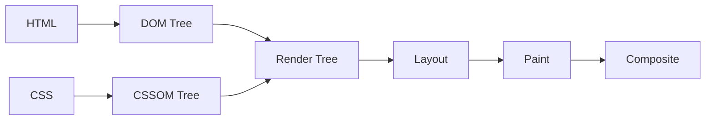
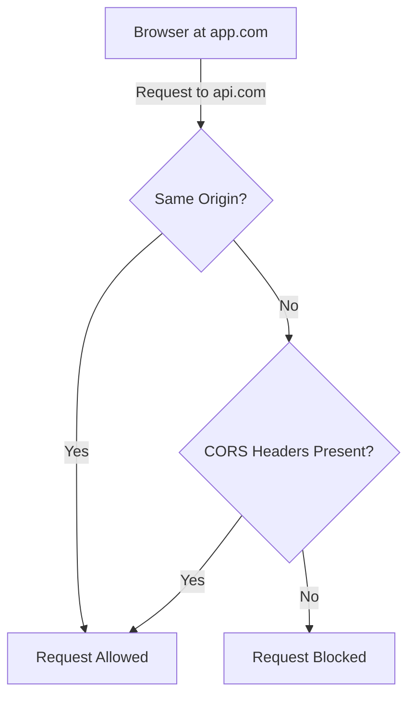
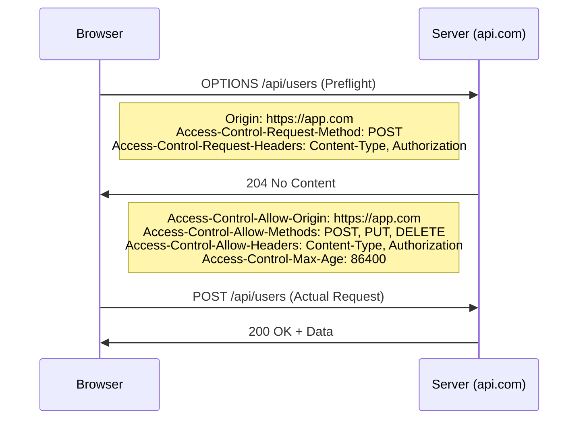
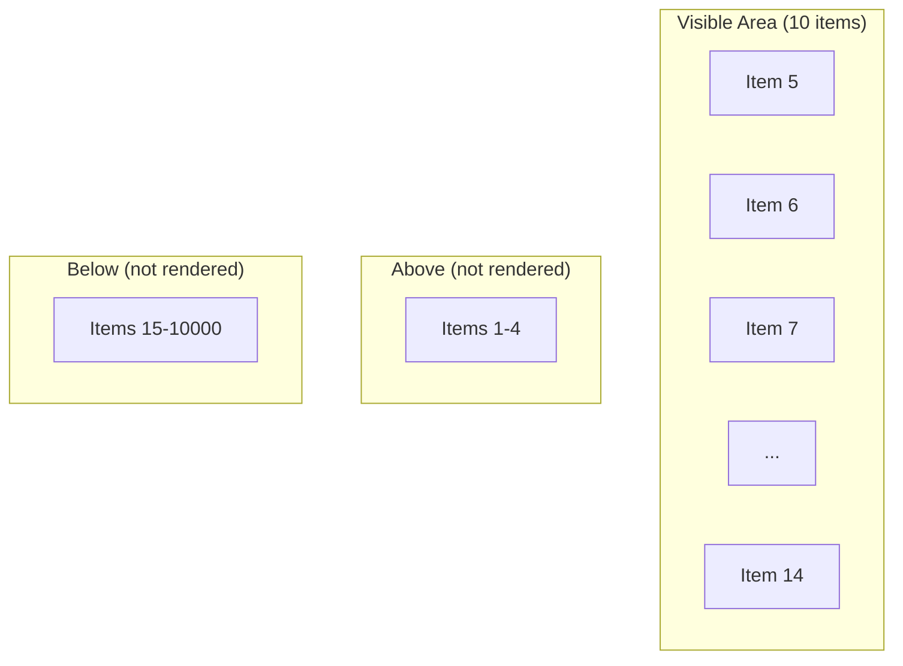

# Web Performance Optimization

## Why Performance Matters

Every 100ms of latency costs Amazon 1% in sales. Google found that a 0.5-second delay in search results caused a 20% drop in traffic. Performance is not a luxury — it is a feature.

**Analogy:** A fast website is like a well-organized warehouse. If every item is in the right place, workers find things instantly. If the warehouse is cluttered, even finding one box takes forever.

---

## Critical Rendering Path (CRP)

The Critical Rendering Path is the sequence of steps the browser takes to convert HTML, CSS, and JavaScript into pixels on the screen.



### Step 1: DOM Construction

The browser parses HTML and builds the **Document Object Model** — a tree of every element.

```html
<html>
  <body>
    <h1>Hello</h1>
    <p>World</p>
  </body>
</html>
```

```
Document
 └── html
      └── body
           ├── h1 → "Hello"
           └── p  → "World"
```

**Blocking:** Scripts without `async` or `defer` block DOM construction.

### Step 2: CSSOM Construction

The browser parses all CSS (inline, external, stylesheets) and builds the **CSS Object Model**.

```css
body {
  font-size: 16px;
}
h1 {
  color: blue;
}
p {
  display: none;
}
```

**Blocking:** CSS is render-blocking. The browser will not paint anything until all CSS is parsed.

### Step 3: Render Tree

The browser combines DOM + CSSOM into a **Render Tree** — only visible elements are included.

```
Render Tree:
 └── body (font-size: 16px)
      └── h1 (color: blue) → "Hello"
      // <p> is excluded (display: none)
```

### Step 4: Layout (Reflow)

The browser calculates the exact position and size of each element on the page.

### Step 5: Paint & Composite

The browser draws pixels to the screen and composites layers together.

### Optimizing the CRP

```html
<!-- Move CSS to <head> — unblock rendering early -->
<link rel="stylesheet" href="critical.css" />

<!-- Defer non-critical CSS -->
<link
  rel="stylesheet"
  href="non-critical.css"
  media="print"
  onload="this.media='all'"
/>

<!-- Defer scripts — don't block DOM parsing -->
<script src="app.js" defer></script>

<!-- Async for independent scripts (analytics, ads) -->
<script src="analytics.js" async></script>
```

| Attribute | DOM Parsing    | Execution Order             | Use Case                        |
| --------- | -------------- | --------------------------- | ------------------------------- |
| (none)    | Blocks         | In order                    | Legacy scripts                  |
| `async`   | Does not block | When downloaded (any order) | Independent scripts (analytics) |
| `defer`   | Does not block | After DOM parse, in order   | App scripts that need DOM       |

---

## Resource Prioritization

### Preload

Tells the browser: "You will need this resource very soon — start downloading now."

```html
<!-- Preload critical font -->
<link
  rel="preload"
  href="/fonts/Inter.woff2"
  as="font"
  type="font/woff2"
  crossorigin
/>

<!-- Preload hero image -->
<link rel="preload" href="/images/hero.webp" as="image" />

<!-- Preload critical JS module -->
<link rel="preload" href="/js/critical.js" as="script" />
```

**Use for:** Fonts, hero images, above-the-fold resources that the parser discovers late.

### Prefetch

Tells the browser: "You might need this on the next page — download it when idle."

```html
<!-- Prefetch next page -->
<link rel="prefetch" href="/dashboard" />

<!-- Prefetch data for likely navigation -->
<link rel="prefetch" href="/api/user/profile" as="fetch" />
```

**Use for:** Resources for likely next navigations (e.g., prefetch dashboard after login page).

### Preconnect

Tells the browser: "Establish a connection to this origin early" (DNS + TCP + TLS handshake).

```html
<!-- Preconnect to API server -->
<link rel="preconnect" href="https://api.example.com" />

<!-- Preconnect to CDN -->
<link rel="preconnect" href="https://cdn.example.com" crossorigin />

<!-- DNS prefetch as fallback -->
<link rel="dns-prefetch" href="https://analytics.example.com" />
```

**Use for:** Third-party origins you know you will call (APIs, CDNs, font providers).

### Priority Hints (Fetch Priority API)

```html
<!-- High priority — hero image -->


<!-- Low priority — below the fold -->


<!-- High priority fetch -->
<script>
  fetch("/api/critical-data", { priority: "high" });
</script>
```

---

## CORS & Preflight Requests

### What is CORS?

Cross-Origin Resource Sharing (CORS) is a browser security mechanism that blocks requests to a different origin unless the server explicitly allows it.

**Analogy:** CORS is like a building security guard. Even if you have the right key (credentials), you cannot enter unless the building has your name on the approved visitors list.



### Simple vs Preflight Requests

**Simple requests** (no preflight):

- Methods: `GET`, `HEAD`, `POST`
- Headers: Only safe-listed (Accept, Content-Type with form data)
- Content-Type: `text/plain`, `multipart/form-data`, `application/x-www-form-urlencoded`

**Preflight triggers** (sends OPTIONS first):

- Methods: `PUT`, `DELETE`, `PATCH`
- Custom headers: `Authorization`, `X-Custom-Header`
- Content-Type: `application/json`

### Preflight Flow



### Server-Side CORS Configuration (Express)

```javascript
const cors = require("cors");

app.use(
  cors({
    origin: ["https://app.example.com", "https://admin.example.com"],
    methods: ["GET", "POST", "PUT", "DELETE"],
    allowedHeaders: ["Content-Type", "Authorization"],
    credentials: true, // Allow cookies
    maxAge: 86400, // Cache preflight for 24 hours
  }),
);
```

### Reducing Preflight Overhead

- Set `Access-Control-Max-Age` to cache preflight results.
- Use simple requests where possible (avoid custom headers if not needed).
- Proxy API calls through the same origin to avoid CORS entirely.

---

## Windowing / List Virtualization

When rendering thousands of items in a list, the browser struggles because it creates DOM nodes for every single item.

**Analogy:** Imagine a library with 100,000 books. Instead of putting all books on display simultaneously, you only show the books on the shelf the visitor is currently looking at.

### The Problem

```javascript
// Rendering 10,000 items = 10,000 DOM nodes = browser freezes
{
  items.map((item) => <div key={item.id}>{item.name}</div>);
}
```

### The Solution: Virtualization

Only render items that are currently visible in the viewport.



### React Implementation with react-window

```jsx
import { FixedSizeList } from "react-window";

function VirtualizedList({ items }) {
  const Row = ({ index, style }) => (
    <div style={style} className="list-item">
      {items[index].name}
    </div>
  );

  return (
    <FixedSizeList
      height={600} // Viewport height
      itemCount={items.length} // Total items (10,000)
      itemSize={50} // Each row height
      width="100%"
    >
      {Row}
    </FixedSizeList>
  );
}
```

### Variable Size Lists

```jsx
import { VariableSizeList } from "react-window";

function DynamicList({ items }) {
  const getItemSize = (index) => (items[index].isExpanded ? 120 : 50);

  return (
    <VariableSizeList
      height={600}
      itemCount={items.length}
      itemSize={getItemSize}
      width="100%"
    >
      {({ index, style }) => <div style={style}>{items[index].content}</div>}
    </VariableSizeList>
  );
}
```

### When to Virtualize

| List Size       | Recommendation                                |
| --------------- | --------------------------------------------- |
| < 100 items     | No virtualization needed                      |
| 100–1,000 items | Consider it if items are complex              |
| 1,000+ items    | Definitely virtualize                         |
| 10,000+ items   | Mandatory — add pagination or infinite scroll |

---

## Image Optimization & Lazy Loading

Images account for ~50% of a typical web page's weight. Optimizing them is the single biggest performance win.

### Modern Image Formats

| Format | Compression | Transparency | Animation | Browser Support |
| ------ | ----------- | ------------ | --------- | --------------- |
| JPEG   | Lossy       | No           | No        | Universal       |
| PNG    | Lossless    | Yes          | No        | Universal       |
| WebP   | Both        | Yes          | Yes       | 97%+            |
| AVIF   | Both (best) | Yes          | Yes       | ~90%            |
| SVG    | Vector      | Yes          | Yes       | Universal       |

### Responsive Images

```html
<!-- Let the browser choose the best size -->


<!-- Art direction with <picture> -->
<picture>
  <source media="(max-width: 768px)" srcset="hero-mobile.webp" />
  <source media="(min-width: 769px)" srcset="hero-desktop.webp" />
  
</picture>
```

### Lazy Loading

Only load images when they enter (or approach) the viewport.

```html
<!-- Native lazy loading (simplest) -->


<!-- Never lazy-load above-the-fold images -->

```

#### Intersection Observer (Custom Control)

```javascript
const observer = new IntersectionObserver(
  (entries) => {
    entries.forEach((entry) => {
      if (entry.isIntersecting) {
        const img = entry.target;
        img.src = img.dataset.src; // Load actual image
        img.classList.add("loaded");
        observer.unobserve(img); // Stop watching
      }
    });
  },
  {
    rootMargin: "200px", // Start loading 200px before viewport
  },
);

document.querySelectorAll("img[data-src]").forEach((img) => {
  observer.observe(img);
});
```

### Image Optimization Checklist

- Use WebP/AVIF with JPEG/PNG fallback.
- Serve responsive sizes (do not send 4K images to mobile).
- Lazy load everything below the fold.
- Set explicit `width` and `height` to prevent layout shifts.
- Use CDN with automatic format conversion.
- Compress: aim for 80-85% quality (visually indistinguishable).

---

## Core Web Vitals

Core Web Vitals are Google's metrics for measuring real-world user experience. They directly impact SEO rankings.


### Largest Contentful Paint (LCP)

**What:** Time until the largest visible element (hero image, heading, video) finishes rendering.

**Target:** < 2.5 seconds

| Rating            | Time        |
| ----------------- | ----------- |
| Good              | ≤ 2.5s      |
| Needs Improvement | 2.5s – 4.0s |
| Poor              | > 4.0s      |

**Common causes of poor LCP:**

- Slow server response (TTFB)
- Render-blocking CSS/JS
- Large unoptimized images
- Client-side rendering (CSR) without SSR

**Fixes:**

```html
<!-- Preload LCP image -->
<link rel="preload" href="/hero.webp" as="image" />

<!-- Preconnect to image CDN -->
<link rel="preconnect" href="https://images.cdn.com" />

<!-- Use priority hint -->

```

### First Input Delay (FID) / Interaction to Next Paint (INP)

**What:** Time from when a user first interacts (click, tap, keypress) until the browser responds.

**Target:** < 100ms (FID) / < 200ms (INP)

| Rating            | Time          |
| ----------------- | ------------- |
| Good              | ≤ 100ms       |
| Needs Improvement | 100ms – 300ms |
| Poor              | > 300ms       |

**Common causes of poor FID/INP:**

- Heavy JavaScript blocking the main thread
- Long tasks (> 50ms)
- Large bundle sizes
- Excessive third-party scripts

**Fixes:**

```javascript
// Break long tasks into smaller chunks
function processLargeArray(items) {
  const CHUNK_SIZE = 100;
  let index = 0;

  function processChunk() {
    const end = Math.min(index + CHUNK_SIZE, items.length);
    for (; index < end; index++) {
      processItem(items[index]);
    }
    if (index < items.length) {
      // Yield to main thread between chunks
      setTimeout(processChunk, 0);
    }
  }
  processChunk();
}

// Or use requestIdleCallback for non-urgent work
requestIdleCallback((deadline) => {
  while (deadline.timeRemaining() > 0 && tasks.length > 0) {
    performTask(tasks.shift());
  }
});
```

### Cumulative Layout Shift (CLS)

**What:** Measures unexpected layout shifts — elements moving around while the page loads.

**Target:** < 0.1

| Rating            | Score      |
| ----------------- | ---------- |
| Good              | ≤ 0.1      |
| Needs Improvement | 0.1 – 0.25 |
| Poor              | > 0.25     |

**Common causes of poor CLS:**

- Images without dimensions
- Ads/embeds without reserved space
- Web fonts causing FOUT/FOIT
- Dynamically injected content above existing content

**Fixes:**

```html
<!-- Always set width and height on images -->


<!-- Reserve space for ads -->
<div style="min-height: 250px;">
  <!-- Ad loads here -->
</div>

<!-- Prevent font swap layout shift -->
<style>
  @font-face {
    font-family: "Inter";
    src: url("/fonts/Inter.woff2") format("woff2");
    font-display: swap; /* Show fallback immediately, swap when loaded */
  }
</style>
```

### Measuring Core Web Vitals

```javascript
import { onLCP, onFID, onCLS } from "web-vitals";

onLCP((metric) => {
  console.log("LCP:", metric.value, "ms");
  sendToAnalytics({ name: "LCP", value: metric.value });
});

onFID((metric) => {
  console.log("FID:", metric.value, "ms");
  sendToAnalytics({ name: "FID", value: metric.value });
});

onCLS((metric) => {
  console.log("CLS:", metric.value);
  sendToAnalytics({ name: "CLS", value: metric.value });
});
```

---

## Best Practices

1. **Measure before optimizing** — use Lighthouse, WebPageTest, and Chrome DevTools Performance panel. Do not guess.
2. **Optimize the Critical Rendering Path** — minimize render-blocking resources, inline critical CSS, defer non-essential JS.
3. **Lazy load everything below the fold** — images, components, routes. Only load what the user can see.
4. **Use modern image formats** — WebP and AVIF save 30-50% over JPEG/PNG with no visible quality loss.
5. **Virtualize long lists** — never render 1000+ DOM nodes when only 20 are visible.
6. **Cache preflight responses** — set `Access-Control-Max-Age` to avoid redundant OPTIONS requests.
7. **Monitor Core Web Vitals in production** — lab data (Lighthouse) differs from real-user metrics. Use RUM (Real User Monitoring).
8. **Code split aggressively** — use dynamic `import()` to load routes and heavy components on demand.

---

## Common Mistakes

| Mistake                         | Why It Is Wrong                            | Fix                                            |
| ------------------------------- | ------------------------------------------ | ---------------------------------------------- |
| Lazy loading hero/LCP image     | Delays the most important content          | Use `loading="eager"` + `fetchpriority="high"` |
| Not setting image dimensions    | Causes layout shifts (CLS)                 | Always set `width` and `height` attributes     |
| Loading all JS upfront          | Blocks interactivity (FID)                 | Code-split, defer, use dynamic imports         |
| Preloading everything           | Competes for bandwidth, nothing loads fast | Preload only 2-3 critical resources            |
| Ignoring CORS preflight caching | Every API call triggers 2 requests         | Set `Access-Control-Max-Age` header            |
| Using CSS `@import`             | Creates sequential download chains         | Use `<link>` tags (parallel downloads)         |
| Rendering 10,000 items          | Freezes the browser                        | Virtualize with react-window or similar        |

---

## Summary

- **Critical Rendering Path (CRP):** The browser builds DOM → CSSOM → Render Tree → Layout → Paint. Block as little as possible.
- **Resource hints** (`preload`, `prefetch`, `preconnect`) give the browser advance knowledge about what to fetch and when.
- **CORS** protects users from cross-origin attacks. Preflight (OPTIONS) requests add latency — cache them with `Max-Age`.
- **Virtualization** renders only visible list items, turning O(n) DOM nodes into O(visible) — critical for large datasets.
- **Image optimization** (modern formats, responsive sizes, lazy loading) is the single biggest performance win on most pages.
- **Core Web Vitals** (LCP, FID/INP, CLS) measure real user experience and impact SEO. Optimize for all three.
