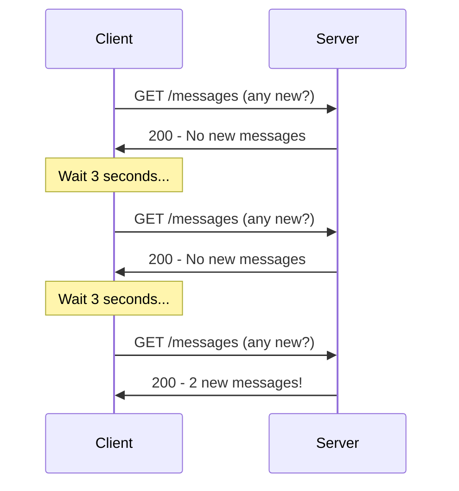
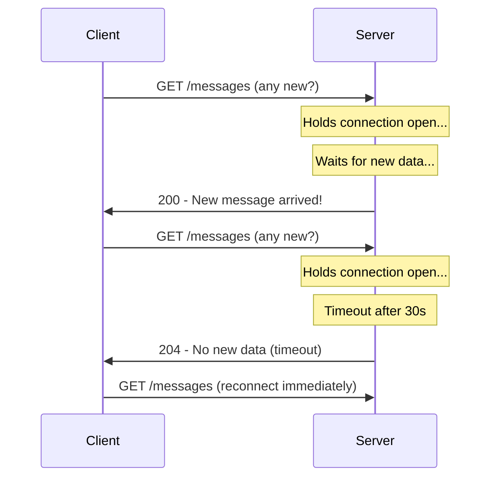
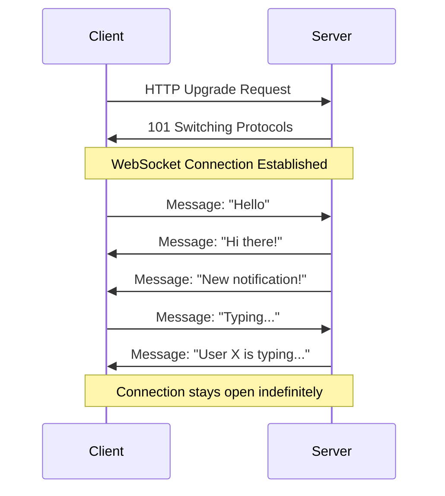
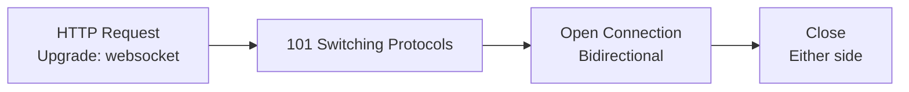
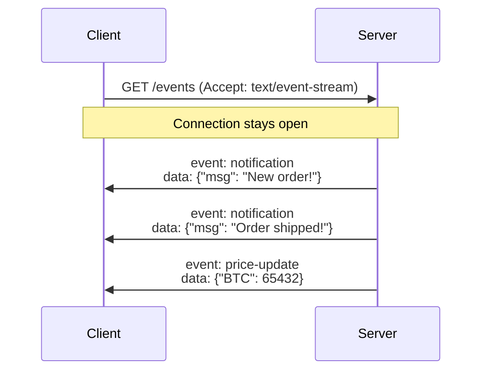
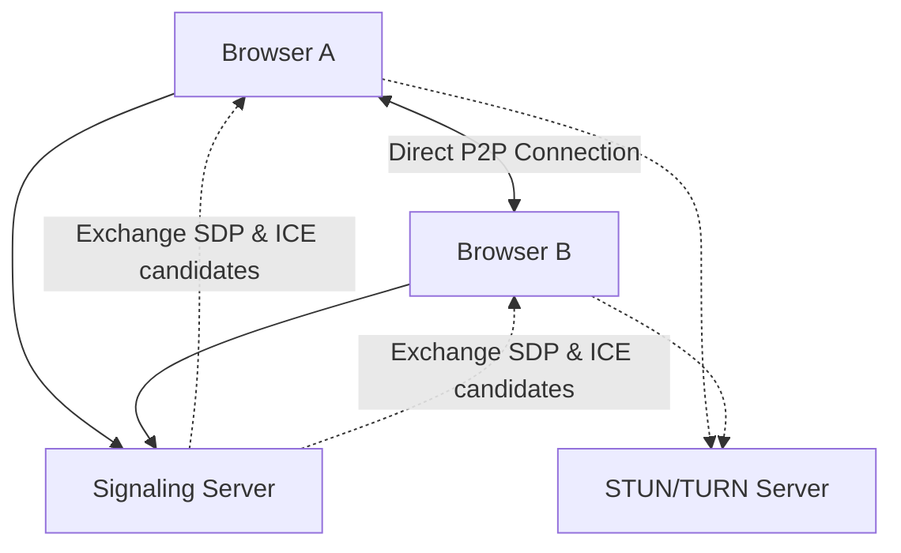
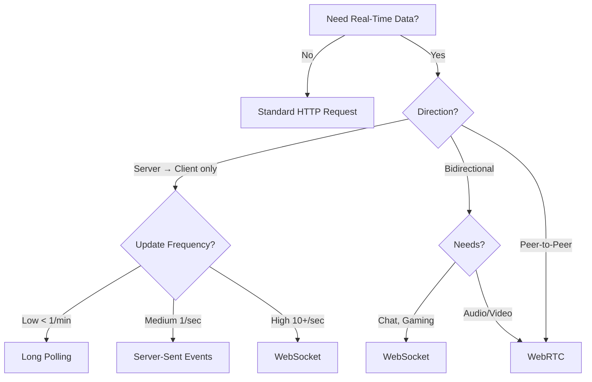

# Real-Time Communication

## Why Real-Time?

Traditional HTTP follows a request-response model — the client asks, the server answers. But many modern applications need data pushed to the client the instant it changes: chat messages, stock tickers, live scores, collaborative editing.

**Analogy:** HTTP is like sending a letter and waiting for a reply. Real-time communication is like having a phone call — both sides can talk at any time.

---

## HTTP Polling

The simplest approach: the client repeatedly asks the server "anything new?" at regular intervals.



### Implementation

```javascript
// Simple polling
function pollForMessages() {
  setInterval(async () => {
    const response = await fetch("/api/messages?since=" + lastTimestamp);
    const messages = await response.json();

    if (messages.length > 0) {
      messages.forEach((msg) => displayMessage(msg));
      lastTimestamp = messages[messages.length - 1].timestamp;
    }
  }, 3000); // Poll every 3 seconds
}
```

### Pros & Cons

| Pros                       | Cons                            |
| -------------------------- | ------------------------------- |
| Simple to implement        | Wasteful (many empty responses) |
| Works with any HTTP server | Latency = polling interval      |
| No special infrastructure  | High server load at scale       |
| Stateless                  | Not truly real-time             |

**Use when:** Updates are infrequent, simplicity matters, infrastructure is limited.

---

## Long Polling

An improvement over polling: the server holds the connection open until it has new data (or a timeout occurs).



### Implementation

```javascript
// Client-side long polling
async function longPoll() {
  while (true) {
    try {
      const response = await fetch("/api/messages/subscribe", {
        signal: AbortSignal.timeout(35000), // Slightly longer than server timeout
      });

      if (response.status === 200) {
        const messages = await response.json();
        messages.forEach((msg) => displayMessage(msg));
      }
      // Immediately reconnect for next update
    } catch (error) {
      // Wait before retrying on error
      await new Promise((resolve) => setTimeout(resolve, 3000));
    }
  }
}
```

```javascript
// Server-side (Express)
app.get("/api/messages/subscribe", (req, res) => {
  const clientId = req.query.clientId;

  // Register this client as waiting
  const listener = (message) => {
    res.json([message]);
    cleanup();
  };

  messageEmitter.on("new-message", listener);

  // Timeout after 30 seconds
  const timeout = setTimeout(() => {
    res.status(204).end();
    cleanup();
  }, 30000);

  function cleanup() {
    clearTimeout(timeout);
    messageEmitter.off("new-message", listener);
  }

  // Handle client disconnect
  req.on("close", cleanup);
});
```

### Pros & Cons

| Pros                               | Cons                               |
| ---------------------------------- | ---------------------------------- |
| Near real-time delivery            | Server holds many open connections |
| Fewer wasted requests than polling | Connection overhead on reconnect   |
| Works through firewalls/proxies    | Not truly bidirectional            |
| Simple HTTP semantics              | Timeout management complexity      |

**Use when:** Near real-time needed, WebSocket infrastructure not available, moderate scale.

---

## WebSockets

WebSockets provide a persistent, full-duplex (bidirectional) connection between client and server over a single TCP connection.

**Analogy:** A phone call — once connected, both sides can talk at any time without hanging up and redialing.



### Connection Lifecycle



### Client Implementation

```javascript
// Establishing a WebSocket connection
const ws = new WebSocket("wss://api.example.com/ws");

// Connection opened
ws.addEventListener("open", () => {
  console.log("Connected to server");
  ws.send(JSON.stringify({ type: "join", room: "general" }));
});

// Receiving messages
ws.addEventListener("message", (event) => {
  const data = JSON.parse(event.data);

  switch (data.type) {
    case "chat":
      displayMessage(data.content);
      break;
    case "typing":
      showTypingIndicator(data.user);
      break;
    case "presence":
      updateOnlineUsers(data.users);
      break;
  }
});

// Connection closed
ws.addEventListener("close", (event) => {
  console.log(`Disconnected: ${event.code} - ${event.reason}`);
  // Implement reconnection logic
  setTimeout(connect, 3000);
});

// Error handling
ws.addEventListener("error", (error) => {
  console.error("WebSocket error:", error);
});

// Sending messages
function sendMessage(content) {
  if (ws.readyState === WebSocket.OPEN) {
    ws.send(JSON.stringify({ type: "chat", content }));
  }
}
```

### Server Implementation (Node.js with ws library)

```javascript
const WebSocket = require("ws");
const wss = new WebSocket.Server({ port: 8080 });

const rooms = new Map(); // room -> Set of clients

wss.on("connection", (ws, req) => {
  console.log("New client connected");

  ws.on("message", (data) => {
    const message = JSON.parse(data);

    switch (message.type) {
      case "join":
        joinRoom(ws, message.room);
        break;
      case "chat":
        broadcastToRoom(ws.room, {
          type: "chat",
          user: ws.userId,
          content: message.content,
          timestamp: Date.now(),
        });
        break;
    }
  });

  ws.on("close", () => {
    leaveRoom(ws);
  });

  // Heartbeat to detect dead connections
  ws.isAlive = true;
  ws.on("pong", () => {
    ws.isAlive = true;
  });
});

// Heartbeat interval
setInterval(() => {
  wss.clients.forEach((ws) => {
    if (!ws.isAlive) return ws.terminate();
    ws.isAlive = false;
    ws.ping();
  });
}, 30000);

function broadcastToRoom(room, message) {
  const clients = rooms.get(room) || new Set();
  const payload = JSON.stringify(message);
  clients.forEach((client) => {
    if (client.readyState === WebSocket.OPEN) {
      client.send(payload);
    }
  });
}
```

### Reconnection with Exponential Backoff

```javascript
class ReconnectingWebSocket {
  constructor(url) {
    this.url = url;
    this.retries = 0;
    this.maxRetries = 10;
    this.connect();
  }

  connect() {
    this.ws = new WebSocket(this.url);

    this.ws.onopen = () => {
      this.retries = 0; // Reset on successful connection
      console.log("Connected");
    };

    this.ws.onclose = () => {
      if (this.retries < this.maxRetries) {
        const delay = Math.min(1000 * 2 ** this.retries, 30000); // Max 30s
        console.log(`Reconnecting in ${delay}ms...`);
        setTimeout(() => this.connect(), delay);
        this.retries++;
      }
    };

    this.ws.onmessage = (event) => {
      this.handleMessage(JSON.parse(event.data));
    };
  }

  send(data) {
    if (this.ws.readyState === WebSocket.OPEN) {
      this.ws.send(JSON.stringify(data));
    }
  }
}
```

### Pros & Cons

| Pros                              | Cons                                 |
| --------------------------------- | ------------------------------------ |
| True bidirectional communication  | More complex infrastructure          |
| Low latency (no HTTP overhead)    | Stateful — harder to scale           |
| Efficient (single TCP connection) | Not cacheable                        |
| Native browser support            | Firewalls/proxies can interfere      |
| Event-driven                      | Need heartbeats for dead connections |

**Use when:** Chat, gaming, collaborative editing, live trading — anywhere bidirectional, low-latency communication is needed.

---

## Server-Sent Events (SSE)

SSE provides a one-way channel from server to client over a standard HTTP connection. The server pushes updates; the client only listens.

**Analogy:** A radio broadcast — the station sends, you listen. If you want to talk back, you use a different channel (regular HTTP request).



### Client Implementation

```javascript
const eventSource = new EventSource("/api/events");

// Default "message" event
eventSource.onmessage = (event) => {
  const data = JSON.parse(event.data);
  console.log("Message:", data);
};

// Named events
eventSource.addEventListener("notification", (event) => {
  const data = JSON.parse(event.data);
  showNotification(data.title, data.body);
});

eventSource.addEventListener("price-update", (event) => {
  const data = JSON.parse(event.data);
  updatePriceDisplay(data);
});

// Error handling (auto-reconnects by default!)
eventSource.onerror = (error) => {
  console.error("SSE error:", error);
  if (eventSource.readyState === EventSource.CLOSED) {
    console.log("Connection closed permanently");
  }
};

// Close when done
eventSource.close();
```

### Server Implementation (Express)

```javascript
app.get("/api/events", (req, res) => {
  // Set SSE headers
  res.writeHead(200, {
    "Content-Type": "text/event-stream",
    "Cache-Control": "no-cache",
    Connection: "keep-alive",
    "X-Accel-Buffering": "no", // Disable nginx buffering
  });

  // Send initial connection event
  res.write('event: connected\ndata: {"status": "ok"}\n\n');

  // Send periodic updates
  const interval = setInterval(() => {
    const data = JSON.stringify({ time: new Date().toISOString() });
    res.write(`event: heartbeat\ndata: ${data}\n\n`);
  }, 15000);

  // Listen for new notifications
  const listener = (notification) => {
    res.write(`event: notification\ndata: ${JSON.stringify(notification)}\n\n`);
  };
  notificationEmitter.on("new", listener);

  // Cleanup on disconnect
  req.on("close", () => {
    clearInterval(interval);
    notificationEmitter.off("new", listener);
  });
});
```

### SSE Protocol Format

```
event: notification
data: {"title": "New message", "body": "Hello!"}
id: 12345
retry: 5000

event: price-update
data: {"symbol": "AAPL", "price": 178.50}
id: 12346

```

- `event:` — Named event type (optional, defaults to "message").
- `data:` — Payload (can span multiple lines).
- `id:` — Event ID (client sends `Last-Event-ID` on reconnect).
- `retry:` — Reconnection delay in milliseconds.

### Auto-Reconnection with Last-Event-ID

SSE automatically reconnects on connection loss and sends the last received event ID:

```
// Client reconnects with:
GET /api/events
Last-Event-ID: 12345

// Server can resume from where client left off
```

### Pros & Cons

| Pros                            | Cons                                                     |
| ------------------------------- | -------------------------------------------------------- |
| Simple — standard HTTP          | One-way only (server → client)                           |
| Auto-reconnects natively        | Limited to ~6 connections per domain (HTTP/1.1)          |
| Event IDs for resume            | Text-only (no binary data)                               |
| Works through proxies/firewalls | No bidirectional communication                           |
| Lightweight                     | Less efficient than WebSocket for high-frequency updates |

**Use when:** Notifications, live feeds, dashboards, stock tickers — anywhere the server pushes and the client only receives.

---

## WebRTC (Introduction)

WebRTC (Web Real-Time Communication) enables peer-to-peer audio, video, and data transfer directly between browsers — without routing through a server.

**Analogy:** Instead of passing notes through a teacher (server), two students talk directly to each other. The teacher only helps them find each other initially.



### How WebRTC Establishes a Connection

1. **Signaling:** Peers exchange connection metadata (SDP offers/answers) through a signaling server (WebSocket, HTTP, any channel).
2. **ICE Candidates:** STUN servers help discover public IP/port. TURN servers relay traffic if direct connection fails.
3. **P2P Connection:** Once ICE candidates are exchanged, a direct connection is established.

### Basic WebRTC Flow

```javascript
// Peer A — creates offer
const peerA = new RTCPeerConnection({
  iceServers: [{ urls: "stun:stun.l.google.com:19302" }],
});

// Add local stream
const stream = await navigator.mediaDevices.getUserMedia({
  video: true,
  audio: true,
});
stream.getTracks().forEach((track) => peerA.addTrack(track, stream));

// Create and send offer via signaling server
const offer = await peerA.createOffer();
await peerA.setLocalDescription(offer);
signalingServer.send({ type: "offer", sdp: offer });

// Handle ICE candidates
peerA.onicecandidate = (event) => {
  if (event.candidate) {
    signalingServer.send({ type: "ice-candidate", candidate: event.candidate });
  }
};
```

```javascript
// Peer B — receives offer, creates answer
const peerB = new RTCPeerConnection({
  iceServers: [{ urls: "stun:stun.l.google.com:19302" }],
});

// Receive remote stream
peerB.ontrack = (event) => {
  remoteVideo.srcObject = event.streams[0];
};

// Handle offer from Peer A
signalingServer.onmessage = async (msg) => {
  if (msg.type === "offer") {
    await peerB.setRemoteDescription(msg.sdp);
    const answer = await peerB.createAnswer();
    await peerB.setLocalDescription(answer);
    signalingServer.send({ type: "answer", sdp: answer });
  }
};
```

### WebRTC Use Cases

- Video/audio calls (Google Meet, Zoom web client)
- Screen sharing
- Peer-to-peer file transfer
- Multiplayer gaming (low-latency data channels)
- IoT device communication

### Pros & Cons

| Pros                             | Cons                                         |
| -------------------------------- | -------------------------------------------- |
| Peer-to-peer (low latency)       | Complex setup (signaling, ICE, STUN/TURN)    |
| Audio/video/data support         | NAT traversal can fail (needs TURN fallback) |
| Encrypted by default (DTLS/SRTP) | Not suitable for 1-to-many broadcast         |
| No server bandwidth for media    | Browser compatibility nuances                |

---

## Comprehensive Comparison

| Feature         | HTTP Polling            | Long Polling              | WebSocket          | SSE                | WebRTC           |
| --------------- | ----------------------- | ------------------------- | ------------------ | ------------------ | ---------------- |
| Direction       | Client → Server         | Client → Server           | Bidirectional      | Server → Client    | Peer-to-Peer     |
| Connection      | New request each time   | Held until response       | Persistent         | Persistent         | Persistent (P2P) |
| Latency         | High (polling interval) | Medium                    | Low                | Low                | Very Low         |
| Protocol        | HTTP                    | HTTP                      | WS (over TCP)      | HTTP               | UDP/TCP (DTLS)   |
| Binary Data     | Yes                     | Yes                       | Yes                | No (text only)     | Yes              |
| Auto-Reconnect  | Manual                  | Manual                    | Manual             | Built-in           | Manual           |
| Scalability     | Easy (stateless)        | Moderate                  | Hard (stateful)    | Moderate           | N/A (P2P)        |
| Browser Support | Universal               | Universal                 | Universal          | Universal\*        | Universal        |
| Proxy/Firewall  | No issues               | No issues                 | May be blocked     | No issues          | May need TURN    |
| Server Load     | High (many requests)    | Medium (held connections) | Low per connection | Low per connection | Minimal (P2P)    |

\*SSE: limited to 6 connections per domain on HTTP/1.1, not an issue with HTTP/2.

---

## When to Use Which



| Scenario                  | Best Choice         | Why                                                |
| ------------------------- | ------------------- | -------------------------------------------------- |
| Live notifications        | SSE                 | Server-push only, auto-reconnect, simple           |
| Chat application          | WebSocket           | Bidirectional, low latency                         |
| Stock ticker / dashboard  | SSE or WebSocket    | SSE if read-only, WebSocket if user sends commands |
| Video call                | WebRTC              | P2P, audio/video streams                           |
| Social media feed         | Long Polling or SSE | Infrequent updates, simple setup                   |
| Multiplayer game          | WebSocket or WebRTC | Low latency, bidirectional data                    |
| IoT sensor data           | WebSocket           | Persistent connection, bidirectional               |
| File upload progress      | SSE                 | Server pushes progress updates                     |
| Collaborative editing     | WebSocket           | Bidirectional, operational transforms              |
| Simple infrequent updates | HTTP Polling        | Simplest, works everywhere                         |

---

## Best Practices

1. **Start with the simplest solution** — do not use WebSockets when SSE or even polling is sufficient.
2. **Always implement reconnection logic** — connections drop. Use exponential backoff for WebSockets.
3. **Use heartbeats** — detect dead WebSocket connections with ping/pong frames every 30 seconds.
4. **Authenticate on connect** — validate tokens during the WebSocket handshake, not after.
5. **Use rooms/channels** — do not broadcast everything to everyone. Filter messages server-side.
6. **Consider scaling** — WebSocket servers are stateful. Use Redis pub/sub or similar for multi-server setups.
7. **Implement message ordering** — use sequence numbers or timestamps; network does not guarantee order.
8. **Handle backpressure** — if the client cannot keep up with message rate, buffer or drop messages gracefully.

---

## Common Mistakes

| Mistake                                  | Why It Is Wrong                          | Fix                                              |
| ---------------------------------------- | ---------------------------------------- | ------------------------------------------------ |
| Using WebSocket when SSE is sufficient   | Unnecessary complexity                   | Use SSE for server-push only scenarios           |
| No reconnection logic                    | Users silently lose updates              | Implement auto-reconnect with backoff            |
| Polling too frequently                   | Wastes bandwidth, overloads server       | Increase interval or switch to long polling/SSE  |
| Not authenticating WebSocket connections | Security vulnerability                   | Validate token in upgrade handshake              |
| Sending large payloads over WebSocket    | Blocks the connection for other messages | Fragment large data, use HTTP for file transfers |
| Ignoring connection limits               | Browsers limit connections per origin    | Use HTTP/2 for SSE, multiplex WebSocket channels |
| No heartbeat mechanism                   | Dead connections consume resources       | Ping/pong every 30 seconds                       |

---

## Summary

- **HTTP Polling** is simplest but wasteful — good for infrequent, non-critical updates.
- **Long Polling** reduces waste by holding connections open — a step up when infrastructure is limited.
- **WebSockets** provide true bidirectional, low-latency communication — the go-to for chat, gaming, and collaborative apps.
- **Server-Sent Events (SSE)** are perfect for server-push scenarios (notifications, feeds) — simpler than WebSocket with built-in reconnection.
- **WebRTC** enables peer-to-peer audio, video, and data transfer — ideal for calls and screen sharing.
- Choose based on direction (one-way vs bidirectional), frequency, latency requirements, and infrastructure constraints.
