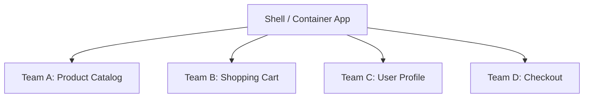
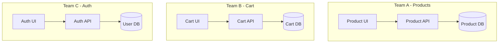
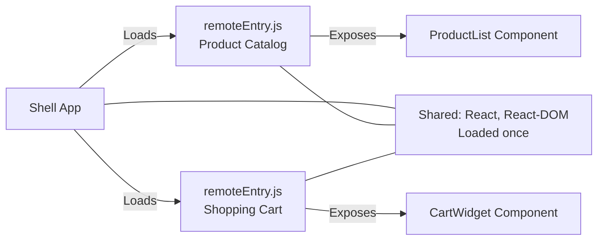
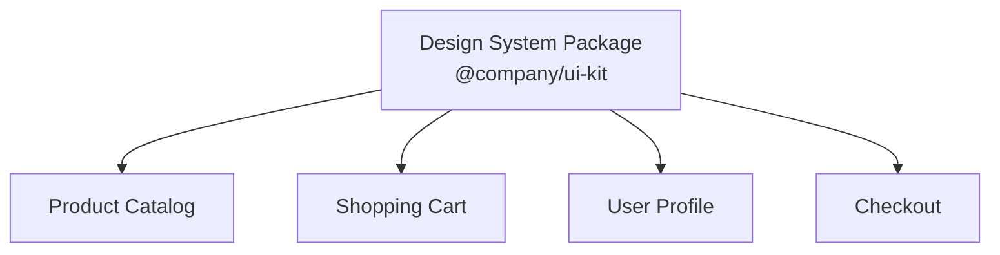
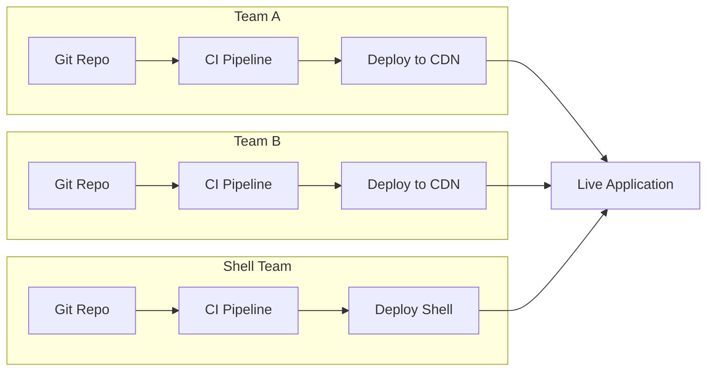
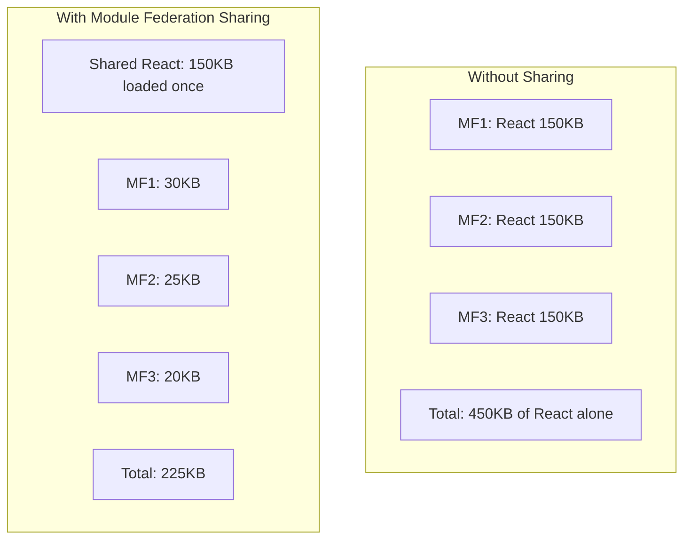

# Micro Frontends

## What are Micro Frontends?

Micro Frontends extend the microservices philosophy to the frontend. Instead of one monolithic frontend application, you break it into smaller, independently developed, tested, and deployed pieces — each owned by a different team.

**Analogy:** Think of a shopping mall. Each store (team) designs, stocks, and manages its own space independently, but they all exist within the same building (shell application) and share common infrastructure (hallways, parking, security).



---

## Core Principles

### 1. Team Autonomy

Each team owns a vertical slice of the product — from the database to the UI.



### 2. Technology Agnostic

Each micro frontend can use different frameworks:

| Team            | Framework | Reason                      |
| --------------- | --------- | --------------------------- |
| Product Catalog | React     | Rich interactivity          |
| Checkout        | Svelte    | Small bundle, fast checkout |
| Admin Dashboard | Angular   | Enterprise form handling    |
| Marketing Pages | Astro     | Static-first, SEO optimized |

### 3. Isolated & Resilient

- **No shared runtime state** — if Team A's micro frontend crashes, Team B's keeps working.
- **Scoped CSS** — styles do not leak between micro frontends.
- **Independent failures** — one broken micro frontend does not take down the page.

### 4. Decentralized Governance

Each team chooses its own:

- Framework and libraries
- Build tools and CI/CD pipeline
- Testing strategy
- Release cadence

---

## Integration Patterns

### Build-Time Integration

Micro frontends are published as npm packages and composed during the build step.

```json
// shell-app/package.json
{
  "dependencies": {
    "@company/product-catalog": "^2.1.0",
    "@company/shopping-cart": "^1.5.0",
    "@company/user-profile": "^3.0.0"
  }
}
```

```jsx
// shell-app/src/App.jsx
import ProductCatalog from "@company/product-catalog";
import ShoppingCart from "@company/shopping-cart";

function App() {
  return (
    <div>
      <ProductCatalog />
      <ShoppingCart />
    </div>
  );
}
```

| Pros                          | Cons                                          |
| ----------------------------- | --------------------------------------------- |
| Simple, familiar workflow     | Requires redeployment of shell for any update |
| Type safety across boundaries | Tight coupling at build time                  |
| Single optimized bundle       | No independent deployment                     |
| Good for small teams          | Version conflicts                             |

**Best for:** Small teams, shared component libraries, when independent deployment is not critical.

### Run-Time Integration

Micro frontends are loaded dynamically at runtime. The shell fetches and mounts them on demand.

#### iframe-based

```html
<iframe
  src="https://products.company.com/catalog"
  title="Product Catalog"
></iframe>
```

#### JavaScript-based (Dynamic Script Loading)

```javascript
// Shell loads micro frontend at runtime
async function loadMicroFrontend(name, containerId) {
  const manifest = await fetch(`https://${name}.cdn.com/manifest.json`);
  const { entryPoint } = await manifest.json();

  const script = document.createElement("script");
  script.src = entryPoint;

  script.onload = () => {
    // Each micro frontend exposes mount/unmount functions
    window[name].mount(document.getElementById(containerId));
  };

  document.head.appendChild(script);
}

// Usage
loadMicroFrontend("product-catalog", "product-section");
loadMicroFrontend("shopping-cart", "cart-section");
```

#### Micro Frontend Contract

Each micro frontend exposes a standard lifecycle:

```javascript
// product-catalog/src/index.js
class ProductCatalog {
  mount(container, props) {
    // Render into container
    ReactDOM.render(<App {...props} />, container);
  }

  unmount(container) {
    ReactDOM.unmountComponentAtNode(container);
  }

  update(props) {
    // Re-render with new props
  }
}

window["product-catalog"] = new ProductCatalog();
```

| Pros                                | Cons                                  |
| ----------------------------------- | ------------------------------------- |
| True independent deployment         | Runtime overhead (multiple downloads) |
| Teams release on their own schedule | Harder to share dependencies          |
| Technology agnostic                 | More complex error handling           |
| No shell redeployment needed        | Coordination for shared UX            |

### Server-Side Integration (SSI / Edge-Side Includes)

The server composes the page by fetching fragments from different services.

```html
<!-- Server-side template (using ESI or SSI) -->
<html>
  <body>
    <header>
      <!--#include virtual="/fragments/header" -->
    </header>
    <main>
      <!--#include virtual="/fragments/product-catalog" -->
    </main>
    <aside>
      <!--#include virtual="/fragments/shopping-cart" -->
    </aside>
  </body>
</html>
```

| Pros                     | Cons                                    |
| ------------------------ | --------------------------------------- |
| Fast first paint (SSR)   | Limited interactivity without hydration |
| SEO friendly             | Complex caching                         |
| Works without JavaScript | Higher server complexity                |
| Good performance         | Team coordination for layout            |

**Best for:** Content-heavy sites, e-commerce product pages, SEO-critical applications.

---

## Module Federation (Webpack 5 / Vite)

Module Federation allows separate builds to share code at runtime — without npm packages or rebuilds. It is the most popular pattern for micro frontends today.

**Analogy:** Instead of each apartment building having its own power plant, they all connect to a shared power grid. Each building is independent, but they share electricity (modules) efficiently.

### Webpack 5 Module Federation

```javascript
// shell/webpack.config.js (Host)
const { ModuleFederationPlugin } = require("webpack").container;

module.exports = {
  plugins: [
    new ModuleFederationPlugin({
      name: "shell",
      remotes: {
        productCatalog:
          "productCatalog@https://products.cdn.com/remoteEntry.js",
        shoppingCart: "shoppingCart@https://cart.cdn.com/remoteEntry.js",
      },
      shared: {
        react: { singleton: true, requiredVersion: "^18.0.0" },
        "react-dom": { singleton: true, requiredVersion: "^18.0.0" },
      },
    }),
  ],
};
```

```javascript
// product-catalog/webpack.config.js (Remote)
const { ModuleFederationPlugin } = require("webpack").container;

module.exports = {
  plugins: [
    new ModuleFederationPlugin({
      name: "productCatalog",
      filename: "remoteEntry.js",
      exposes: {
        "./ProductList": "./src/components/ProductList",
        "./ProductDetail": "./src/components/ProductDetail",
      },
      shared: {
        react: { singleton: true, requiredVersion: "^18.0.0" },
        "react-dom": { singleton: true, requiredVersion: "^18.0.0" },
      },
    }),
  ],
};
```

```jsx
// shell/src/App.jsx (consuming remote modules)
import React, { Suspense, lazy } from "react";

const ProductList = lazy(() => import("productCatalog/ProductList"));
const ShoppingCart = lazy(() => import("shoppingCart/CartWidget"));

function App() {
  return (
    <div>
      <Suspense fallback={<div>Loading products...</div>}>
        <ProductList />
      </Suspense>
      <Suspense fallback={<div>Loading cart...</div>}>
        <ShoppingCart />
      </Suspense>
    </div>
  );
}
```

### Vite Module Federation

```javascript
// shell/vite.config.js
import federation from "@originjs/vite-plugin-federation";

export default {
  plugins: [
    federation({
      name: "shell",
      remotes: {
        productCatalog: "https://products.cdn.com/assets/remoteEntry.js",
      },
      shared: ["react", "react-dom"],
    }),
  ],
};
```

### How Module Federation Works



### Key Concepts

| Concept            | Description                                                    |
| ------------------ | -------------------------------------------------------------- |
| **Host**           | The app that consumes remote modules (shell)                   |
| **Remote**         | The app that exposes modules (micro frontend)                  |
| **Shared**         | Dependencies loaded once and shared at runtime (React, lodash) |
| **Singleton**      | Ensures only one instance of a shared dependency exists        |
| **remoteEntry.js** | Manifest file that tells the host what modules are available   |

---

## Communication Between Micro Frontends

Micro frontends should be loosely coupled, but they sometimes need to communicate. Here are the patterns, from loosest to tightest coupling.

### 1. Custom Events (Recommended)

```javascript
// Product Catalog — dispatches event
function addToCart(product) {
  const event = new CustomEvent("cart:add", {
    detail: { productId: product.id, quantity: 1 },
    bubbles: true,
  });
  window.dispatchEvent(event);
}

// Shopping Cart — listens for event
window.addEventListener("cart:add", (event) => {
  const { productId, quantity } = event.detail;
  cartStore.addItem(productId, quantity);
  updateCartBadge();
});
```

### 2. Shared Event Bus

```javascript
// shared/eventBus.js
class EventBus {
  constructor() {
    this.listeners = new Map();
  }

  on(event, callback) {
    if (!this.listeners.has(event)) {
      this.listeners.set(event, new Set());
    }
    this.listeners.get(event).add(callback);
    return () => this.listeners.get(event).delete(callback); // unsubscribe
  }

  emit(event, data) {
    const handlers = this.listeners.get(event);
    if (handlers) {
      handlers.forEach((handler) => handler(data));
    }
  }
}

// Singleton shared across micro frontends
window.__EVENT_BUS__ = window.__EVENT_BUS__ || new EventBus();
export default window.__EVENT_BUS__;
```

### 3. URL / Query Parameters

```javascript
// Product page communicates selected filters via URL
// /products?category=electronics&sort=price

// Any micro frontend can read the URL state
const params = new URLSearchParams(window.location.search);
const category = params.get("category");
```

### 4. Shared State (Use Sparingly)

```javascript
// shared/store.js — minimal shared state
class SharedStore {
  constructor() {
    this.state = {};
    this.subscribers = new Set();
  }

  setState(key, value) {
    this.state[key] = value;
    this.subscribers.forEach((fn) => fn(this.state));
  }

  getState(key) {
    return this.state[key];
  }

  subscribe(callback) {
    this.subscribers.add(callback);
    return () => this.subscribers.delete(callback);
  }
}

window.__SHARED_STORE__ = window.__SHARED_STORE__ || new SharedStore();
```

### Communication Pattern Comparison

| Pattern                | Coupling   | Complexity | Best For                              |
| ---------------------- | ---------- | ---------- | ------------------------------------- |
| Custom Events          | Very Loose | Low        | Simple notifications, fire-and-forget |
| Event Bus              | Loose      | Medium     | Multiple publishers/subscribers       |
| URL State              | Loose      | Low        | Shareable state (filters, pagination) |
| Props (parent → child) | Medium     | Low        | Direct parent-child relationship      |
| Shared Store           | Tight      | High       | Complex shared state (use sparingly)  |

---

## Shared Component Libraries & Design Systems

To maintain visual consistency across micro frontends, teams share a design system.



### Structure

```
@company/ui-kit/
├── src/
│   ├── Button/
│   │   ├── Button.tsx
│   │   ├── Button.styles.ts
│   │   └── Button.test.tsx
│   ├── Input/
│   ├── Modal/
│   ├── DataTable/
│   └── index.ts
├── tokens/
│   ├── colors.ts
│   ├── spacing.ts
│   └── typography.ts
├── package.json
└── rollup.config.js
```

### Versioning Strategy

```json
// Each micro frontend pins the design system version
{
  "dependencies": {
    "@company/ui-kit": "^3.2.0"
  }
}
```

- **Major version:** Breaking changes (teams migrate on their schedule).
- **Minor/Patch:** Backward-compatible additions and fixes (auto-updated).

### Sharing via Module Federation

```javascript
// Design system exposed as a shared module
new ModuleFederationPlugin({
  shared: {
    "@company/ui-kit": {
      singleton: true,
      requiredVersion: "^3.0.0",
    },
  },
});
```

---

## Independent Deployment & CI/CD Pipelines

Each micro frontend has its own repository, CI/CD pipeline, and deployment.



### CI/CD Pipeline per Micro Frontend

```yaml
# .github/workflows/deploy.yml (Product Catalog team)
name: Deploy Product Catalog

on:
  push:
    branches: [main]

jobs:
  build-and-deploy:
    runs-on: ubuntu-latest
    steps:
      - uses: actions/checkout@v4

      - name: Install dependencies
        run: npm ci

      - name: Run tests
        run: npm test

      - name: Build
        run: npm run build

      - name: Deploy to CDN
        run: |
          aws s3 sync dist/ s3://cdn-bucket/product-catalog/
          aws cloudfront create-invalidation --distribution-id ${{ secrets.CF_ID }} --paths "/product-catalog/*"

      # Integration tests against shell
      - name: Smoke test
        run: npm run test:integration
```

### Deployment Strategies

| Strategy           | How It Works                        | Risk           |
| ------------------ | ----------------------------------- | -------------- |
| Independent Deploy | Each MF deploys on its own schedule | Low (isolated) |
| Canary Release     | Route 5% of traffic to new version  | Very Low       |
| Blue-Green         | Two environments, swap on success   | Low            |
| Feature Flags      | New code deployed but gated         | Minimal        |

### Contract Testing

Ensure the shell and micro frontends stay compatible:

```javascript
// contract.test.js — run in shell's CI
describe("Product Catalog Contract", () => {
  it("should expose mount function", async () => {
    const module = await import("productCatalog/ProductList");
    expect(typeof module.default).toBe("function");
  });

  it("should accept required props", () => {
    const { container } = render(<ProductList category="electronics" />);
    expect(container).not.toBeEmpty();
  });
});
```

---

## Routing & Deep Linking

Each micro frontend manages its own routes, but the shell orchestrates top-level navigation.

### Shell-Level Routing

```jsx
// Shell handles top-level routes
function ShellRouter() {
  return (
    <BrowserRouter>
      <Routes>
        <Route path="/products/*" element={<ProductCatalogMF />} />
        <Route path="/cart/*" element={<ShoppingCartMF />} />
        <Route path="/profile/*" element={<UserProfileMF />} />
        <Route path="/checkout/*" element={<CheckoutMF />} />
      </Routes>
    </BrowserRouter>
  );
}
```

### Micro Frontend Internal Routing

```jsx
// Inside Product Catalog MF — handles sub-routes
function ProductRouter() {
  return (
    <Routes>
      <Route path="/" element={<ProductList />} />
      <Route path="/:productId" element={<ProductDetail />} />
      <Route path="/category/:category" element={<CategoryPage />} />
    </Routes>
  );
}
```

### Cross-MF Navigation

```javascript
// Navigating between micro frontends
// Option 1: Browser native navigation
window.location.href = "/cart";

// Option 2: Shared history (if using same router)
import { createBrowserHistory } from "history";
const sharedHistory = window.__SHARED_HISTORY__ || createBrowserHistory();
sharedHistory.push("/cart");

// Option 3: Custom event
window.dispatchEvent(
  new CustomEvent("navigate", {
    detail: { path: "/cart", params: { productId: "123" } },
  }),
);
```

### URL Structure

```
https://shop.example.com/products/electronics/laptop-123
                         ├── Shell route ──┤├── MF route ──┤

Shell: matches "/products/*" → loads Product Catalog MF
MF:   matches "/electronics/laptop-123" → renders product detail
```

---

## Performance & Security Considerations

### Performance

#### Bundle Size

Each micro frontend adds JavaScript to the page. Without optimization, users download duplicate dependencies.



#### Loading Strategies

```javascript
// Lazy load micro frontends on route change
const ProductCatalog = lazy(() => import("productCatalog/App"));
const ShoppingCart = lazy(() => import("shoppingCart/App"));

// Preload on hover (anticipate navigation)
function NavLink({ to, mfLoader, children }) {
  return (
    <Link
      to={to}
      onMouseEnter={() => mfLoader()} // Start loading on hover
    >
      {children}
    </Link>
  );
}
```

#### Performance Checklist

- Share common dependencies via Module Federation (`singleton: true`).
- Lazy load micro frontends by route.
- Preload likely navigations on hover/focus.
- Set performance budgets per micro frontend (e.g., max 100KB gzipped).
- Use tree-shaking in shared component library.
- Monitor bundle sizes in CI (fail builds that exceed budgets).

### Security

#### CSS Isolation

Prevent styles from leaking between micro frontends:

```javascript
// Option 1: Shadow DOM (strongest isolation)
class ProductCatalog extends HTMLElement {
  constructor() {
    super();
    this.attachShadow({ mode: "open" });
  }

  connectedCallback() {
    this.shadowRoot.innerHTML = `
      <style>
        /* Styles are scoped to this shadow root */
        .product { border: 1px solid #ddd; }
      </style>
      <div class="product">...</div>
    `;
  }
}

// Option 2: CSS Modules / Scoped styles
// .product_abc123 { border: 1px solid #ddd; }

// Option 3: Naming convention (BEM with prefix)
// .mf-product__card { ... }
```

#### JavaScript Sandboxing

```javascript
// Prevent micro frontends from polluting global scope
function createSandbox(microFrontend) {
  const proxy = new Proxy(window, {
    set(target, key, value) {
      // Scope writes to MF namespace
      if (!target.__MF_SCOPE__) target.__MF_SCOPE__ = {};
      target.__MF_SCOPE__[microFrontend.name] =
        target.__MF_SCOPE__[microFrontend.name] || {};
      target.__MF_SCOPE__[microFrontend.name][key] = value;
      return true;
    },
    get(target, key) {
      // Check MF scope first, then fall through to window
      const scope = target.__MF_SCOPE__?.[microFrontend.name];
      return scope?.[key] ?? target[key];
    },
  });
  return proxy;
}
```

#### Security Checklist

- Isolate CSS (Shadow DOM, CSS Modules, or naming conventions).
- Validate all data passed between micro frontends.
- Use CSP (Content Security Policy) headers to restrict script sources.
- Authenticate and authorize at the shell level.
- Audit shared dependencies for vulnerabilities independently.
- Use Subresource Integrity (SRI) for CDN-loaded scripts.

```html
<!-- SRI ensures CDN-served scripts haven't been tampered with -->
<script
  src="https://cdn.example.com/product-catalog/remoteEntry.js"
  integrity="sha384-oqVuAfXRKap7fdgcCY5uykM6+R9GqQ8K/ux..."
  crossorigin="anonymous"
></script>
```

---

## Best Practices

1. **Keep the shell thin** — the shell should handle layout, routing, and authentication. Business logic lives in micro frontends.
2. **Share dependencies wisely** — use Module Federation `shared` for React, UI kit. Do not share business libraries.
3. **Define clear contracts** — document the props, events, and lifecycle methods each micro frontend exposes.
4. **Use custom events for communication** — they are framework-agnostic, loosely coupled, and easy to debug.
5. **Set performance budgets** — each micro frontend should have a max bundle size. Fail CI if exceeded.
6. **Version your design system** — allow teams to migrate at their own pace using semantic versioning.
7. **Test in isolation AND integration** — unit test each MF alone, then run integration tests with the shell.
8. **Avoid shared mutable state** — if you must share state, make it read-only from consumers. One owner, many readers.
9. **Plan for failure** — if one micro frontend fails to load, the rest of the page should still work. Show fallback UI.

---

## Common Mistakes

| Mistake                                | Why It Is Wrong                             | Fix                                              |
| -------------------------------------- | ------------------------------------------- | ------------------------------------------------ |
| Sharing too much state                 | Creates tight coupling, defeats the purpose | Use events, minimize shared state                |
| Duplicate dependencies without sharing | Bundle bloat (multiple React copies)        | Use Module Federation `shared` with `singleton`  |
| No CSS isolation                       | Styles leak across micro frontends          | Shadow DOM, CSS Modules, or scoped naming        |
| Micro-frontend per component           | Over-fragmentation, massive overhead        | Split by business domain, not UI component       |
| Single repo for all micro frontends    | Defeats independent deployment              | Use separate repos or clearly separated monorepo |
| No error boundaries                    | One failing MF crashes the whole page       | Wrap each MF in error boundary with fallback UI  |
| Tight coupling to shell framework      | Cannot switch shell or update independently | Use framework-agnostic contracts (mount/unmount) |
| No contract testing                    | Shell breaks when MF changes its API        | Add integration tests in CI                      |

---

## Summary

- **Micro frontends** decompose a frontend monolith into independently developed and deployed pieces, each owned by a vertical team.
- **Integration patterns** range from build-time (npm packages) to run-time (Module Federation, dynamic loading) to server-side (SSI/ESI).
- **Module Federation** (Webpack 5 / Vite) is the modern standard — share dependencies at runtime without rebuilds.
- **Communication** between micro frontends should be event-driven (Custom Events, Event Bus) to stay loosely coupled.
- **Shared design systems** maintain visual consistency while allowing independent development. Version them semantically.
- **Independent CI/CD** pipelines let each team ship at their own pace. Use contract tests to prevent integration breaks.
- **Routing** is split between shell (top-level) and micro frontends (sub-routes). Support deep linking for shareable URLs.
- **Performance** requires dependency sharing, lazy loading, and per-MF bundle budgets. **Security** requires CSS isolation, CSP headers, and SRI.
