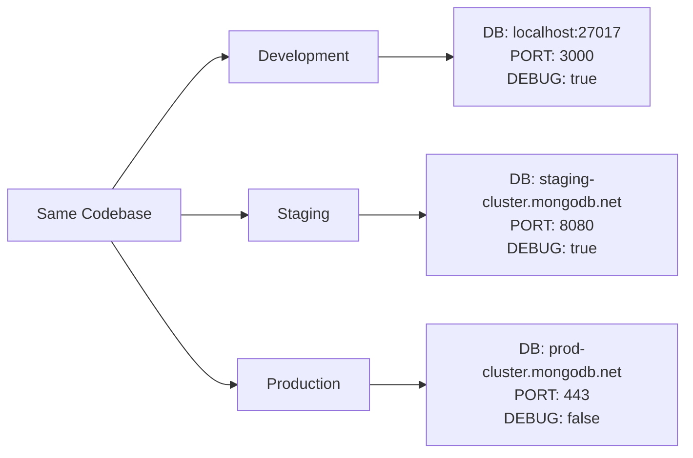
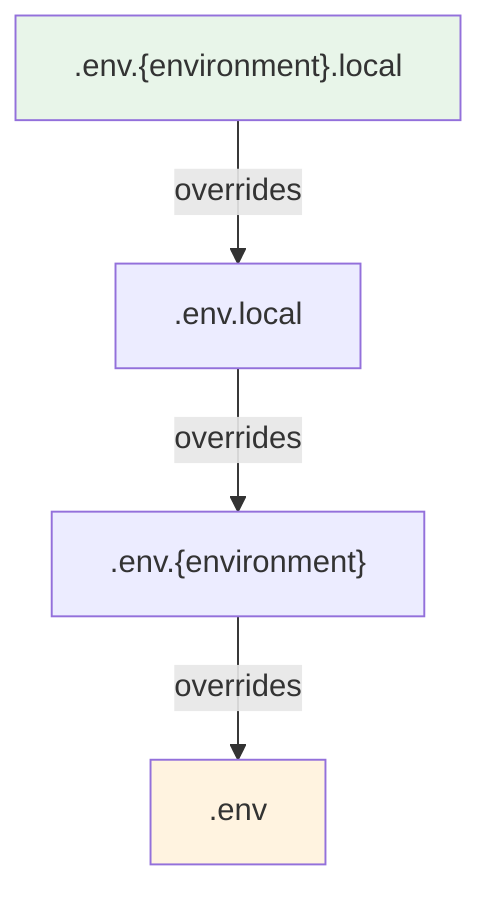
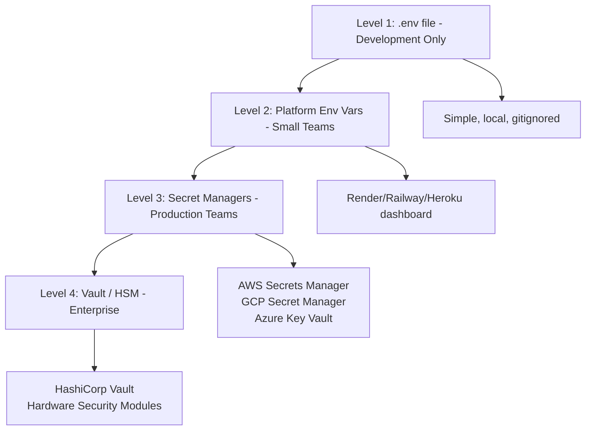

# Environment Variables

## What Are Environment Variables?

Environment variables are key-value pairs that exist outside your application code but are accessible to it at runtime. They allow you to configure your application's behavior without modifying source code — different values for development, staging, and production environments.

Think of environment variables as the **settings panel** for your app. The code stays the same across all environments; only the configuration changes.



## Why Environment Variables Matter

| Reason        | Explanation                                                                         |
| ------------- | ----------------------------------------------------------------------------------- |
| Security      | Secrets (API keys, DB passwords) stay out of source code and version control        |
| Portability   | Same code runs in any environment with different configs                            |
| 12-Factor App | Industry standard methodology — config belongs in the environment                   |
| Team Safety   | New developers can clone the repo without accidentally using production credentials |
| Compliance    | Audit trails are easier when secrets are managed separately from code               |

### The 12-Factor App Principle

The [12-Factor App](https://12factor.net/config) methodology states:

> Store config in the environment. An app's config is everything that is likely to vary between deploys. This includes database credentials, API keys, and per-deploy values like hostnames.

---

## How Environment Variables Work in Node.js

Node.js exposes all environment variables through the global `process.env` object:

```javascript
// Accessing environment variables
console.log(process.env.NODE_ENV); // "development" or "production"
console.log(process.env.PORT); // "3000"
console.log(process.env.MONGODB_URI); // "mongodb+srv://..."

// They are always strings
console.log(typeof process.env.PORT); // "string"

// Convert to number when needed
const port = parseInt(process.env.PORT, 10) || 3000;
```

### Setting Env Vars from the Terminal

```bash
# Linux/macOS — set inline for a single command
PORT=4000 node server.js

# Linux/macOS — export for the session
export NODE_ENV=production
node server.js

# Windows CMD
set NODE_ENV=production
node server.js

# Windows PowerShell
$env:NODE_ENV="production"
node server.js
```

---

## Using dotenv Locally

The `dotenv` package loads variables from a `.env` file into `process.env` during development. This simulates the environment variable injection that cloud platforms provide in production.

### Installation

```bash
npm install dotenv
```

### Basic Usage

```javascript
// server.js — Load at the very top, before any other imports
require("dotenv").config();

const express = require("express");
const mongoose = require("mongoose");

// Now process.env has all values from .env file
const PORT = process.env.PORT || 3000;
const MONGODB_URI = process.env.MONGODB_URI;
```

### The .env File

```env
# .env — Local development configuration
NODE_ENV=development
PORT=3000

# Database
MONGODB_URI=mongodb://localhost:27017/myapp

# Authentication
JWT_SECRET=my-local-development-secret
JWT_EXPIRES_IN=7d

# Third-party APIs
STRIPE_SECRET_KEY=sk_test_xxxxxxxxxxxxx
SENDGRID_API_KEY=SG.xxxxxxxxxxxxxxxx

# Frontend URL (for CORS)
CLIENT_URL=http://localhost:5173
```

### Conditional Loading Pattern

```javascript
// Only load dotenv in development — production platforms inject env vars directly
if (process.env.NODE_ENV !== "production") {
  require("dotenv").config();
}
```

### Validating Environment Variables

```javascript
// config/env.js — Validate all required variables on startup
const requiredVars = ["MONGODB_URI", "JWT_SECRET", "NODE_ENV"];

function validateEnv() {
  const missing = requiredVars.filter((key) => !process.env[key]);

  if (missing.length > 0) {
    console.error("❌ Missing required environment variables:");
    missing.forEach((key) => console.error(`   - ${key}`));
    process.exit(1);
  }

  console.log("✅ All environment variables loaded");
}

module.exports = validateEnv;
```

---

## .env vs .env.local vs .env.production

Different frameworks and tools support multiple `.env` files with a specific loading priority:

### File Hierarchy and Purpose

| File                     | Purpose                             | Committed to Git?      | Loaded When                 |
| ------------------------ | ----------------------------------- | ---------------------- | --------------------------- |
| `.env`                   | Default values for all environments | Sometimes (no secrets) | Always (lowest priority)    |
| `.env.local`             | Local overrides (your machine only) | Never                  | Always (overrides `.env`)   |
| `.env.development`       | Development-specific defaults       | Yes (no secrets)       | When `NODE_ENV=development` |
| `.env.development.local` | Local dev overrides                 | Never                  | When `NODE_ENV=development` |
| `.env.production`        | Production defaults (non-sensitive) | Yes (no secrets)       | When `NODE_ENV=production`  |
| `.env.production.local`  | Local prod testing overrides        | Never                  | When `NODE_ENV=production`  |
| `.env.test`              | Test environment defaults           | Yes (no secrets)       | When `NODE_ENV=test`        |

### Loading Priority (Highest to Lowest)



> **Note**: This hierarchy is used by Create React App, Vite, and Next.js. The base `dotenv` package only loads `.env` unless you configure it manually.

### Configuring dotenv for Multiple Files

```javascript
// Load environment-specific .env file
const path = require("path");
const dotenv = require("dotenv");

const env = process.env.NODE_ENV || "development";

// Load files in priority order (later files don't override existing vars)
dotenv.config({ path: path.resolve(process.cwd(), `.env.${env}.local`) });
dotenv.config({ path: path.resolve(process.cwd(), `.env.local`) });
dotenv.config({ path: path.resolve(process.cwd(), `.env.${env}`) });
dotenv.config({ path: path.resolve(process.cwd(), ".env") });
```

### What Goes Where — Practical Example

```env
# .env — Shared defaults (committed to Git)
PORT=3000
NODE_ENV=development
API_VERSION=v1
```

```env
# .env.local — Your personal overrides (NOT committed)
MONGODB_URI=mongodb://localhost:27017/myapp
JWT_SECRET=dev-secret-123
STRIPE_SECRET_KEY=sk_test_personalkey
```

```env
# .env.production — Production defaults (committed, no secrets)
PORT=8080
NODE_ENV=production
API_VERSION=v1
LOG_LEVEL=error
```

### .gitignore Rules

```gitignore
# Environment files with secrets
.env.local
.env.development.local
.env.production.local
.env.test.local

# If your .env contains secrets, ignore it too
.env

# Never ignore these (they should not contain secrets)
# .env.development
# .env.production
# .env.test
```

---

## Setting Env Vars on Cloud Platforms

### Render

**Dashboard Method:**

1. Go to your service on Render Dashboard
2. Click "Environment" in the left sidebar
3. Add key-value pairs
4. Click "Save Changes" — triggers a redeploy

**render.yaml Method:**

```yaml
services:
  - type: web
    name: my-api
    env: node
    envVars:
      - key: NODE_ENV
        value: production
      - key: MONGODB_URI
        sync: false # marks as sensitive — must be set manually in dashboard
      - key: JWT_SECRET
        sync: false
      - key: DATABASE_URL
        fromDatabase:
          name: my-db
          property: connectionString
```

### Railway

**Dashboard Method:**

1. Open your project on Railway
2. Click the service card
3. Go to "Variables" tab
4. Add variables individually or paste a `.env` file (Railway supports bulk import)

**CLI Method:**

```bash
# Set individual variables
railway variables set MONGODB_URI="mongodb+srv://..."
railway variables set JWT_SECRET="super-secret"

# List all variables
railway variables

# Delete a variable
railway variables delete OLD_VARIABLE
```

**Shared Variables (across services):**

```bash
# Railway supports shared variables between services in a project
# Set on the project level, reference in each service
```

### Heroku

```bash
# Set variables via Heroku CLI
heroku config:set MONGODB_URI="mongodb+srv://..." --app my-app
heroku config:set JWT_SECRET="super-secret" --app my-app

# View all config vars
heroku config --app my-app

# Remove a variable
heroku config:unset OLD_VARIABLE --app my-app
```

### AWS

**Elastic Beanstalk:**

```bash
# Via EB CLI
eb setenv MONGODB_URI="mongodb+srv://..." JWT_SECRET="..." NODE_ENV="production"

# Via AWS Console:
# Elastic Beanstalk → Environment → Configuration → Software → Environment Properties
```

**AWS Systems Manager Parameter Store (recommended for production):**

```bash
# Store a secret
aws ssm put-parameter \
  --name "/myapp/production/MONGODB_URI" \
  --value "mongodb+srv://..." \
  --type "SecureString"

# Retrieve in your app
aws ssm get-parameter \
  --name "/myapp/production/MONGODB_URI" \
  --with-decryption
```

```javascript
// Fetching from Parameter Store in Node.js
const { SSMClient, GetParameterCommand } = require("@aws-sdk/client-ssm");

const ssm = new SSMClient({ region: "us-east-1" });

async function getSecret(name) {
  const command = new GetParameterCommand({
    Name: name,
    WithDecryption: true,
  });
  const response = await ssm.send(command);
  return response.Parameter.Value;
}
```

---

## Secrets Management Best Practices

### The Secrets Hierarchy



### Key Principles

1. **Never commit secrets to Git** — even in private repos (they live in Git history forever)
2. **Rotate secrets regularly** — especially after team member departures
3. **Use different secrets per environment** — dev, staging, and production should never share credentials
4. **Principle of least privilege** — each service gets only the secrets it needs
5. **Audit access** — log who accesses secrets and when
6. **Encrypt at rest** — use encrypted secret stores, not plain text files on servers

### Secret Rotation Strategy

```javascript
// Support multiple API keys during rotation
const STRIPE_KEYS = [
  process.env.STRIPE_SECRET_KEY_NEW,
  process.env.STRIPE_SECRET_KEY_OLD,
].filter(Boolean);

// Try new key first, fall back to old during rotation window
async function chargeCustomer(amount) {
  for (const key of STRIPE_KEYS) {
    try {
      return await stripe(key).charges.create({ amount });
    } catch (err) {
      if (err.code === "api_key_invalid") continue;
      throw err;
    }
  }
  throw new Error("All Stripe keys are invalid");
}
```

### Git Pre-commit Hook for Secret Detection

```bash
#!/bin/sh
# .git/hooks/pre-commit — Prevent committing secrets

# Check for common secret patterns
if git diff --cached --diff-filter=ACM | grep -iE '(api_key|secret|password|token)\s*=\s*["\x27][^\s]+' | grep -v '.env.example'; then
  echo "❌ Possible secret detected in staged files!"
  echo "   Remove the secret and use environment variables instead."
  exit 1
fi
```

### Using .env.example as Documentation

```env
# .env.example — Committed to Git as documentation for the team
# Copy this file to .env and fill in your values

NODE_ENV=development
PORT=3000

# Database — Get connection string from MongoDB Atlas
MONGODB_URI=mongodb://localhost:27017/myapp

# Auth — Generate with: node -e "console.log(require('crypto').randomBytes(32).toString('hex'))"
JWT_SECRET=
JWT_EXPIRES_IN=7d

# Stripe — Get from https://dashboard.stripe.com/test/apikeys
STRIPE_SECRET_KEY=
STRIPE_WEBHOOK_SECRET=

# Email — Get from https://app.sendgrid.com/settings/api_keys
SENDGRID_API_KEY=
```

---

## Advanced: Type-Safe Environment Variables

### With Zod Validation

```javascript
// config/env.js
const { z } = require("zod");

const envSchema = z.object({
  NODE_ENV: z
    .enum(["development", "production", "test"])
    .default("development"),
  PORT: z.string().transform(Number).default("3000"),
  MONGODB_URI: z.string().url(),
  JWT_SECRET: z.string().min(32),
  JWT_EXPIRES_IN: z.string().default("7d"),
  CLIENT_URL: z.string().url().optional(),
});

const parsed = envSchema.safeParse(process.env);

if (!parsed.success) {
  console.error("❌ Invalid environment variables:");
  console.error(parsed.error.format());
  process.exit(1);
}

module.exports = parsed.data;
```

### Usage After Validation

```javascript
// Anywhere in your app — import validated config
const env = require("./config/env");

// These are now type-safe and guaranteed to exist
mongoose.connect(env.MONGODB_URI);
app.listen(env.PORT);
```

---

## Best Practices

- Never commit `.env` files containing secrets to version control — use `.env.example` as a template.
- Load `dotenv` conditionally — only in development. Production platforms inject env vars directly.
- Validate all required environment variables at application startup — fail fast with clear error messages.
- Use a schema validator (Zod, Joi, envalid) for type-safe environment configuration.
- Keep secrets out of logs — never `console.log(process.env)` in production.
- Use platform-native secret management for production (AWS Secrets Manager, GCP Secret Manager).
- Rotate secrets on a schedule and immediately when team members leave.
- Use `.env.example` committed to Git so teammates know what variables are needed.
- Prefix variables by concern: `DB_HOST`, `AUTH_SECRET`, `STRIPE_KEY` for clarity.
- Never use the same secrets across environments — generate unique values for dev, staging, prod.

## Common Mistakes

| Mistake                                        | Why It Is a Problem                                                           |
| ---------------------------------------------- | ----------------------------------------------------------------------------- |
| Committing `.env` to Git                       | Secrets are permanently in Git history, even after deletion                   |
| Using `console.log(process.env)` in production | Leaks all secrets to logs and monitoring systems                              |
| Hardcoding fallback secrets in code            | `const secret = process.env.JWT_SECRET \|\| "default123"` defeats the purpose |
| Sharing secrets between environments           | A compromised dev secret exposes production                                   |
| Not validating env vars on startup             | App crashes at runtime instead of immediately on boot                         |
| Loading dotenv in production                   | Unnecessary; may conflict with platform-injected variables                    |
| Storing secrets in frontend `.env`             | Client-side env vars are bundled into JavaScript — visible to anyone          |
| Not using `NEXT_PUBLIC_` / `VITE_` prefixes    | Framework ignores the variable; it is undefined in the browser                |

## Summary

- Environment variables are key-value pairs that configure your application without code changes.
- The `dotenv` package loads `.env` files into `process.env` for local development.
- Multiple `.env` files (`.env.local`, `.env.production`) allow environment-specific configuration with clear override rules.
- Cloud platforms (Render, Railway, AWS) each provide their own way to set environment variables — use them instead of `.env` files in production.
- Secrets management is critical — never commit secrets, rotate regularly, use least privilege, and validate on startup.
- Type-safe validation with Zod or similar ensures your app fails immediately if misconfigured, not at some random point during execution.
- The golden rule: your code should be identical across environments — only the environment variables change.
