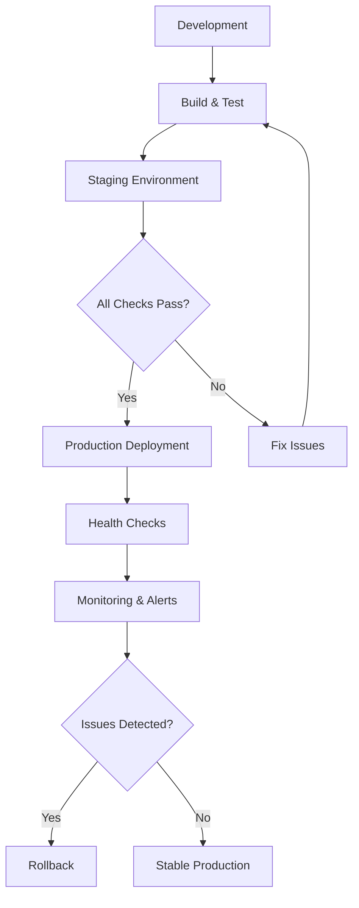
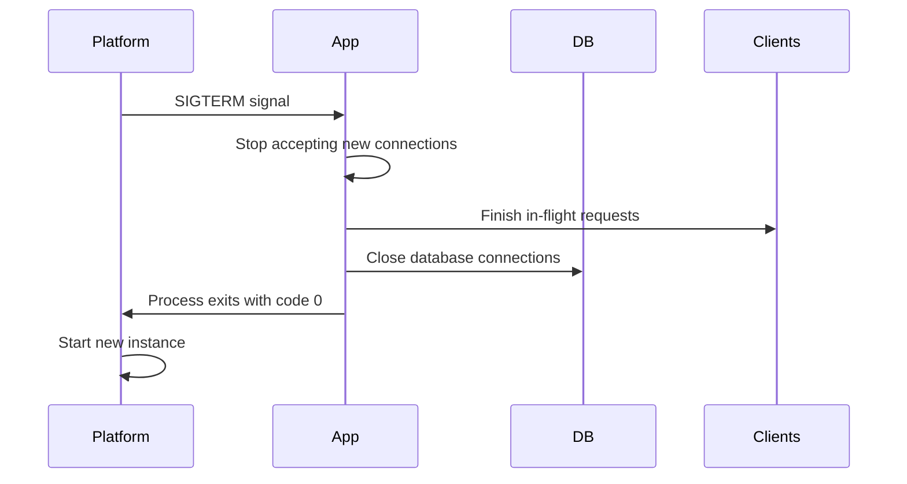
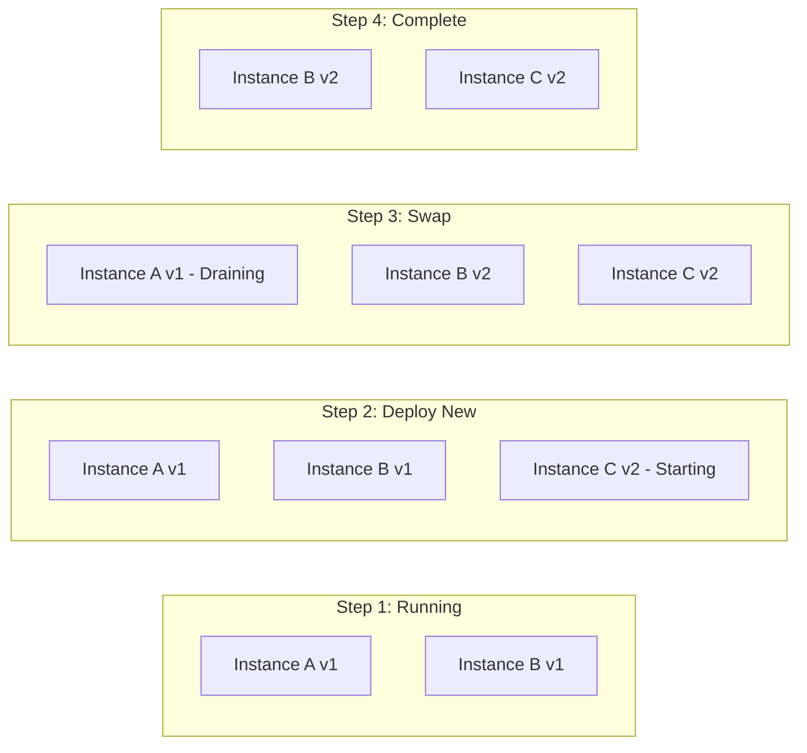
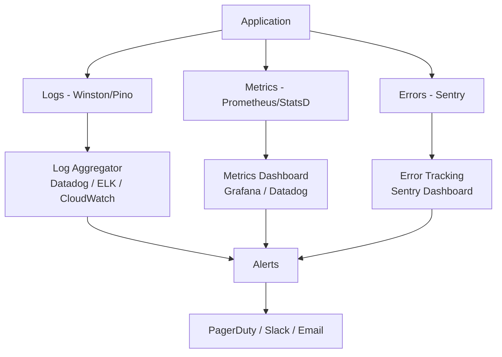
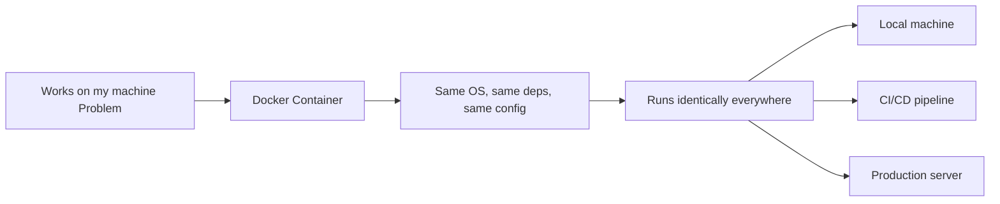

# Deployment Best Practices

## Why Best Practices Matter

Deploying code to production is fundamentally different from running it locally. In production, your app serves real users, handles unpredictable traffic, and must recover from failures without human intervention. A poorly deployed app can lose data, frustrate users, and cost money. Best practices exist to prevent these problems systematically.



---

## Production Readiness Checklist

Before deploying any application to production, verify every item on this checklist:

### Security

- [ ] All secrets stored as environment variables (not in code)
- [ ] HTTPS enforced (TLS/SSL certificate configured)
- [ ] Helmet.js or equivalent security headers enabled
- [ ] CORS restricted to specific domains (not `*`)
- [ ] Rate limiting configured on public endpoints
- [ ] Input validation on all user-facing endpoints
- [ ] SQL injection / NoSQL injection protection
- [ ] Authentication tokens have expiry times
- [ ] Dependencies audited (`npm audit`)

### Performance

- [ ] Response compression enabled (gzip/brotli)
- [ ] Database queries have proper indexes
- [ ] Connection pooling configured
- [ ] Static assets served via CDN
- [ ] Caching headers set appropriately
- [ ] No synchronous blocking operations in request handlers

### Reliability

- [ ] Health check endpoint implemented
- [ ] Graceful shutdown handler configured
- [ ] Error handling middleware catches all unhandled errors
- [ ] Database reconnection logic in place
- [ ] Process manager configured (PM2, systemd, or platform-native)
- [ ] Environment variables validated on startup

### Observability

- [ ] Structured logging (JSON format)
- [ ] Log levels configured (error, warn, info, debug)
- [ ] Application metrics collected (response time, error rate)
- [ ] Alerts configured for critical failures
- [ ] Error tracking service connected (Sentry, Datadog)

---

## Health Check Endpoints

A health check endpoint tells the hosting platform (and monitoring tools) whether your application is alive and ready to serve traffic. Platforms like Render, Railway, and AWS use this to decide when to route traffic to your instance.

### Basic Health Check

```javascript
// Simple liveness check — "Is the process running?"
app.get("/health", (req, res) => {
  res.status(200).json({ status: "ok" });
});
```

### Comprehensive Health Check

```javascript
// Readiness check — "Is the app ready to handle requests?"
app.get("/health", async (req, res) => {
  const healthcheck = {
    status: "ok",
    timestamp: new Date().toISOString(),
    uptime: process.uptime(),
    environment: process.env.NODE_ENV,
    checks: {},
  };

  // Check database connection
  try {
    await mongoose.connection.db.admin().ping();
    healthcheck.checks.database = { status: "ok" };
  } catch (error) {
    healthcheck.status = "degraded";
    healthcheck.checks.database = { status: "error", message: error.message };
  }

  // Check Redis connection (if applicable)
  try {
    await redisClient.ping();
    healthcheck.checks.redis = { status: "ok" };
  } catch (error) {
    healthcheck.status = "degraded";
    healthcheck.checks.redis = { status: "error", message: error.message };
  }

  // Check memory usage
  const memUsage = process.memoryUsage();
  healthcheck.checks.memory = {
    rss: `${Math.round(memUsage.rss / 1024 / 1024)} MB`,
    heapUsed: `${Math.round(memUsage.heapUsed / 1024 / 1024)} MB`,
  };

  const statusCode = healthcheck.status === "ok" ? 200 : 503;
  res.status(statusCode).json(healthcheck);
});
```

### Liveness vs Readiness

| Type      | Purpose                  | Failure Action                        | Example    |
| --------- | ------------------------ | ------------------------------------- | ---------- |
| Liveness  | Is the process alive?    | Restart the container/instance        | `/healthz` |
| Readiness | Can it handle traffic?   | Stop sending traffic to this instance | `/ready`   |
| Startup   | Has it finished booting? | Wait longer before checking liveness  | `/startup` |

```javascript
// Separate endpoints for Kubernetes-style deployments
app.get("/healthz", (req, res) => {
  // Liveness — if this fails, restart the pod
  res.status(200).json({ alive: true });
});

app.get("/ready", async (req, res) => {
  // Readiness — if this fails, don't route traffic here
  const dbReady = mongoose.connection.readyState === 1;
  if (dbReady) {
    res.status(200).json({ ready: true });
  } else {
    res.status(503).json({ ready: false, reason: "Database not connected" });
  }
});
```

---

## Graceful Shutdown

When a platform needs to restart your app (for a new deployment, scaling, or maintenance), it sends a termination signal. A graceful shutdown ensures in-flight requests complete and resources are cleaned up properly.



### Implementation

```javascript
const server = app.listen(PORT, () => {
  console.log(`Server running on port ${PORT}`);
});

// Graceful shutdown handler
function gracefulShutdown(signal) {
  console.log(`\n${signal} received. Starting graceful shutdown...`);

  // Stop accepting new connections
  server.close(async () => {
    console.log("HTTP server closed");

    try {
      // Close database connections
      await mongoose.connection.close();
      console.log("MongoDB connection closed");

      // Close Redis connections
      await redisClient.quit();
      console.log("Redis connection closed");

      // Exit successfully
      process.exit(0);
    } catch (error) {
      console.error("Error during shutdown:", error);
      process.exit(1);
    }
  });

  // Force shutdown after timeout (platform will kill anyway)
  setTimeout(() => {
    console.error("Forced shutdown — timeout exceeded");
    process.exit(1);
  }, 10000); // 10 seconds max
}

// Listen for termination signals
process.on("SIGTERM", () => gracefulShutdown("SIGTERM"));
process.on("SIGINT", () => gracefulShutdown("SIGINT"));

// Handle uncaught errors
process.on("uncaughtException", (error) => {
  console.error("Uncaught Exception:", error);
  gracefulShutdown("uncaughtException");
});

process.on("unhandledRejection", (reason) => {
  console.error("Unhandled Rejection:", reason);
  gracefulShutdown("unhandledRejection");
});
```

### Why Graceful Shutdown Matters

| Without Graceful Shutdown      | With Graceful Shutdown               |
| ------------------------------ | ------------------------------------ |
| In-flight requests get dropped | In-flight requests complete normally |
| Database connections leak      | Connections are properly closed      |
| Data may be partially written  | Transactions complete or roll back   |
| Users see 502/503 errors       | Users experience no interruption     |
| File handles may remain open   | All resources are released           |

---

## Zero-Downtime Deployments

Zero-downtime deployment means users never experience an outage during code updates. The new version starts receiving traffic only after it passes health checks.

### Rolling Deployment Strategy



### Strategies Comparison

| Strategy   | Downtime | Risk   | Rollback Speed      | Resource Cost              |
| ---------- | -------- | ------ | ------------------- | -------------------------- |
| Rolling    | None     | Medium | Moderate            | 1.5x during deploy         |
| Blue-Green | None     | Low    | Instant             | 2x (two full environments) |
| Canary     | None     | Lowest | Instant             | 1.1x (small canary)        |
| Recreate   | Brief    | High   | Slow (redeploy old) | 1x                         |

### Blue-Green with Render

Render handles this automatically — when you push new code:

1. New instance builds and starts
2. Health check passes on new instance
3. Traffic switches to new instance
4. Old instance is terminated

### Canary Deployment Concept

```javascript
// Feature flag for canary routing (simplified example)
app.use((req, res, next) => {
  // Route 5% of traffic to canary
  const isCanary = Math.random() < 0.05;
  req.isCanary = isCanary;

  if (isCanary) {
    // Log canary metrics separately
    req.metricsPrefix = "canary";
  }

  next();
});
```

---

## Logging and Monitoring in Production

### Structured Logging

In production, logs should be machine-parseable (JSON) rather than human-readable text. This enables searching, filtering, and alerting.

```javascript
// Using winston for structured logging
const winston = require("winston");

const logger = winston.createLogger({
  level: process.env.LOG_LEVEL || "info",
  format: winston.format.combine(
    winston.format.timestamp(),
    winston.format.errors({ stack: true }),
    winston.format.json(),
  ),
  defaultMeta: {
    service: "my-api",
    environment: process.env.NODE_ENV,
  },
  transports: [new winston.transports.Console()],
});

// Usage
logger.info("Server started", { port: PORT });
logger.error("Database connection failed", {
  error: err.message,
  stack: err.stack,
});
logger.warn("Rate limit exceeded", { ip: req.ip, endpoint: req.path });
```

### Log Output (JSON)

```json
{
  "level": "info",
  "message": "Request completed",
  "timestamp": "2024-01-15T10:30:00.000Z",
  "service": "my-api",
  "environment": "production",
  "method": "GET",
  "path": "/api/users",
  "statusCode": 200,
  "responseTime": 45,
  "requestId": "req-abc123"
}
```

### Request Logging Middleware

```javascript
const { v4: uuidv4 } = require("uuid");

// Assign a unique ID to each request for tracing
app.use((req, res, next) => {
  req.requestId = req.headers["x-request-id"] || uuidv4();
  res.setHeader("x-request-id", req.requestId);

  const start = Date.now();

  res.on("finish", () => {
    logger.info("Request completed", {
      requestId: req.requestId,
      method: req.method,
      path: req.originalUrl,
      statusCode: res.statusCode,
      responseTime: Date.now() - start,
      userAgent: req.get("user-agent"),
      ip: req.ip,
    });
  });

  next();
});
```

### Monitoring Stack



### Key Metrics to Monitor

| Metric               | What It Tells You  | Alert Threshold   |
| -------------------- | ------------------ | ----------------- |
| Response time (p95)  | User experience    | > 500ms           |
| Error rate (5xx)     | Application health | > 1% of requests  |
| CPU usage            | Compute capacity   | > 80% sustained   |
| Memory usage         | Memory leaks       | > 85%             |
| Database connections | Pool exhaustion    | > 80% of pool     |
| Request rate (RPS)   | Traffic patterns   | Anomaly detection |

---

## Docker Basics for Deployment

Docker packages your application with its entire runtime environment into a container — ensuring it runs identically everywhere.

### Why Docker for Deployment?



### Dockerfile for a Node.js App

```dockerfile
# ---- Base Stage ----
FROM node:20-alpine AS base
WORKDIR /app

# ---- Dependencies Stage ----
FROM base AS dependencies
# Copy package files first (better layer caching)
COPY package.json package-lock.json ./
# Install production dependencies only
RUN npm ci --only=production
# Copy production deps aside
RUN cp -R node_modules /production_deps
# Install ALL dependencies (including dev for building)
RUN npm ci

# ---- Build Stage ----
FROM base AS build
COPY --from=dependencies /app/node_modules ./node_modules
COPY . .
# Run build step if you have one (TypeScript, etc.)
RUN npm run build

# ---- Production Stage ----
FROM base AS production
# Set environment
ENV NODE_ENV=production
# Use non-root user for security
RUN addgroup -g 1001 -S nodejs && \
    adduser -S nodeuser -u 1001
# Copy production dependencies
COPY --from=dependencies /production_deps ./node_modules
# Copy built application
COPY --from=build /app/dist ./dist
COPY --from=build /app/package.json ./
# Switch to non-root user
USER nodeuser
# Expose port
EXPOSE 3000
# Health check
HEALTHCHECK --interval=30s --timeout=3s --start-period=5s --retries=3 \
  CMD wget --no-verbose --tries=1 --spider http://localhost:3000/health || exit 1
# Start the app
CMD ["node", "dist/server.js"]
```

### Dockerfile Explained

| Instruction             | Purpose                                     |
| ----------------------- | ------------------------------------------- |
| `FROM node:20-alpine`   | Lightweight base image (Alpine Linux ~5MB)  |
| `WORKDIR /app`          | Set working directory inside container      |
| `COPY package*.json ./` | Copy package files first for better caching |
| `RUN npm ci`            | Clean install (respects lockfile exactly)   |
| `COPY . .`              | Copy source code                            |
| `USER nodeuser`         | Run as non-root for security                |
| `EXPOSE 3000`           | Document which port the app uses            |
| `HEALTHCHECK`           | Docker monitors container health            |
| `CMD`                   | Command to run when container starts        |

### .dockerignore

```
node_modules
npm-debug.log
.env
.env.local
.git
.gitignore
.dockerignore
Dockerfile
docker-compose.yml
README.md
.nyc_output
coverage
.vscode
```

### Docker Compose for Local Development

```yaml
# docker-compose.yml
version: "3.8"

services:
  api:
    build:
      context: .
      dockerfile: Dockerfile
      target: production
    ports:
      - "3000:3000"
    environment:
      - NODE_ENV=production
      - PORT=3000
      - MONGODB_URI=mongodb://mongo:27017/myapp
      - JWT_SECRET=dev-secret-change-in-production
    depends_on:
      mongo:
        condition: service_healthy
    restart: unless-stopped

  mongo:
    image: mongo:7
    ports:
      - "27017:27017"
    volumes:
      - mongo_data:/data/db
    healthcheck:
      test: echo 'db.runCommand("ping").ok' | mongosh --quiet
      interval: 10s
      timeout: 5s
      retries: 3

  redis:
    image: redis:7-alpine
    ports:
      - "6379:6379"
    volumes:
      - redis_data:/data
    healthcheck:
      test: ["CMD", "redis-cli", "ping"]
      interval: 10s
      timeout: 5s
      retries: 3

volumes:
  mongo_data:
  redis_data:
```

### Essential Docker Commands

```bash
# Build the image
docker build -t my-api .

# Run the container
docker run -p 3000:3000 --env-file .env my-api

# Run with docker-compose
docker compose up -d

# View logs
docker compose logs -f api

# Stop everything
docker compose down

# Rebuild after code changes
docker compose up -d --build

# Remove volumes (reset database)
docker compose down -v
```

---

## Environment-Specific Configurations

### Configuration Module Pattern

```javascript
// config/index.js
const configs = {
  development: {
    db: {
      uri: process.env.MONGODB_URI || "mongodb://localhost:27017/myapp-dev",
      options: { maxPoolSize: 5 },
    },
    cors: {
      origin: ["http://localhost:5173", "http://localhost:3000"],
    },
    rateLimit: {
      windowMs: 15 * 60 * 1000,
      max: 1000, // generous for development
    },
    logging: {
      level: "debug",
      format: "pretty",
    },
  },

  production: {
    db: {
      uri: process.env.MONGODB_URI, // required — validated on startup
      options: { maxPoolSize: 50 },
    },
    cors: {
      origin: [process.env.CLIENT_URL],
    },
    rateLimit: {
      windowMs: 15 * 60 * 1000,
      max: 100, // strict in production
    },
    logging: {
      level: "warn",
      format: "json",
    },
  },

  test: {
    db: {
      uri: process.env.MONGODB_URI || "mongodb://localhost:27017/myapp-test",
      options: { maxPoolSize: 5 },
    },
    cors: {
      origin: "*",
    },
    rateLimit: {
      windowMs: 15 * 60 * 1000,
      max: 10000, // no limiting in tests
    },
    logging: {
      level: "error",
      format: "json",
    },
  },
};

const env = process.env.NODE_ENV || "development";
const config = configs[env];

if (!config) {
  throw new Error(`Unknown environment: ${env}`);
}

module.exports = config;
```

### Using the Config

```javascript
const config = require("./config");

// Database
mongoose.connect(config.db.uri, config.db.options);

// CORS
app.use(cors(config.cors));

// Rate limiting
app.use(rateLimit(config.rateLimit));
```

### Environment-Specific Middleware

```javascript
// Only enable in development
if (process.env.NODE_ENV === "development") {
  const morgan = require("morgan");
  app.use(morgan("dev")); // Colored request logs
}

// Only enable in production
if (process.env.NODE_ENV === "production") {
  const compression = require("compression");
  app.use(compression()); // Gzip responses

  // Trust proxy (for platforms behind a load balancer)
  app.set("trust proxy", 1);
}
```

---

## Error Handling in Production

```javascript
// Global error handler — last middleware
app.use((err, req, res, next) => {
  // Log the full error internally
  logger.error("Unhandled error", {
    error: err.message,
    stack: err.stack,
    requestId: req.requestId,
    path: req.path,
    method: req.method,
  });

  // Send safe error to client
  const statusCode = err.statusCode || 500;
  const response = {
    error: {
      message:
        process.env.NODE_ENV === "production"
          ? "Internal server error" // Hide details in production
          : err.message, // Show details in development
      requestId: req.requestId,
    },
  };

  // Include stack trace only in development
  if (process.env.NODE_ENV !== "production") {
    response.error.stack = err.stack;
  }

  res.status(statusCode).json(response);
});
```

---

## Best Practices

- Implement health check endpoints and configure your platform to use them — this prevents routing traffic to broken instances.
- Always handle `SIGTERM` for graceful shutdown — clean up database connections and finish in-flight requests.
- Use structured JSON logging in production — it enables searching, filtering, and automated alerting.
- Use multi-stage Docker builds to minimize image size and avoid shipping dev dependencies.
- Run containers as non-root users for security.
- Validate environment-specific configuration at startup — fail fast with clear messages.
- Enable response compression in production (`compression` middleware).
- Set `trust proxy` when running behind a load balancer (Render, Railway, AWS ALB all use reverse proxies).
- Monitor the four golden signals: latency, traffic, errors, and saturation.
- Use `.dockerignore` to prevent leaking secrets and unnecessary files into images.
- Tag Docker images with Git SHA or semantic versions — never use `latest` in production.

## Common Mistakes

| Mistake                                | Why It Is a Problem                                                               |
| -------------------------------------- | --------------------------------------------------------------------------------- |
| No graceful shutdown handler           | In-flight requests are killed; database connections leak                          |
| Logging sensitive data                 | User passwords, tokens, or PII end up in log aggregators                          |
| Using `console.log` in production      | No log levels, no structure, impossible to filter or alert on                     |
| Running Docker containers as root      | If container is compromised, attacker has root access                             |
| No health check endpoint               | Platform cannot determine if your app is alive — routes traffic to dead instances |
| Hardcoding environment-specific values | App breaks when moved between environments                                        |
| Not setting a shutdown timeout         | App hangs forever if a connection cannot close                                    |
| Using `latest` Docker tag              | Impossible to know what version is running; cannot reproduce builds               |
| Skipping `.dockerignore`               | `node_modules` and `.env` files end up in the image (bloat + security risk)       |

## Summary

- Production readiness requires security, performance, reliability, and observability checks before deployment.
- Health check endpoints (liveness and readiness) allow platforms to manage traffic routing and restarts intelligently.
- Graceful shutdown ensures zero data loss and zero dropped requests during deployments.
- Zero-downtime deployments (rolling, blue-green, canary) keep users unaware that code is changing underneath them.
- Structured logging with JSON format enables effective monitoring, alerting, and debugging at scale.
- Docker provides consistent, reproducible deployments — multi-stage builds keep images small and secure.
- Environment-specific configuration separates what changes between environments from the code itself, following the 12-Factor App methodology.
- Monitor the four golden signals (latency, traffic, errors, saturation) and set alerts for anomalies.
