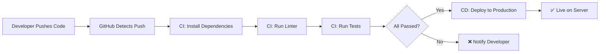
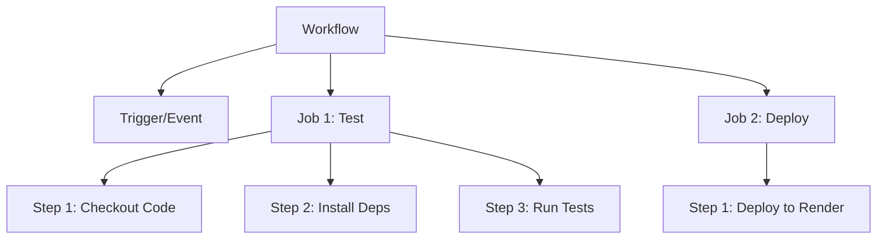
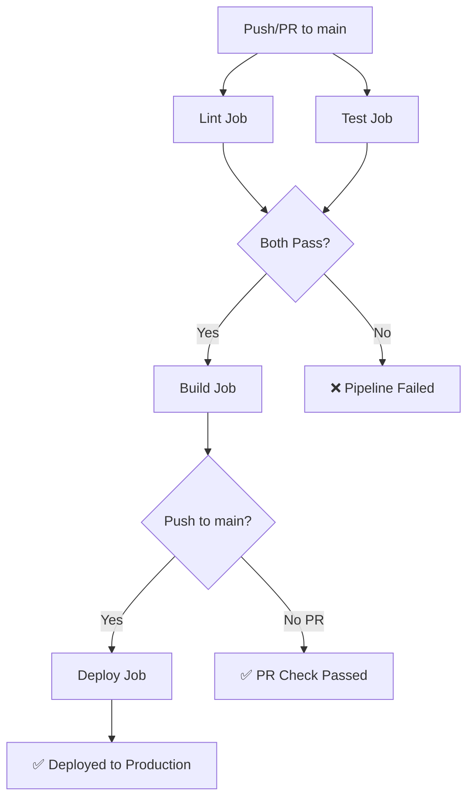

# CI/CD Basics with GitHub Actions

## What / Why

**CI/CD** stands for Continuous Integration and Continuous Deployment — automating the process of testing, building, and deploying your code every time you push changes.

- **Continuous Integration (CI):** Automatically run tests and checks on every push/PR to catch bugs early
- **Continuous Deployment (CD):** Automatically deploy to production when code passes all checks

**Analogy:** CI/CD is like an assembly line in a factory. Instead of manually inspecting and shipping each product, every item automatically goes through quality checks (CI) and gets packaged and delivered (CD) — no human intervention needed.



**Without CI/CD:** "It works on my machine" → push to production → breaks → panic
**With CI/CD:** Push → automated tests catch the bug → deployment blocked → fix before users see it

---

## GitHub Actions Concepts



| Concept           | Description                                  | Example                            |
| ----------------- | -------------------------------------------- | ---------------------------------- |
| **Workflow**      | An automated process defined in a YAML file  | `ci.yml`                           |
| **Event/Trigger** | What starts the workflow                     | `push`, `pull_request`, `schedule` |
| **Job**           | A set of steps that run on the same runner   | `test`, `build`, `deploy`          |
| **Step**          | An individual task within a job              | `Run npm test`                     |
| **Runner**        | The virtual machine that executes jobs       | `ubuntu-latest`                    |
| **Action**        | A reusable step (from marketplace or custom) | `actions/checkout@v4`              |

---

## Workflow File Location

```
my-project/
├── .github/
│   └── workflows/
│       ├── ci.yml           # Runs on every push/PR
│       ├── deploy.yml       # Runs on merge to main
│       └── scheduled.yml    # Runs on a cron schedule
├── src/
├── tests/
└── package.json
```

> Workflows must be in `.github/workflows/` directory with `.yml` or `.yaml` extension.

---

## Basic CI Workflow Example

```yaml
# .github/workflows/ci.yml
name: CI Pipeline

# When to run this workflow
on:
  push:
    branches: [main, develop]
  pull_request:
    branches: [main]

jobs:
  test:
    # Run on Ubuntu latest
    runs-on: ubuntu-latest

    # Test against multiple Node versions
    strategy:
      matrix:
        node-version: [18.x, 20.x]

    steps:
      # Step 1: Check out the repository code
      - name: Checkout code
        uses: actions/checkout@v4

      # Step 2: Set up Node.js
      - name: Setup Node.js ${{ matrix.node-version }}
        uses: actions/setup-node@v4
        with:
          node-version: ${{ matrix.node-version }}
          cache: "npm" # Cache node_modules for speed

      # Step 3: Install dependencies
      - name: Install dependencies
        run: npm ci # Clean install (faster, deterministic)

      # Step 4: Run linter
      - name: Lint code
        run: npm run lint

      # Step 5: Run tests
      - name: Run tests
        run: npm test

      # Step 6: Build (if applicable)
      - name: Build
        run: npm run build --if-present
```

---

## Common Triggers

```yaml
# Run on push to specific branches
on:
  push:
    branches: [main, develop]

# Run on pull requests targeting main
on:
  pull_request:
    branches: [main]

# Run on schedule (cron syntax)
on:
  schedule:
    - cron: '0 0 * * 1'  # Every Monday at midnight

# Run manually from GitHub UI
on:
  workflow_dispatch:

# Run on tag creation (for releases)
on:
  push:
    tags:
      - 'v*'  # v1.0.0, v2.1.3, etc.

# Multiple triggers
on:
  push:
    branches: [main]
  pull_request:
    branches: [main]
  workflow_dispatch:
```

---

## Deploying to Render on Merge to Main

Render has built-in auto-deploy from GitHub, but you can also trigger deploys via their API after tests pass:

```yaml
# .github/workflows/deploy.yml
name: Deploy to Render

on:
  push:
    branches: [main] # Only deploy when merged to main

jobs:
  test:
    runs-on: ubuntu-latest
    steps:
      - uses: actions/checkout@v4
      - uses: actions/setup-node@v4
        with:
          node-version: 20.x
          cache: "npm"
      - run: npm ci
      - run: npm test

  deploy:
    runs-on: ubuntu-latest
    needs: test # Only deploy if tests pass
    steps:
      - name: Trigger Render Deploy
        run: |
          curl -X POST "${{ secrets.RENDER_DEPLOY_HOOK_URL }}"
```

### Getting the Render Deploy Hook

1. Render Dashboard → Your Service → **Settings**
2. Scroll to **Deploy Hook**
3. Copy the URL
4. Add it as a GitHub secret (see next section)

---

## Deploying to Railway

```yaml
# .github/workflows/deploy-railway.yml
name: Deploy to Railway

on:
  push:
    branches: [main]

jobs:
  test:
    runs-on: ubuntu-latest
    steps:
      - uses: actions/checkout@v4
      - uses: actions/setup-node@v4
        with:
          node-version: 20.x
          cache: "npm"
      - run: npm ci
      - run: npm test

  deploy:
    runs-on: ubuntu-latest
    needs: test
    steps:
      - uses: actions/checkout@v4
      - name: Install Railway CLI
        run: npm install -g @railway/cli
      - name: Deploy
        run: railway up
        env:
          RAILWAY_TOKEN: ${{ secrets.RAILWAY_TOKEN }}
```

---

## Secrets in GitHub

Secrets are encrypted environment variables for your workflows. They're masked in logs.

### Adding Secrets

1. Repository → **Settings** → **Secrets and variables** → **Actions**
2. Click **New repository secret**
3. Add name and value:

```
Name: RENDER_DEPLOY_HOOK_URL
Value: https://api.render.com/deploy/srv-abc123?key=xyz789
```

### Using Secrets in Workflows

```yaml
steps:
  - name: Deploy
    env:
      API_KEY: ${{ secrets.API_KEY }}
      DEPLOY_TOKEN: ${{ secrets.DEPLOY_TOKEN }}
    run: |
      echo "Deploying with token..."
      # secrets are masked in logs - shows *** if printed
```

### Common Secrets to Store

```
RENDER_DEPLOY_HOOK_URL    # Render deploy webhook
RAILWAY_TOKEN             # Railway CLI authentication
DOCKER_USERNAME           # Docker Hub login
DOCKER_PASSWORD           # Docker Hub password
AWS_ACCESS_KEY_ID         # AWS credentials
AWS_SECRET_ACCESS_KEY     # AWS credentials
SENTRY_AUTH_TOKEN         # Error tracking
```

> ⚠️ Never hardcode secrets in workflow files. Always use `${{ secrets.SECRET_NAME }}`.

---

## Full CI/CD Pipeline Example

```yaml
# .github/workflows/pipeline.yml
name: Full CI/CD Pipeline

on:
  push:
    branches: [main]
  pull_request:
    branches: [main]

env:
  NODE_VERSION: 20.x

jobs:
  # Job 1: Code Quality
  lint:
    runs-on: ubuntu-latest
    steps:
      - uses: actions/checkout@v4
      - uses: actions/setup-node@v4
        with:
          node-version: ${{ env.NODE_VERSION }}
          cache: "npm"
      - run: npm ci
      - run: npm run lint

  # Job 2: Tests (runs in parallel with lint)
  test:
    runs-on: ubuntu-latest
    steps:
      - uses: actions/checkout@v4
      - uses: actions/setup-node@v4
        with:
          node-version: ${{ env.NODE_VERSION }}
          cache: "npm"
      - run: npm ci
      - run: npm test
      - name: Upload coverage
        uses: actions/upload-artifact@v4
        with:
          name: coverage-report
          path: coverage/

  # Job 3: Build
  build:
    runs-on: ubuntu-latest
    needs: [lint, test] # Wait for both to pass
    steps:
      - uses: actions/checkout@v4
      - uses: actions/setup-node@v4
        with:
          node-version: ${{ env.NODE_VERSION }}
          cache: "npm"
      - run: npm ci
      - run: npm run build

  # Job 4: Deploy (only on push to main, not PRs)
  deploy:
    runs-on: ubuntu-latest
    needs: build
    if: github.event_name == 'push' && github.ref == 'refs/heads/main'
    steps:
      - name: Deploy to Production
        run: curl -X POST "${{ secrets.RENDER_DEPLOY_HOOK_URL }}"
```



---

## Workflow Badges

Add a status badge to your `README.md`:

```markdown

```

**Format:**

```
https://github.com/{owner}/{repo}/actions/workflows/{workflow-file}/badge.svg
```

**Example in README:**

```markdown
# My Express API


A REST API built with Express and MongoDB.
```

---

## Useful Actions from Marketplace

```yaml
# Cache dependencies (faster builds)
- uses: actions/cache@v4
  with:
    path: ~/.npm
    key: ${{ runner.os }}-node-${{ hashFiles('**/package-lock.json') }}

# Send Slack notification
- uses: slackapi/slack-github-action@v1
  with:
    channel-id: "deploys"
    slack-message: "Deploy succeeded! 🚀"
  env:
    SLACK_BOT_TOKEN: ${{ secrets.SLACK_TOKEN }}

# Create GitHub Release
- uses: softprops/action-gh-release@v1
  with:
    tag_name: ${{ github.ref_name }}
    generate_release_notes: true
```

---

## Best Practices

1. **Run CI on every PR** — catch bugs before they reach main
2. **Use `npm ci` over `npm install`** — faster, uses lockfile exactly
3. **Cache `node_modules`** — speeds up workflows significantly
4. **Keep jobs independent** — lint and test can run in parallel
5. **Use `needs` for dependencies** — deploy only after tests pass
6. **Store secrets properly** — never hardcode tokens in YAML
7. **Use matrix strategy** — test against multiple Node.js versions
8. **Add status badges** — visibility into project health
9. **Keep workflows focused** — separate CI from CD for clarity
10. **Set timeouts** — prevent stuck workflows from running forever

```yaml
jobs:
  test:
    runs-on: ubuntu-latest
    timeout-minutes: 10 # Kill if stuck
```

---

## Common Mistakes

| Mistake                      | Problem                         | Fix                                          |
| ---------------------------- | ------------------------------- | -------------------------------------------- |
| Hardcoding secrets in YAML   | Exposed in repo history         | Use `${{ secrets.NAME }}`                    |
| No `needs` between jobs      | Deploy runs before tests finish | Add `needs: test` to deploy job              |
| Using `npm install` in CI    | Non-deterministic, slower       | Use `npm ci`                                 |
| Not caching dependencies     | Every run downloads everything  | Use `actions/setup-node` with `cache: 'npm'` |
| Deploying on PR events       | Deploys untested PR code        | Use `if: github.ref == 'refs/heads/main'`    |
| Missing checkout step        | Job has no code to work with    | Always start with `actions/checkout@v4`      |
| Wrong workflow file location | GitHub doesn't detect it        | Must be in `.github/workflows/`              |
| Not testing before deploy    | Broken code goes live           | Always `needs: test` before deploy           |

---

## Summary

- **CI** (Continuous Integration) = automatically test code on every push/PR
- **CD** (Continuous Deployment) = automatically deploy after tests pass
- GitHub Actions uses **YAML workflow files** in `.github/workflows/`
- Workflows have **triggers** (on push/PR), **jobs** (test/deploy), and **steps** (individual commands)
- Use **secrets** in GitHub settings for API keys and deploy tokens — never in code
- Deploy to Render/Railway by triggering their deploy hooks after tests pass
- Add **status badges** to README for quick visibility into build health
- Use `npm ci`, caching, and parallel jobs to keep pipelines fast
