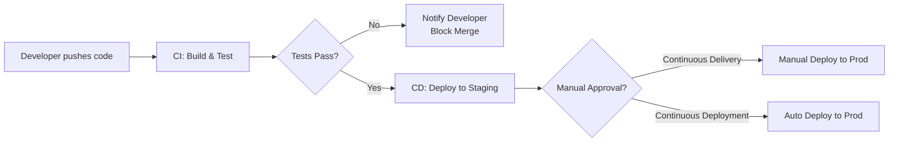
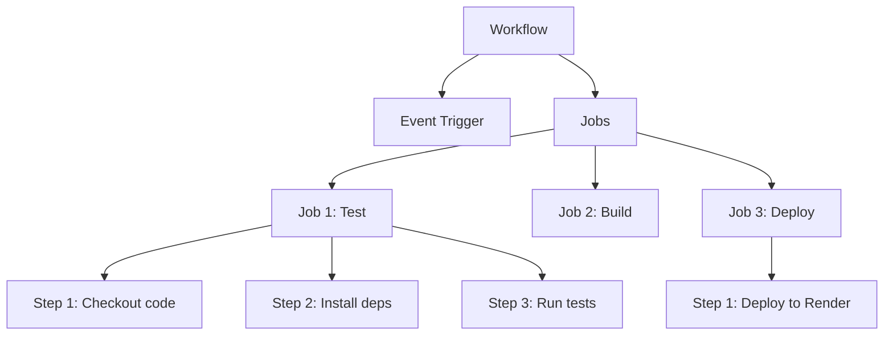
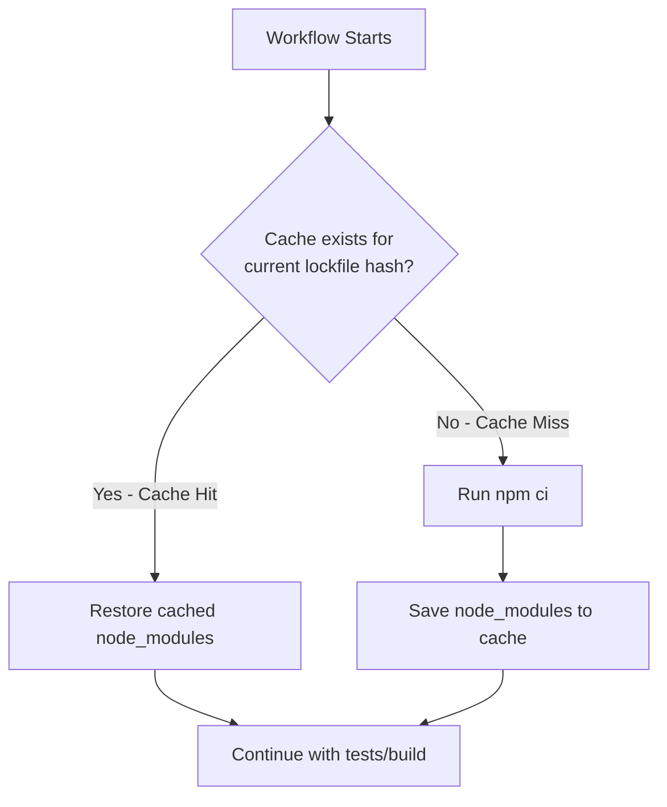
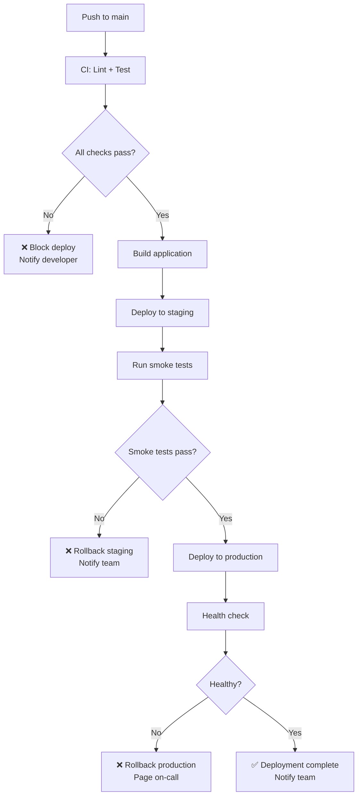

# CI/CD with GitHub Actions

## What is CI/CD?

CI/CD stands for **Continuous Integration** and **Continuous Deployment** (or Continuous Delivery). It is the practice of automating the building, testing, and deployment of your application every time code changes are pushed.

- **Continuous Integration (CI)**: Automatically run tests and checks whenever code is pushed or a pull request is opened. Catches bugs before they reach the main branch.
- **Continuous Delivery (CD)**: Automatically prepare code for release to production after CI passes. Deployment may require a manual approval.
- **Continuous Deployment (CD)**: Automatically deploy code to production after CI passes — no human intervention required.



### Why CI/CD Matters

| Without CI/CD                   | With CI/CD                                  |
| ------------------------------- | ------------------------------------------- |
| "Works on my machine" surprises | Every push is tested in a clean environment |
| Manual testing before deploy    | Automated test suite runs on every change   |
| Risky big-bang deployments      | Small, frequent, safe deployments           |
| Broken main branch              | Main is always deployable                   |
| Hours spent on deployment       | Deployment is a Git push                    |

---

## GitHub Actions Basics

GitHub Actions is GitHub's built-in CI/CD platform. It runs workflows in response to events (push, pull request, schedule, manual trigger).

### Core Concepts



| Concept      | Definition                                                 | Example                            |
| ------------ | ---------------------------------------------------------- | ---------------------------------- |
| **Workflow** | An automated process defined in a YAML file                | `.github/workflows/deploy.yml`     |
| **Event**    | What triggers the workflow                                 | `push`, `pull_request`, `schedule` |
| **Job**      | A set of steps that run on the same runner                 | `test`, `build`, `deploy`          |
| **Step**     | An individual task within a job                            | `Run npm test`                     |
| **Action**   | A reusable unit of code (from Marketplace or custom)       | `actions/checkout@v4`              |
| **Runner**   | The virtual machine that executes your job                 | `ubuntu-latest`, `windows-latest`  |
| **Artifact** | Files produced by a workflow (build outputs, test reports) | `coverage/`, `dist/`               |

### Workflow File Location

All workflow files live in `.github/workflows/` and use YAML format:

```
my-project/
├── .github/
│   └── workflows/
│       ├── ci.yml          ← Runs tests on every push/PR
│       ├── deploy.yml      ← Deploys to production on merge to main
│       └── scheduled.yml   ← Runs on a schedule (cron)
├── src/
├── package.json
└── ...
```

---

## Writing a Complete Workflow File

### Basic CI Workflow (Test on Every Push)

```yaml
# .github/workflows/ci.yml
name: CI - Run Tests

# When does this workflow run?
on:
  push:
    branches: [main, develop]
  pull_request:
    branches: [main]

# What does it do?
jobs:
  test:
    name: Run Tests
    runs-on: ubuntu-latest

    # Test against multiple Node versions
    strategy:
      matrix:
        node-version: [18, 20, 22]

    steps:
      # Step 1: Check out the repository code
      - name: Checkout code
        uses: actions/checkout@v4

      # Step 2: Set up Node.js
      - name: Setup Node.js ${{ matrix.node-version }}
        uses: actions/setup-node@v4
        with:
          node-version: ${{ matrix.node-version }}
          cache: "npm"

      # Step 3: Install dependencies
      - name: Install dependencies
        run: npm ci

      # Step 4: Run linter
      - name: Lint code
        run: npm run lint

      # Step 5: Run tests
      - name: Run tests
        run: npm test
        env:
          NODE_ENV: test
          MONGODB_URI: ${{ secrets.MONGODB_URI_TEST }}
          JWT_SECRET: test-secret-for-ci

      # Step 6: Upload coverage report
      - name: Upload coverage
        if: matrix.node-version == 20
        uses: actions/upload-artifact@v4
        with:
          name: coverage-report
          path: coverage/
```

### Full CI/CD Workflow (Test + Deploy)

```yaml
# .github/workflows/deploy.yml
name: CI/CD Pipeline

on:
  push:
    branches: [main]
  pull_request:
    branches: [main]

env:
  NODE_VERSION: 20

jobs:
  # ==================== JOB 1: TEST ====================
  test:
    name: Test
    runs-on: ubuntu-latest

    # Services (like Docker containers for the job)
    services:
      mongodb:
        image: mongo:7
        ports:
          - 27017:27017
        options: >-
          --health-cmd "mongosh --eval 'db.runCommand({ping:1})'"
          --health-interval 10s
          --health-timeout 5s
          --health-retries 5

    steps:
      - name: Checkout code
        uses: actions/checkout@v4

      - name: Setup Node.js
        uses: actions/setup-node@v4
        with:
          node-version: ${{ env.NODE_VERSION }}
          cache: "npm"

      - name: Install dependencies
        run: npm ci

      - name: Run linter
        run: npm run lint

      - name: Run unit tests
        run: npm run test:unit
        env:
          NODE_ENV: test
          JWT_SECRET: ci-test-secret

      - name: Run integration tests
        run: npm run test:integration
        env:
          NODE_ENV: test
          MONGODB_URI: mongodb://localhost:27017/testdb
          JWT_SECRET: ci-test-secret

      - name: Upload test results
        if: always()
        uses: actions/upload-artifact@v4
        with:
          name: test-results
          path: |
            coverage/
            test-results/

  # ==================== JOB 2: BUILD ====================
  build:
    name: Build
    runs-on: ubuntu-latest
    needs: test # Only runs if test job passes

    steps:
      - name: Checkout code
        uses: actions/checkout@v4

      - name: Setup Node.js
        uses: actions/setup-node@v4
        with:
          node-version: ${{ env.NODE_VERSION }}
          cache: "npm"

      - name: Install dependencies
        run: npm ci

      - name: Build application
        run: npm run build

      - name: Upload build artifact
        uses: actions/upload-artifact@v4
        with:
          name: build-output
          path: dist/

  # ==================== JOB 3: DEPLOY ====================
  deploy:
    name: Deploy to Production
    runs-on: ubuntu-latest
    needs: [test, build] # Only runs if both test and build pass
    if: github.ref == 'refs/heads/main' && github.event_name == 'push'
    # ↑ Only deploy on push to main (not on PRs)

    steps:
      - name: Checkout code
        uses: actions/checkout@v4

      - name: Deploy to Render
        uses: johnbeynon/render-deploy-action@v0.0.8
        with:
          service-id: ${{ secrets.RENDER_SERVICE_ID }}
          api-key: ${{ secrets.RENDER_API_KEY }}

      - name: Verify deployment
        run: |
          echo "Waiting for deployment to be live..."
          sleep 30
          curl -f https://my-api.onrender.com/health || exit 1
          echo "Deployment verified successfully!"
```

---

## Running Tests on Push/PR

### Triggering on Specific Events

```yaml
on:
  # Run on any push to main or develop
  push:
    branches: [main, develop]
    # Only run when these files change
    paths:
      - "src/**"
      - "tests/**"
      - "package.json"
      - "package-lock.json"
    # Ignore these paths
    paths-ignore:
      - "**.md"
      - "docs/**"

  # Run on PRs targeting main
  pull_request:
    branches: [main]
    types: [opened, synchronize, reopened]

  # Manual trigger from GitHub UI
  workflow_dispatch:
    inputs:
      environment:
        description: "Environment to deploy to"
        required: true
        default: "staging"
        type: choice
        options:
          - staging
          - production
```

### PR Status Checks

```yaml
# Require this workflow to pass before merging
# Configure in: GitHub → Repo Settings → Branches → Branch Protection Rules
# ✓ Require status checks to pass before merging
# ✓ Select "test" job as required check
```

### Testing with MongoDB Service Container

```yaml
jobs:
  test:
    runs-on: ubuntu-latest

    services:
      mongo:
        image: mongo:7
        ports:
          - 27017:27017
        options: >-
          --health-cmd "mongosh --eval 'db.runCommand({ping:1})'"
          --health-interval 10s
          --health-timeout 5s
          --health-retries 3

    steps:
      - uses: actions/checkout@v4
      - uses: actions/setup-node@v4
        with:
          node-version: 20
          cache: "npm"
      - run: npm ci
      - run: npm test
        env:
          MONGODB_URI: mongodb://localhost:27017/test
```

---

## Auto-Deploy to Render on Merge to Main

### Method 1: Render Deploy Hook (Simplest)

Render provides a deploy hook URL that triggers a new deployment when called:

```yaml
# .github/workflows/deploy-render.yml
name: Deploy to Render

on:
  push:
    branches: [main]

jobs:
  deploy:
    name: Trigger Render Deploy
    runs-on: ubuntu-latest

    steps:
      - name: Trigger deployment
        run: |
          curl -X POST "${{ secrets.RENDER_DEPLOY_HOOK_URL }}"
          echo "Deployment triggered on Render"
```

> Set `RENDER_DEPLOY_HOOK_URL` in GitHub Secrets. Find it in Render Dashboard → Service → Settings → Deploy Hook.

### Method 2: Render API (More Control)

```yaml
# .github/workflows/deploy-render-api.yml
name: Deploy to Render (API)

on:
  push:
    branches: [main]

jobs:
  test:
    runs-on: ubuntu-latest
    steps:
      - uses: actions/checkout@v4
      - uses: actions/setup-node@v4
        with:
          node-version: 20
          cache: "npm"
      - run: npm ci
      - run: npm test
        env:
          NODE_ENV: test

  deploy:
    needs: test
    runs-on: ubuntu-latest
    steps:
      - name: Deploy to Render
        env:
          RENDER_API_KEY: ${{ secrets.RENDER_API_KEY }}
          RENDER_SERVICE_ID: ${{ secrets.RENDER_SERVICE_ID }}
        run: |
          curl -X POST "https://api.render.com/v1/services/${RENDER_SERVICE_ID}/deploys" \
            -H "Authorization: Bearer ${RENDER_API_KEY}" \
            -H "Content-Type: application/json" \
            -d '{"clearCache": "do_not_clear"}'
          echo "Deployment triggered via Render API"
```

### Auto-Deploy to Railway

```yaml
# .github/workflows/deploy-railway.yml
name: Deploy to Railway

on:
  push:
    branches: [main]

jobs:
  test:
    runs-on: ubuntu-latest
    steps:
      - uses: actions/checkout@v4
      - uses: actions/setup-node@v4
        with:
          node-version: 20
          cache: "npm"
      - run: npm ci
      - run: npm test

  deploy:
    needs: test
    runs-on: ubuntu-latest
    steps:
      - name: Checkout code
        uses: actions/checkout@v4

      - name: Install Railway CLI
        run: npm install -g @railway/cli

      - name: Deploy to Railway
        run: railway up --detach
        env:
          RAILWAY_TOKEN: ${{ secrets.RAILWAY_TOKEN }}
```

> Generate `RAILWAY_TOKEN` from: Railway Dashboard → Account Settings → Tokens → Create Token.

---

## Caching Dependencies for Faster Builds

Without caching, every workflow run downloads and installs all dependencies from scratch. Caching reuses previously downloaded packages, reducing build times by 50–80%.

### Built-in Cache with setup-node

```yaml
- name: Setup Node.js
  uses: actions/setup-node@v4
  with:
    node-version: 20
    cache: "npm" # Automatically caches ~/.npm directory
```

### Advanced Caching with actions/cache

```yaml
- name: Cache node_modules
  id: cache-deps
  uses: actions/cache@v4
  with:
    path: node_modules
    key: deps-${{ runner.os }}-${{ hashFiles('package-lock.json') }}
    restore-keys: |
      deps-${{ runner.os }}-

- name: Install dependencies
  if: steps.cache-deps.outputs.cache-hit != 'true'
  run: npm ci
```

### Caching Explained



| Cache Strategy  | Key Pattern                                        | When It Invalidates              |
| --------------- | -------------------------------------------------- | -------------------------------- |
| Exact match     | `deps-linux-${{ hashFiles('package-lock.json') }}` | When any dependency changes      |
| Partial restore | `deps-linux-` (fallback)                           | Uses closest match, then updates |
| OS-specific     | `${{ runner.os }}-node-modules`                    | Different OS = different cache   |

### Build Times Comparison

| Scenario                 | Without Cache | With Cache                              |
| ------------------------ | ------------- | --------------------------------------- |
| Fresh install (no cache) | ~45 seconds   | ~45 seconds (first run)                 |
| No dependency changes    | ~45 seconds   | ~5 seconds (restore)                    |
| Minor dependency update  | ~45 seconds   | ~15 seconds (partial restore + install) |

---

## Environment Secrets in GitHub Actions

GitHub Actions provides encrypted secrets that are never exposed in logs or to forked repositories.

### Setting Up Secrets

1. Go to **Repository → Settings → Secrets and variables → Actions**
2. Click **New repository secret**
3. Add name and value (value is encrypted and never shown again)

### Using Secrets in Workflows

```yaml
jobs:
  deploy:
    runs-on: ubuntu-latest
    steps:
      - name: Deploy with secrets
        env:
          # Access secrets via ${{ secrets.NAME }}
          MONGODB_URI: ${{ secrets.MONGODB_URI }}
          JWT_SECRET: ${{ secrets.JWT_SECRET }}
          RENDER_API_KEY: ${{ secrets.RENDER_API_KEY }}
        run: |
          echo "Deploying with secure credentials..."
          # Secrets are masked in logs — if you accidentally echo them,
          # GitHub replaces the value with ***
```

### Environment-Specific Secrets

GitHub supports **Environments** for separating secrets per deployment target:

```yaml
jobs:
  deploy-staging:
    runs-on: ubuntu-latest
    environment: staging # Uses secrets from "staging" environment
    steps:
      - name: Deploy to staging
        env:
          API_URL: ${{ secrets.API_URL }} # staging-specific value
        run: echo "Deploying to staging..."

  deploy-production:
    runs-on: ubuntu-latest
    environment: production # Uses secrets from "production" environment
    needs: deploy-staging
    steps:
      - name: Deploy to production
        env:
          API_URL: ${{ secrets.API_URL }} # production-specific value
        run: echo "Deploying to production..."
```

### Secrets Scope

| Scope                | Access                             | Use Case                       |
| -------------------- | ---------------------------------- | ------------------------------ |
| Repository secrets   | All workflows in the repo          | API keys, deploy tokens        |
| Environment secrets  | Only jobs with that environment    | Stage-specific DB URLs         |
| Organization secrets | All repos in the org (or selected) | Shared credentials (npm token) |

### Security Rules for Secrets

```yaml
# Secrets are NOT available in:
# - Workflows triggered by forks (prevents secret theft)
# - Steps that run user-provided code from PRs without approval

# Required protection for production environments:
# GitHub → Settings → Environments → production
#   ✓ Required reviewers (someone must approve before deploy)
#   ✓ Wait timer (e.g., 5 minutes delay)
#   ✓ Deployment branches (only main can deploy)
```

### Example: Complete Secrets Setup

```yaml
# .github/workflows/deploy.yml
name: Deploy Pipeline

on:
  push:
    branches: [main]

jobs:
  test:
    runs-on: ubuntu-latest
    steps:
      - uses: actions/checkout@v4
      - uses: actions/setup-node@v4
        with:
          node-version: 20
          cache: "npm"
      - run: npm ci
      - run: npm test
        env:
          # Test-specific secrets (can use test/mock values)
          MONGODB_URI: mongodb://localhost:27017/test
          JWT_SECRET: ${{ secrets.JWT_SECRET_TEST }}

  deploy:
    needs: test
    runs-on: ubuntu-latest
    environment: production # Requires approval + uses production secrets

    steps:
      - uses: actions/checkout@v4

      - name: Deploy to Render
        run: |
          curl -X POST "https://api.render.com/v1/services/${{ secrets.RENDER_SERVICE_ID }}/deploys" \
            -H "Authorization: Bearer ${{ secrets.RENDER_API_KEY }}" \
            -H "Content-Type: application/json"

      - name: Notify team
        if: success()
        run: |
          curl -X POST "${{ secrets.SLACK_WEBHOOK_URL }}" \
            -H "Content-Type: application/json" \
            -d '{"text": "✅ Deployed to production: ${{ github.sha }}"}'

      - name: Notify failure
        if: failure()
        run: |
          curl -X POST "${{ secrets.SLACK_WEBHOOK_URL }}" \
            -H "Content-Type: application/json" \
            -d '{"text": "❌ Deployment failed: ${{ github.sha }}"}'
```

---

## Advanced Patterns

### Reusable Workflows

```yaml
# .github/workflows/reusable-test.yml
name: Reusable Test Workflow

on:
  workflow_call:
    inputs:
      node-version:
        required: false
        type: string
        default: "20"
    secrets:
      MONGODB_URI:
        required: true

jobs:
  test:
    runs-on: ubuntu-latest
    steps:
      - uses: actions/checkout@v4
      - uses: actions/setup-node@v4
        with:
          node-version: ${{ inputs.node-version }}
          cache: "npm"
      - run: npm ci
      - run: npm test
        env:
          MONGODB_URI: ${{ secrets.MONGODB_URI }}
```

```yaml
# .github/workflows/main.yml — Call the reusable workflow
name: Main Pipeline

on:
  push:
    branches: [main]

jobs:
  test:
    uses: ./.github/workflows/reusable-test.yml
    with:
      node-version: "20"
    secrets:
      MONGODB_URI: ${{ secrets.MONGODB_URI }}

  deploy:
    needs: test
    runs-on: ubuntu-latest
    steps:
      - run: echo "Deploying..."
```

### Conditional Steps and Jobs

```yaml
jobs:
  deploy:
    runs-on: ubuntu-latest
    steps:
      - name: Deploy to staging
        if: github.ref == 'refs/heads/develop'
        run: echo "Deploying to staging..."

      - name: Deploy to production
        if: github.ref == 'refs/heads/main'
        run: echo "Deploying to production..."

      - name: Notify on failure only
        if: failure()
        run: echo "Something went wrong!"

      - name: Always run cleanup
        if: always()
        run: echo "Cleaning up..."
```

### Matrix Strategy for Multiple Environments

```yaml
jobs:
  test:
    runs-on: ubuntu-latest
    strategy:
      matrix:
        node-version: [18, 20, 22]
        mongodb-version: ["6.0", "7.0"]
      fail-fast: false # Don't cancel other jobs if one fails

    steps:
      - uses: actions/checkout@v4
      - uses: actions/setup-node@v4
        with:
          node-version: ${{ matrix.node-version }}
      - name: Start MongoDB
        uses: supercharge/mongodb-github-action@1.10.0
        with:
          mongodb-version: ${{ matrix.mongodb-version }}
      - run: npm ci
      - run: npm test
```

---

## Workflow Visualization



---

## Best Practices

- Run tests on every push and PR — never merge code that has not passed CI.
- Use `npm ci` instead of `npm install` in CI — it is faster and respects the lockfile exactly.
- Cache dependencies to reduce build times by 50–80%.
- Use environment-specific secrets — never share production credentials with staging or test.
- Require status checks before merging — configure branch protection rules to enforce CI.
- Deploy only from main branch — PRs trigger tests, merges trigger deployments.
- Add a health check step after deployment to verify the new version is actually working.
- Use matrix builds to test across multiple Node.js versions.
- Keep workflows DRY with reusable workflows for common patterns.
- Set timeouts on jobs to prevent stuck workflows from consuming minutes: `timeout-minutes: 10`.
- Use `if: always()` for cleanup steps that must run regardless of success/failure.
- Pin action versions to a specific SHA or major version (`actions/checkout@v4`) — not `@main`.

## Common Mistakes

| Mistake                                 | Why It Is a Problem                                                     |
| --------------------------------------- | ----------------------------------------------------------------------- |
| Using `npm install` instead of `npm ci` | `npm install` may modify `package-lock.json`; `npm ci` is deterministic |
| Not caching `node_modules`              | Every workflow run spends 30–60s downloading the same packages          |
| Exposing secrets in logs                | `echo $SECRET` prints to logs; use `${{ secrets.X }}` which auto-masks  |
| Deploying from pull request events      | Forked PRs could contain malicious code that accesses secrets           |
| No branch protection rules              | Anyone can push broken code directly to main                            |
| Hardcoding secrets in workflow files    | YAML files are committed to Git — secrets must use `${{ secrets.X }}`   |
| No timeout on jobs                      | A hanging test can consume all your free CI minutes                     |
| Running deploy without `needs: test`    | Deploys broken code if test job is skipped or fails                     |
| Using `@latest` for actions             | Breaking changes in actions can silently break your workflows           |

## Summary

- CI/CD automates building, testing, and deploying your application — reducing human error and enabling rapid, safe releases.
- GitHub Actions is GitHub's built-in CI/CD platform using YAML workflow files stored in `.github/workflows/`.
- Workflows consist of events (triggers), jobs (groups of steps), and steps (individual tasks).
- Run tests on every push and PR to catch bugs before they reach production. Use service containers for databases in CI.
- Auto-deploy to Render or Railway using deploy hooks, platform APIs, or CLI tools — triggered only on merge to main.
- Caching `node_modules` with `actions/cache` or built-in setup-node caching reduces build times dramatically.
- Secrets are encrypted, auto-masked in logs, and scoped to repositories or environments — never commit them to workflow files.
- Use branch protection rules, required status checks, and environment approvals to enforce quality gates.
- A well-configured CI/CD pipeline means every merge to main is automatically tested and deployed — your main branch is always production-ready.
