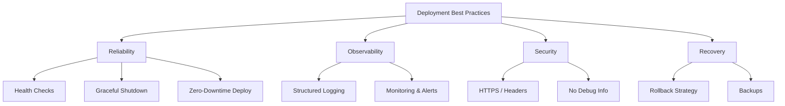
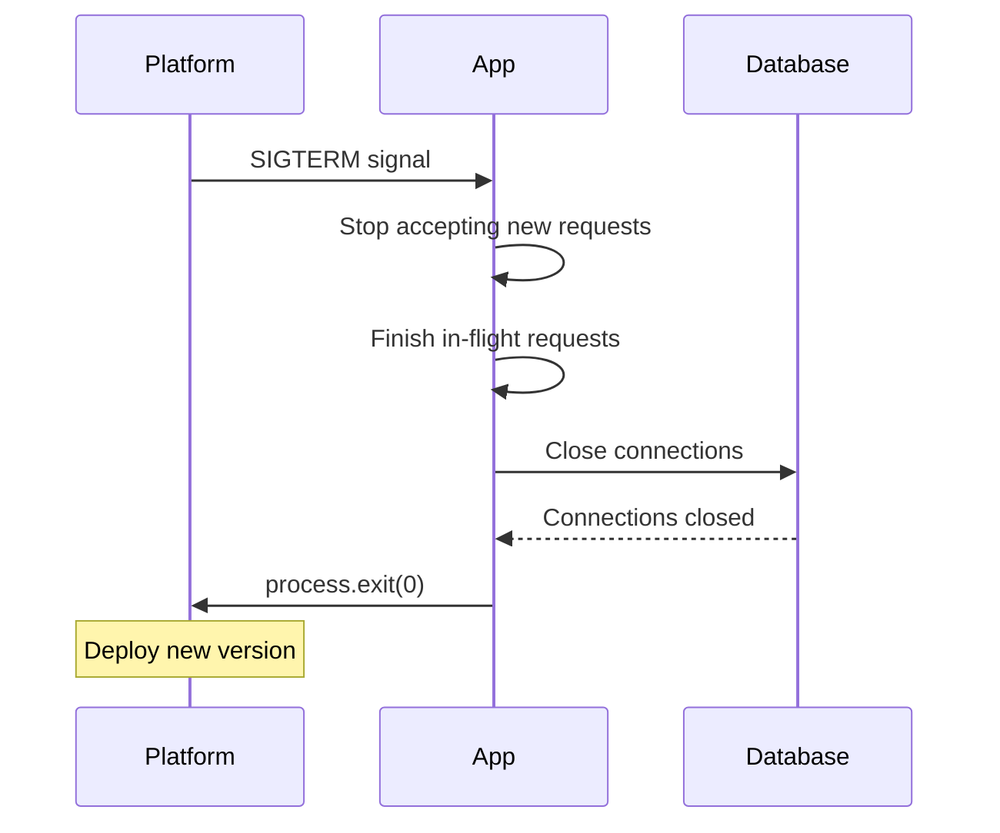
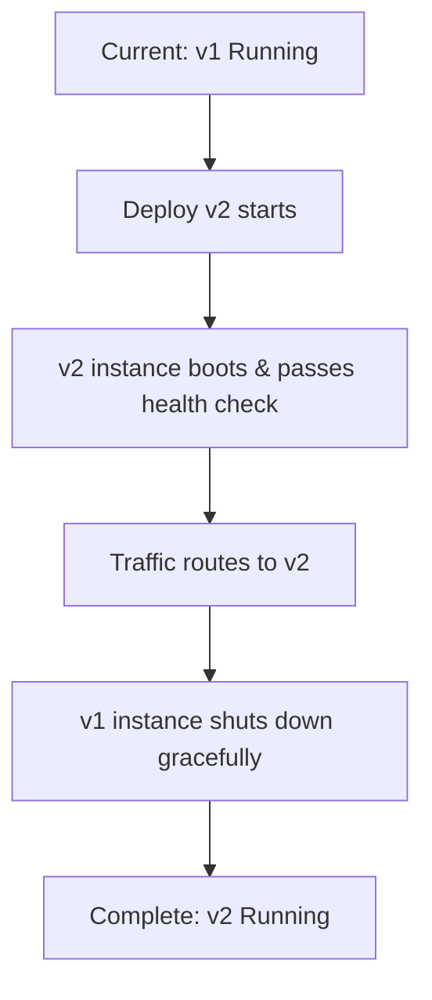
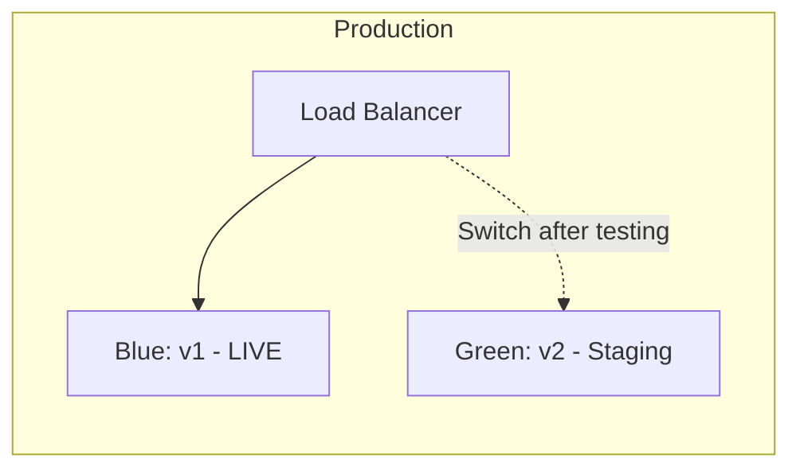
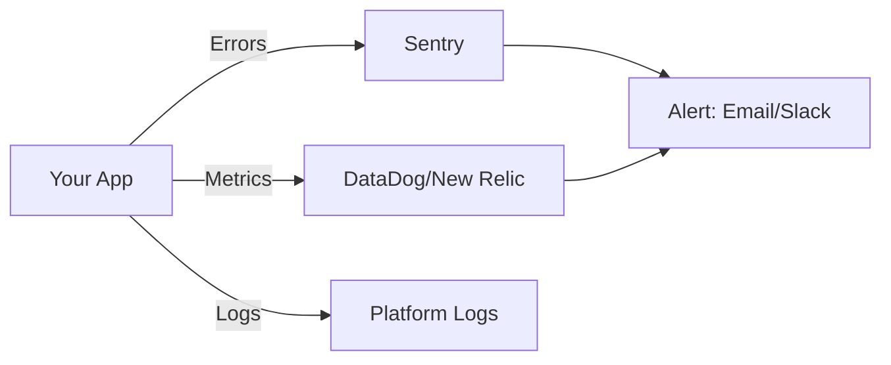
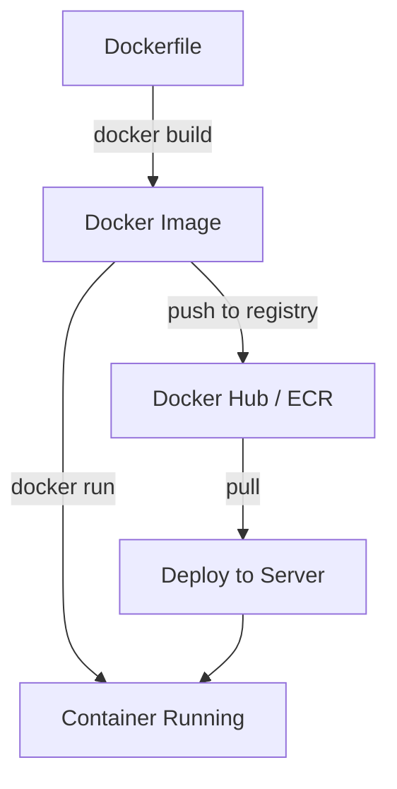

# Deployment Best Practices

## What / Why

Deploying code is only half the battle. Keeping your app **reliable, observable, secure, and recoverable** in production is what separates a demo from a real product. These practices ensure your app stays healthy under real-world conditions.

**Analogy:** Deploying without best practices is like opening a restaurant but having no fire exits, no food safety checks, and no way to contact staff in an emergency. You might serve food, but you're not ready for real customers.



---

## Health Check Endpoints

A health check endpoint tells your platform (and you) whether the app is alive and functioning.

```javascript
const mongoose = require("mongoose");

// Basic health check
app.get("/health", (req, res) => {
  res.status(200).json({ status: "ok" });
});

// Detailed health check (with dependency status)
app.get("/health/detailed", async (req, res) => {
  const health = {
    status: "ok",
    timestamp: new Date().toISOString(),
    uptime: process.uptime(),
    environment: process.env.NODE_ENV,
    checks: {
      database:
        mongoose.connection.readyState === 1 ? "connected" : "disconnected",
      memory: {
        used: `${Math.round(process.memoryUsage().heapUsed / 1024 / 1024)}MB`,
        total: `${Math.round(process.memoryUsage().heapTotal / 1024 / 1024)}MB`,
      },
    },
  };

  const httpStatus = health.checks.database === "connected" ? 200 : 503;
  res.status(httpStatus).json(health);
});
```

**Why hosting platforms need this:**

- Render/Railway ping your health endpoint to confirm the app started
- Load balancers route traffic only to healthy instances
- Auto-restart triggers when health checks fail

---

## Logging in Production (Structured JSON Logs)

Console.log is for development. In production, use structured logging:

```javascript
// ❌ Bad: Unstructured logs
console.log("User logged in: " + userId);
console.log("Error:", error.message);

// ✅ Good: Structured JSON logs
const logger = require("./logger");
logger.info("User logged in", { userId, ip: req.ip });
logger.error("Database query failed", {
  error: error.message,
  query,
  stack: error.stack,
});
```

### Simple Production Logger

```javascript
// utils/logger.js
const levels = { error: 0, warn: 1, info: 2, debug: 3 };
const currentLevel = levels[process.env.LOG_LEVEL || "info"];

const log = (level, message, meta = {}) => {
  if (levels[level] > currentLevel) return;

  const entry = JSON.stringify({
    timestamp: new Date().toISOString(),
    level,
    message,
    ...meta,
    service: process.env.SERVICE_NAME || "my-api",
  });

  if (level === "error") console.error(entry);
  else console.log(entry);
};

module.exports = {
  info: (msg, meta) => log("info", msg, meta),
  warn: (msg, meta) => log("warn", msg, meta),
  error: (msg, meta) => log("error", msg, meta),
  debug: (msg, meta) => log("debug", msg, meta),
};
```

### Using Winston (Popular Library)

```bash
npm install winston
```

```javascript
const winston = require("winston");

const logger = winston.createLogger({
  level: process.env.LOG_LEVEL || "info",
  format: winston.format.combine(
    winston.format.timestamp(),
    winston.format.json(),
  ),
  defaultMeta: { service: "my-api" },
  transports: [new winston.transports.Console()],
});

// In development, add colorized output
if (process.env.NODE_ENV !== "production") {
  logger.add(
    new winston.transports.Console({
      format: winston.format.combine(
        winston.format.colorize(),
        winston.format.simple(),
      ),
    }),
  );
}

module.exports = logger;
```

**Output in production:**

```json
{"timestamp":"2024-01-15T10:30:00.000Z","level":"info","message":"Server started","service":"my-api","port":3000}
{"timestamp":"2024-01-15T10:30:05.123Z","level":"error","message":"DB query failed","service":"my-api","query":"findUser","error":"timeout"}
```

---

## Process Managers (PM2)

PM2 keeps your Node.js app running, restarts on crashes, and manages multiple instances.

```bash
# Install globally
npm install -g pm2

# Start your app
pm2 start server.js --name "my-api"

# Start with cluster mode (use all CPU cores)
pm2 start server.js -i max --name "my-api"

# Common commands
pm2 status          # View running processes
pm2 logs            # View logs
pm2 restart my-api  # Restart
pm2 stop my-api     # Stop
pm2 delete my-api   # Remove from PM2
```

### Ecosystem File

```javascript
// ecosystem.config.js
module.exports = {
  apps: [
    {
      name: "my-api",
      script: "server.js",
      instances: "max", // Use all CPU cores
      exec_mode: "cluster", // Cluster mode for load balancing
      env: {
        NODE_ENV: "development",
        PORT: 3000,
      },
      env_production: {
        NODE_ENV: "production",
        PORT: 10000,
      },
      // Auto-restart config
      max_memory_restart: "500M",
      exp_backoff_restart_delay: 100,
    },
  ],
};
```

```bash
# Start with ecosystem file
pm2 start ecosystem.config.js --env production

# Save process list (survives server reboot)
pm2 save
pm2 startup  # Generate startup script
```

> 💡 On platforms like Render/Railway, you don't need PM2 — the platform manages process lifecycle. PM2 is essential for self-managed servers (EC2, VPS).

---

## Graceful Shutdown (SIGTERM Handling)

When a platform needs to stop your app (deploy, scaling down, restart), it sends a `SIGTERM` signal. Handle it gracefully:

```javascript
const express = require("express");
const mongoose = require("mongoose");

const app = express();
const server = app.listen(process.env.PORT || 3000);

// Graceful shutdown handler
function gracefulShutdown(signal) {
  console.log(`\n${signal} received. Starting graceful shutdown...`);

  // Step 1: Stop accepting new connections
  server.close(() => {
    console.log("HTTP server closed");

    // Step 2: Close database connections
    mongoose.connection.close(false, () => {
      console.log("MongoDB connection closed");

      // Step 3: Exit cleanly
      console.log("Graceful shutdown complete");
      process.exit(0);
    });
  });

  // Step 4: Force shutdown if graceful fails (timeout)
  setTimeout(() => {
    console.error("Forced shutdown - graceful shutdown timed out");
    process.exit(1);
  }, 10000); // 10 second timeout
}

// Listen for termination signals
process.on("SIGTERM", () => gracefulShutdown("SIGTERM"));
process.on("SIGINT", () => gracefulShutdown("SIGINT"));

// Handle uncaught exceptions
process.on("uncaughtException", (error) => {
  console.error("Uncaught Exception:", error);
  gracefulShutdown("uncaughtException");
});

process.on("unhandledRejection", (reason) => {
  console.error("Unhandled Rejection:", reason);
  // Don't exit — log and monitor
});
```



---

## Zero-Downtime Deployments

Ensure users never see an error during deployment:

### Strategy 1: Rolling Deployment (Platform-managed)



Render and Railway do this automatically — new instance starts, health check passes, old instance gets SIGTERM.

### Strategy 2: Blue-Green Deployment



### Key Requirements for Zero-Downtime

1. **Health check endpoint** — platform knows when new version is ready
2. **Graceful shutdown** — old version finishes requests before dying
3. **Backward-compatible database changes** — new code works with old data and vice versa
4. **Stateless app** — no in-memory sessions (use Redis/DB instead)

---

## Rollback Strategies

```javascript
// Always know your last working version
// On Render: Dashboard → Deploys → click "Rollback" on previous deploy
// On Railway: Dashboard → Deployments → Redeploy previous
```

### Git-based Rollback

```bash
# Revert the problematic commit
git revert HEAD
git push origin main
# Auto-deploy triggers with the revert

# Or deploy a specific previous commit
git checkout <previous-commit-hash>
# Force deploy from that commit in platform dashboard
```

### Best Practices for Rollbacks

1. Keep deployments small and frequent — easier to identify what broke
2. Use feature flags — disable broken features without redeploying
3. Maintain database backward compatibility — rollback shouldn't break data
4. Tag releases — know exactly what's deployed

```bash
git tag -a v1.2.3 -m "Release 1.2.3"
git push origin v1.2.3
```

---

## Monitoring and Alerting Basics



### Error Tracking with Sentry

```bash
npm install @sentry/node
```

```javascript
const Sentry = require("@sentry/node");

Sentry.init({
  dsn: process.env.SENTRY_DSN,
  environment: process.env.NODE_ENV,
  tracesSampleRate: 0.1, // 10% of transactions
});

// Express error handler (add LAST, after all routes)
app.use(Sentry.Handlers.errorHandler());
```

### Key Metrics to Monitor

| Metric               | Why              | Alert Threshold  |
| -------------------- | ---------------- | ---------------- |
| Response time (p95)  | User experience  | > 2 seconds      |
| Error rate           | App stability    | > 1% of requests |
| Memory usage         | Memory leaks     | > 80% of limit   |
| CPU usage            | Performance      | > 70% sustained  |
| Uptime               | Availability     | Any downtime     |
| Database connections | Connection leaks | Near pool limit  |

---

## Security Checklist

```javascript
const helmet = require("helmet");
const rateLimit = require("express-rate-limit");
const cors = require("cors");

// Security headers (HTTPS, XSS protection, etc.)
app.use(helmet());

// CORS - restrict origins
app.use(
  cors({
    origin: process.env.CORS_ORIGIN || "https://myapp.com",
    credentials: true,
  }),
);

// Rate limiting
const limiter = rateLimit({
  windowMs: 15 * 60 * 1000, // 15 minutes
  max: 100, // limit per IP
  message: "Too many requests, please try again later",
});
app.use("/api", limiter);

// Don't expose tech stack
app.disable("x-powered-by");

// Production error handler - no stack traces
app.use((err, req, res, next) => {
  const status = err.status || 500;
  res.status(status).json({
    error:
      process.env.NODE_ENV === "production"
        ? "Something went wrong" // Generic message
        : err.message, // Detailed in dev
  });
});
```

### Security Checklist Table

| Check                 | Why                          | Implementation                             |
| --------------------- | ---------------------------- | ------------------------------------------ |
| HTTPS only            | Encrypt all traffic          | Platform provides SSL; redirect HTTP→HTTPS |
| Security headers      | Prevent XSS, clickjacking    | `helmet()` middleware                      |
| Rate limiting         | Prevent DDoS/brute force     | `express-rate-limit`                       |
| CORS restrictions     | Prevent unauthorized origins | Configure allowed origins                  |
| No debug info in prod | Don't expose internals       | Generic error messages                     |
| Input validation      | Prevent injection            | Validate/sanitize all input                |
| Dependency audit      | Known vulnerabilities        | `npm audit` in CI pipeline                 |
| Secrets in env vars   | Don't expose credentials     | Never hardcode secrets                     |

---

## Docker Basics for Deployment

### Why Docker?

- **Consistency:** "Works on my machine" → "Works everywhere"
- **Isolation:** App runs in its own container with exact dependencies
- **Portability:** Deploy the same container to any platform

### Dockerfile for Node.js

```dockerfile
# Dockerfile
# Stage 1: Use official Node.js image
FROM node:20-alpine

# Set working directory
WORKDIR /app

# Copy package files first (for better caching)
COPY package*.json ./

# Install production dependencies only
RUN npm ci --only=production

# Copy application code
COPY . .

# Expose port
EXPOSE 3000

# Health check
HEALTHCHECK --interval=30s --timeout=3s --start-period=5s --retries=3 \
  CMD wget --no-verbose --tries=1 --spider http://localhost:3000/health || exit 1

# Start the app
CMD ["node", "server.js"]
```

### .dockerignore

```dockerignore
node_modules
npm-debug.log
.env
.git
.gitignore
README.md
.github
coverage
tests
```

### Docker Compose (Multi-container)

```yaml
# docker-compose.yml
version: "3.8"

services:
  api:
    build: .
    ports:
      - "3000:3000"
    environment:
      - NODE_ENV=production
      - DATABASE_URL=mongodb://mongo:27017/myapp
      - JWT_SECRET=${JWT_SECRET}
    depends_on:
      - mongo
    restart: unless-stopped

  mongo:
    image: mongo:7
    ports:
      - "27017:27017"
    volumes:
      - mongo-data:/data/db
    restart: unless-stopped

volumes:
  mongo-data:
```

### Common Docker Commands

```bash
# Build the image
docker build -t my-api .

# Run the container
docker run -p 3000:3000 --env-file .env my-api

# Docker Compose
docker-compose up -d        # Start all services
docker-compose down         # Stop all services
docker-compose logs -f api  # Follow logs for api service

# View running containers
docker ps
```



---

## Best Practices Summary

1. **Health checks** — every app needs a `/health` endpoint
2. **Structured logging** — JSON logs with timestamps and context
3. **Graceful shutdown** — handle SIGTERM, close connections, finish requests
4. **Zero-downtime** — rolling deploys, backward-compatible DB changes
5. **Security headers** — use `helmet()`, disable `x-powered-by`
6. **Rate limiting** — protect against abuse
7. **Error tracking** — use Sentry or similar for production errors
8. **Docker** — containerize for consistent deployments across environments
9. **Rollback plan** — always know how to revert to the previous version
10. **Monitor metrics** — response time, error rate, memory, CPU

---

## Common Mistakes

| Mistake                           | Problem                                   | Fix                                 |
| --------------------------------- | ----------------------------------------- | ----------------------------------- |
| No health check                   | Platform can't verify app is alive        | Add `/health` endpoint              |
| Using `console.log` in production | Unstructured, hard to search/filter       | Use structured JSON logging         |
| No SIGTERM handler                | In-flight requests get killed             | Implement graceful shutdown         |
| Exposing stack traces             | Attackers learn your internals            | Generic errors in production        |
| No rate limiting                  | Vulnerable to DDoS                        | Add `express-rate-limit`            |
| Storing sessions in memory        | Lost on restart, can't scale              | Use Redis or database               |
| No rollback plan                  | Stuck with broken deploy                  | Tag releases, use platform rollback |
| Running as root in Docker         | Security risk                             | Use `USER node` in Dockerfile       |
| No `.dockerignore`                | Image bloated with `node_modules`, `.git` | Create `.dockerignore`              |

---

## Summary

- Production apps need **health checks**, **structured logging**, and **graceful shutdown**
- Use **PM2** on self-managed servers; platforms like Render handle process management
- Handle **SIGTERM** to cleanly close connections and finish requests
- Implement **zero-downtime deploys** through rolling updates and stateless design
- Always have a **rollback strategy** — tag releases and keep deployments small
- **Security:** use helmet, rate limiting, CORS, and never expose debug info
- **Docker** provides consistent environments — build once, run anywhere
- **Monitor** errors (Sentry), metrics (response time, memory), and set alerts
