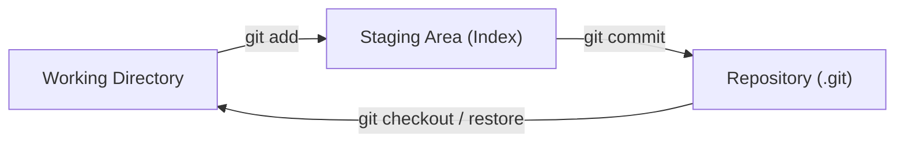

# Git Basics

## What Is Git?

Git is a **distributed version control system (DVCS)** — it tracks changes to files over time and allows multiple developers to collaborate on the same codebase without overwriting each other's work.

**Analogy:** Think of Git as an unlimited "undo history" for your entire project. Every save point (commit) is a snapshot you can travel back to at any time. Unlike Google Docs which saves to one central server, Git gives every developer a full copy of the project history on their own machine.

### Distributed vs Centralized

| Feature                 | Centralized (SVN)         | Distributed (Git)                 |
| ----------------------- | ------------------------- | --------------------------------- |
| History location        | Single server             | Every developer's machine         |
| Offline work            | ❌ Need server connection | ✅ Full history available locally |
| Speed                   | Slower (network calls)    | Faster (local operations)         |
| Single point of failure | Yes                       | No                                |

---

## Why Version Control Matters

1. **History** — See what changed, when, and by whom.
2. **Collaboration** — Multiple people work on the same project without conflicts.
3. **Experimentation** — Create branches to try ideas without breaking the main code.
4. **Backup** — Every clone is a full backup of the repository.
5. **Accountability** — Every change is attributed to a specific developer.

---

## Installing Git

### Windows

```bash
# Download from https://git-scm.com/download/win
# Or use winget:
winget install --id Git.Git -e --source winget
```

### macOS

```bash
# Xcode command line tools (includes git):
xcode-select --install

# Or via Homebrew:
brew install git
```

### Linux (Debian/Ubuntu)

```bash
sudo apt update
sudo apt install git
```

### Verify Installation

```bash
git --version
# git version 2.43.0
```

### First-Time Configuration

```bash
git config --global user.name "Your Name"
git config --global user.email "you@example.com"
git config --global init.defaultBranch main

# Verify config
git config --list
```

---

## The Three Areas of Git

Understanding how Git moves files between three areas is the key to everything else.



| Area                 | What It Is                                                            | Analogy                                        |
| -------------------- | --------------------------------------------------------------------- | ---------------------------------------------- |
| Working Directory    | Your actual project files on disk                                     | Your desk where you do work                    |
| Staging Area (Index) | A "preparation zone" — files marked to be included in the next commit | A box where you put things before shipping     |
| Repository (.git)    | The permanent history of committed snapshots                          | The warehouse that stores all shipped packages |

---

## Core Commands

### `git init` — Initialize a Repository

Creates a new `.git` folder in the current directory, turning it into a Git repository.

```bash
mkdir my-project
cd my-project
git init
# Initialized empty Git repository in /home/user/my-project/.git/
```

### `git status` — Check the Current State

Shows which files are modified, staged, or untracked.

```bash
git status
# On branch main
# No commits yet
#
# Untracked files:
#   (use "git add <file>..." to include in what will be committed)
#         index.html
#         style.css
```

### `git add` — Stage Changes

Moves files from the working directory to the staging area.

```bash
# Stage a specific file
git add index.html

# Stage multiple files
git add index.html style.css

# Stage all changes in the current directory
git add .

# Stage all changes in the entire repo
git add -A
```

### `git commit` — Save a Snapshot

Takes everything in the staging area and saves it as a permanent snapshot.

```bash
# Commit with a message
git commit -m "Add homepage HTML structure"

# Commit with a multi-line message (opens editor)
git commit

# Stage all tracked files AND commit in one step
git commit -am "Fix typo in heading"
```

**Note:** `git commit -am` only works for files that Git is already tracking. New (untracked) files still need `git add` first.

---

## Viewing History with `git log`

```bash
# Full log
git log

# Compact one-line format
git log --oneline

# Show last 5 commits
git log --oneline -5

# Show a graph of branches
git log --oneline --graph --all

# Show changes in each commit
git log -p

# Filter by author
git log --author="Vikas"

# Filter by date
git log --since="2024-01-01" --until="2024-06-01"
```

**Example output:**

```
$ git log --oneline -3
a1b2c3d (HEAD -> main) Add contact page
f4e5d6c Fix navigation links
7890abc Initial commit
```

---

## Seeing Changes with `git diff`

```bash
# Changes in working directory (not yet staged)
git diff

# Changes that are staged (ready to commit)
git diff --staged

# Compare two commits
git diff a1b2c3d f4e5d6c

# Compare a specific file
git diff index.html

# Show only file names that changed
git diff --name-only
```

**Example output:**

```diff
diff --git a/index.html b/index.html
index 83db48f..bf269f4 100644
--- a/index.html
+++ b/index.html
@@ -1,4 +1,4 @@
 <html>
-  <h1>Hello World</h1>
+  <h1>Hello Git</h1>
 </html>
```

Lines with `-` are removed, lines with `+` are added.

---

## The `.gitignore` File

Tells Git which files and directories to ignore (never track).

### Common `.gitignore` for Node.js Projects

```gitignore
# Dependencies
node_modules/

# Environment variables
.env
.env.local
.env.*.local

# Build output
dist/
build/

# Logs
*.log
npm-debug.log*

# OS files
.DS_Store
Thumbs.db

# IDE files
.vscode/
.idea/
*.swp

# Coverage reports
coverage/

# TypeScript cache
*.tsbuildinfo
```

### Pattern Syntax

| Pattern          | Meaning                                  |
| ---------------- | ---------------------------------------- |
| `node_modules/`  | Ignore a directory and everything inside |
| `*.log`          | Ignore all files ending in `.log`        |
| `!important.log` | Exception — do NOT ignore this file      |
| `build/`         | Ignore the `build` folder                |
| `**/*.tmp`       | Ignore `.tmp` files in any subdirectory  |
| `/TODO`          | Ignore `TODO` only in the root directory |

**Important:** If a file is already tracked by Git, adding it to `.gitignore` won't stop tracking it. You need to untrack it first:

```bash
git rm --cached filename.log
git commit -m "Stop tracking filename.log"
```

---

## Undoing Changes

### `git restore` — Discard Working Directory Changes (Git 2.23+)

```bash
# Discard changes in a specific file (revert to last commit)
git restore index.html

# Discard all changes in working directory
git restore .

# Unstage a file (move from staging back to working directory)
git restore --staged index.html
```

### `git checkout --` — Older Way to Discard Changes

```bash
# Same as git restore (pre-2.23 syntax)
git checkout -- index.html
```

### Amend the Last Commit

```bash
# Fix the last commit message
git commit --amend -m "Corrected commit message"

# Add forgotten files to the last commit
git add forgotten-file.js
git commit --amend --no-edit
```

⚠️ **Never amend commits that have been pushed to a shared remote.**

---

## Commit Message Conventions

Good commit messages make history readable and searchable.

### Conventional Commits Format

```
<type>(<scope>): <description>

[optional body]

[optional footer]
```

### Types

| Type       | When to Use                             |
| ---------- | --------------------------------------- |
| `feat`     | A new feature                           |
| `fix`      | A bug fix                               |
| `docs`     | Documentation only                      |
| `style`    | Formatting, semicolons (no code change) |
| `refactor` | Code restructuring (no feature/fix)     |
| `test`     | Adding or fixing tests                  |
| `chore`    | Build process, dependencies, tooling    |
| `perf`     | Performance improvement                 |
| `ci`       | CI/CD configuration changes             |

### Examples

```bash
git commit -m "feat(auth): add Google OAuth login"
git commit -m "fix(cart): resolve quantity not updating on click"
git commit -m "docs(readme): add setup instructions for Windows"
git commit -m "refactor(api): extract validation into middleware"
```

### Rules for Good Messages

1. Use **imperative mood** — "Add feature" not "Added feature" or "Adds feature"
2. Keep the subject line under **72 characters**
3. Capitalize the first letter after the type
4. Do not end the subject line with a period
5. Separate subject from body with a blank line

---

## Best Practices

| Practice                     | Why                                                                         |
| ---------------------------- | --------------------------------------------------------------------------- |
| Commit often, commit small   | Each commit should represent one logical change                             |
| Write meaningful messages    | Future you (and teammates) will thank you                                   |
| Always use `.gitignore`      | Avoid committing secrets, dependencies, build artifacts                     |
| Stage intentionally          | Review what you're staging with `git diff --staged`                         |
| Don't commit generated files | `node_modules/`, `dist/`, `coverage/` belong in `.gitignore`                |
| Configure Git early          | Set `user.name`, `user.email`, and `defaultBranch` before your first commit |

---

## Common Mistakes

| Mistake                           | Why It's Wrong                              | Fix                                                 |
| --------------------------------- | ------------------------------------------- | --------------------------------------------------- |
| Committing `node_modules/`        | Bloats repo, causes merge conflicts         | Add to `.gitignore` before first commit             |
| Committing `.env` files           | Exposes secrets (API keys, passwords)       | Add `.env` to `.gitignore`, use `.env.example`      |
| Giant commits with vague messages | Impossible to understand or revert          | One logical change per commit, descriptive messages |
| Using `git add .` blindly         | May stage unintended files                  | Use `git status` first, then stage intentionally    |
| Forgetting to pull before pushing | Causes push rejection or unnecessary merges | `git pull` before starting new work                 |
| Amending pushed commits           | Rewrites shared history, breaks teammates   | Only amend local unpushed commits                   |

---

## Summary

- **Git** is a distributed version control system — every developer has the full project history locally.
- Files flow through three areas: **Working Directory → Staging Area → Repository**.
- `git init` creates a repo, `git add` stages, `git commit` saves a snapshot, `git status` shows state.
- `git log` shows history, `git diff` shows changes between states.
- `.gitignore` prevents files from being tracked — add it early and include dependencies, secrets, and build output.
- `git restore` undoes changes in the working directory or unstages files.
- Follow **Conventional Commits** for readable, searchable, automatable commit history.
