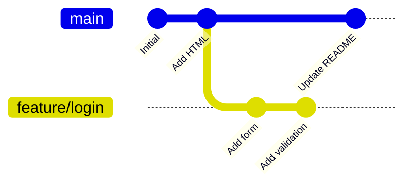
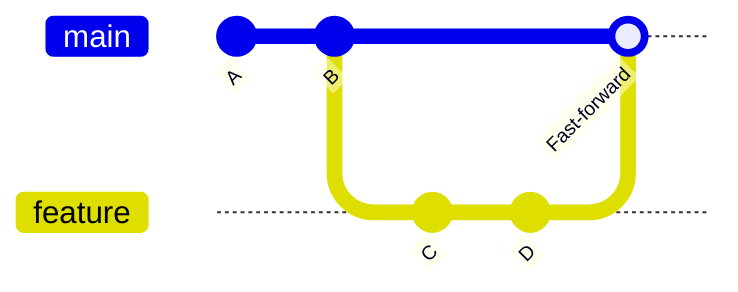
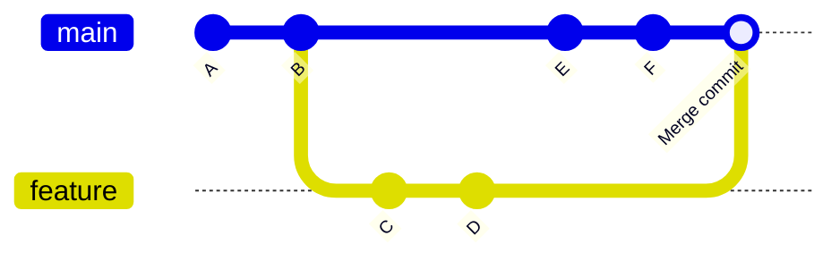
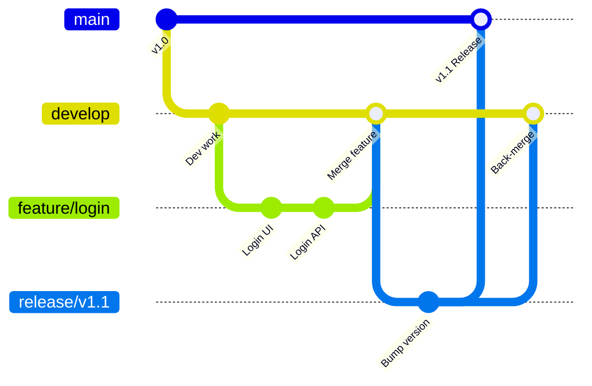

# Branching & Merging

## What Are Branches?

A branch in Git is a **lightweight movable pointer** to a commit. When you create a branch, Git simply creates a new pointer — it does NOT copy your files.

**Analogy:** Imagine a book where you can place multiple bookmarks. Each bookmark (branch) points to a specific page (commit). You can move bookmarks independently, and creating a new bookmark costs almost nothing — you're not photocopying the book.



### How Branches Work Internally

- A branch is just a file containing a 40-character commit hash.
- `HEAD` is a special pointer that tells Git which branch you're currently on.
- Creating a branch = creating a 41-byte file. That's it.

```bash
# Peek behind the curtain
cat .git/refs/heads/main
# a1b2c3d4e5f6... (the commit SHA that main points to)

cat .git/HEAD
# ref: refs/heads/main (HEAD points to main branch)
```

---

## Branch Commands

### Creating Branches

```bash
# Create a new branch (does NOT switch to it)
git branch feature/navbar

# Create AND switch to the new branch
git switch -c feature/navbar

# Older syntax (still works)
git checkout -b feature/navbar
```

### Switching Branches

```bash
# Modern syntax (Git 2.23+)
git switch feature/navbar

# Older syntax
git checkout feature/navbar
```

### Listing Branches

```bash
# List local branches (* = current)
git branch
#   feature/navbar
# * main

# List all branches (including remote)
git branch -a

# List branches with last commit info
git branch -v
```

### Deleting Branches

```bash
# Delete a merged branch
git branch -d feature/navbar

# Force delete an unmerged branch
git branch -D experimental-branch

# Delete a remote branch
git push origin --delete feature/navbar
```

### Renaming Branches

```bash
# Rename current branch
git branch -m new-name

# Rename a specific branch
git branch -m old-name new-name
```

---

## Merging

Merging combines work from one branch into another.

```bash
# Step 1: Switch to the branch you want to merge INTO
git switch main

# Step 2: Merge the feature branch into main
git merge feature/navbar
```

### Fast-Forward Merge

Happens when the target branch has NO new commits since the feature branch was created. Git simply moves the pointer forward.



```bash
git switch main
git merge feature/navbar
# Updating a1b2c3d..f4e5d6c
# Fast-forward
#  navbar.html | 25 +++++++++++++++
#  1 file changed, 25 insertions(+)
```

**Result:** No merge commit is created. `main` simply moves to the same commit as `feature/navbar`.

### Three-Way Merge

Happens when BOTH branches have new commits. Git creates a new **merge commit** with two parents.



```bash
git switch main
git merge feature/navbar
# Merge made by the 'ort' strategy.
#  navbar.html | 25 +++++++++++++++
#  1 file changed, 25 insertions(+)
```

**Result:** A merge commit is created that ties both histories together.

---

## Merge Conflicts

A merge conflict occurs when **both branches modify the same line(s)** in the same file and Git cannot automatically determine which change to keep.

### What a Conflict Looks Like

```bash
git merge feature/navbar
# Auto-merging index.html
# CONFLICT (content): Merge conflict in index.html
# Automatic merge failed; fix conflicts and then commit the result.
```

The conflicted file will contain conflict markers:

```html
<nav>
  <<<<<<< HEAD
  <a href="/home">Home</a>
  <a href="/about">About</a>
  =======
  <a href="/">Home</a>
  <a href="/about-us">About Us</a>
  >>>>>>> feature/navbar
</nav>
```

| Marker                   | Meaning                              |
| ------------------------ | ------------------------------------ |
| `<<<<<<< HEAD`           | Start of YOUR branch's version       |
| `=======`                | Separator between the two versions   |
| `>>>>>>> feature/navbar` | End of the INCOMING branch's version |

### Resolving Conflicts

1. **Open the file** and decide which changes to keep (or combine both).
2. **Remove the conflict markers** (`<<<<<<<`, `=======`, `>>>>>>>`).
3. **Stage the resolved file** and commit.

```html
<!-- Resolved version -->
<nav>
  <a href="/">Home</a>
  <a href="/about">About</a>
</nav>
```

```bash
git add index.html
git commit -m "resolve: merge navbar into main"
```

### Aborting a Merge

If you want to back out and try again later:

```bash
git merge --abort
```

---

## Branch Naming Conventions

Consistent naming makes it clear what each branch is for.

| Prefix     | Purpose               | Example                       |
| ---------- | --------------------- | ----------------------------- |
| `feature/` | New feature           | `feature/user-authentication` |
| `bugfix/`  | Bug fix               | `bugfix/login-redirect-loop`  |
| `hotfix/`  | Urgent production fix | `hotfix/payment-crash`        |
| `release/` | Prepare a release     | `release/v2.1.0`              |
| `chore/`   | Maintenance tasks     | `chore/update-dependencies`   |
| `docs/`    | Documentation         | `docs/api-endpoints`          |
| `test/`    | Experiment/spike      | `test/new-db-driver`          |

### Rules

- Use lowercase and hyphens (no spaces, no underscores)
- Be descriptive but concise
- Include ticket/issue numbers when available: `feature/AUTH-123-google-oauth`

---

## Branching Strategies

### Git Flow

A structured model with long-lived branches.



| Branch      | Purpose               | Merges Into          |
| ----------- | --------------------- | -------------------- |
| `main`      | Production-ready code | —                    |
| `develop`   | Integration branch    | `main` (via release) |
| `feature/*` | New features          | `develop`            |
| `release/*` | Release preparation   | `main` + `develop`   |
| `hotfix/*`  | Emergency fixes       | `main` + `develop`   |

**Best for:** Large teams, scheduled releases, enterprise software.

### GitHub Flow

Simple, single long-lived branch.

1. `main` is always deployable.
2. Create a feature branch from `main`.
3. Open a Pull Request.
4. Review, discuss, test.
5. Merge to `main` and deploy.

**Best for:** Continuous deployment, smaller teams, web applications.

### Trunk-Based Development

All developers commit to `main` (trunk) frequently — at least daily.

- Feature flags hide incomplete work.
- Short-lived branches (< 1 day) are allowed.
- No long-lived branches.

**Best for:** Experienced teams, CI/CD-heavy environments, high-velocity projects.

### Comparison

| Aspect               | Git Flow                | GitHub Flow      | Trunk-Based       |
| -------------------- | ----------------------- | ---------------- | ----------------- |
| Complexity           | High                    | Low              | Low               |
| Long-lived branches  | Yes (`develop`, `main`) | No (only `main`) | No (only `main`)  |
| Release cadence      | Scheduled               | Continuous       | Continuous        |
| Feature flags needed | No                      | No               | Yes               |
| Team size            | Large                   | Small–Medium     | Any (experienced) |

---

## Best Practices

| Practice                                | Why                                                       |
| --------------------------------------- | --------------------------------------------------------- |
| Keep branches short-lived               | Long branches drift from `main` and create painful merges |
| Delete merged branches                  | Keeps branch list clean and readable                      |
| Pull `main` before branching            | Start with the latest code to minimize conflicts          |
| One feature per branch                  | Makes PRs reviewable and reverts simple                   |
| Name branches descriptively             | Team members can tell what you're working on at a glance  |
| Merge `main` into your branch regularly | Catches conflicts early while they're small               |

---

## Common Mistakes

| Mistake                          | Why It's Wrong                             | Fix                                     |
| -------------------------------- | ------------------------------------------ | --------------------------------------- |
| Working directly on `main`       | No isolation, can't easily revert features | Always branch for changes               |
| Never deleting old branches      | Branch list becomes unmanageable           | Delete after merge: `git branch -d`     |
| Huge long-lived branches         | Merge conflicts become massive             | Break work into small, frequent PRs     |
| Ignoring merge conflicts         | Broken code gets committed                 | Always test after resolving conflicts   |
| Not pulling before branching     | Your branch starts from stale code         | `git pull` then `git switch -c`         |
| Force-deleting unmerged branches | Lose work permanently                      | Use `-d` (safe) not `-D` unless certain |

---

## Summary

- A **branch** is a lightweight pointer to a commit — creating one is instant and cheap.
- `git switch -c branch-name` creates and switches, `git merge` combines branches.
- **Fast-forward merge** moves the pointer; **three-way merge** creates a merge commit.
- **Merge conflicts** happen when both branches edit the same lines — resolve manually, remove markers, then commit.
- Use **prefixes** (`feature/`, `bugfix/`, `hotfix/`) for clear branch naming.
- Choose a branching strategy that matches your team: **Git Flow** for structured releases, **GitHub Flow** for simplicity, or **Trunk-Based** for high velocity.
- Keep branches short-lived, delete after merging, and pull `main` regularly to avoid painful conflicts.
