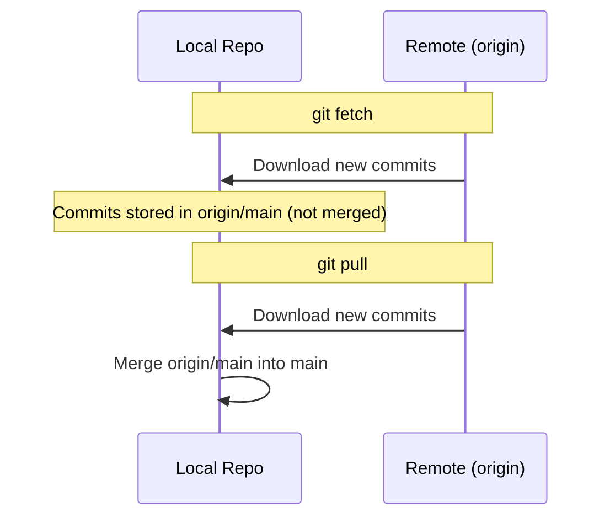
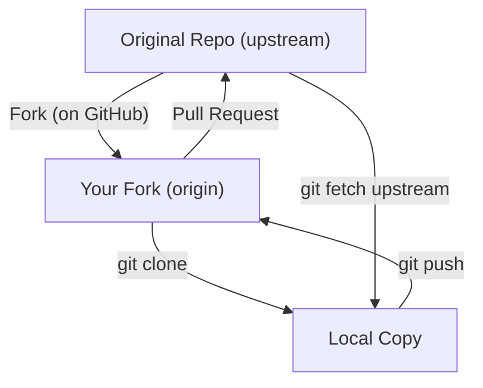

# Remote Repos & GitHub

## What Are Remotes?

A **remote** is a version of your repository hosted on a server (like GitHub, GitLab, or Bitbucket). It allows multiple developers to share work and serves as a backup.

**Analogy:** Your local repo is your personal notebook. A remote is the shared whiteboard in the office. You write in your notebook locally, then post your work to the whiteboard for everyone to see. You can also copy others' work from the whiteboard into your notebook.

### Common Remote Names

| Name       | Convention                              |
| ---------- | --------------------------------------- |
| `origin`   | Your fork or your own remote copy       |
| `upstream` | The original repository you forked from |

---

## Remote Commands

### Adding a Remote

```bash
# Add a remote named "origin"
git remote add origin https://github.com/username/my-project.git

# Add an upstream remote (original repo you forked from)
git remote add upstream https://github.com/original-author/project.git
```

### Viewing Remotes

```bash
# List remote names
git remote
# origin
# upstream

# List with URLs
git remote -v
# origin    https://github.com/username/my-project.git (fetch)
# origin    https://github.com/username/my-project.git (push)
# upstream  https://github.com/original-author/project.git (fetch)
# upstream  https://github.com/original-author/project.git (push)
```

### Managing Remotes

```bash
# Rename a remote
git remote rename origin old-origin

# Remove a remote
git remote remove upstream

# Change the URL of a remote
git remote set-url origin git@github.com:username/my-project.git
```

---

## Cloning Repositories

`git clone` downloads a repository and sets up `origin` automatically.

```bash
# Clone via HTTPS
git clone https://github.com/username/project.git

# Clone via SSH
git clone git@github.com:username/project.git

# Clone into a specific folder
git clone https://github.com/username/project.git my-folder

# Shallow clone (only latest commit — faster for large repos)
git clone --depth 1 https://github.com/username/project.git
```

After cloning:

```bash
cd project
git remote -v
# origin    https://github.com/username/project.git (fetch)
# origin    https://github.com/username/project.git (push)
```

---

## Push, Pull, and Fetch

### `git push` — Upload Local Commits to Remote

```bash
# Push current branch to origin
git push origin main

# Push and set upstream tracking (first time)
git push -u origin feature/navbar

# After -u is set, just:
git push

# Push all branches
git push --all origin

# Push tags
git push origin --tags
```

### `git pull` — Download and Merge Remote Changes

```bash
# Pull from origin's main branch
git pull origin main

# If upstream is already set:
git pull

# Pull with rebase instead of merge
git pull --rebase origin main
```

`git pull` = `git fetch` + `git merge`

### `git fetch` — Download Without Merging

```bash
# Fetch all branches from origin
git fetch origin

# Fetch a specific branch
git fetch origin main

# Fetch from all remotes
git fetch --all
```

**When to use fetch vs pull:**

| Command     | Downloads changes | Merges into your branch |
| ----------- | ----------------- | ----------------------- |
| `git fetch` | ✅                | ❌ (you review first)   |
| `git pull`  | ✅                | ✅ (automatic merge)    |



---

## SSH Keys vs HTTPS Authentication

### HTTPS

- Uses username + Personal Access Token (PAT).
- Simpler to set up.
- Requires entering credentials (or using a credential manager).

```bash
git clone https://github.com/username/repo.git
# Prompts for username and token
```

### SSH

- Uses a public/private key pair.
- No password prompt after setup.
- More secure for regular use.

```bash
# Generate SSH key
ssh-keygen -t ed25519 -C "your@email.com"

# Start the SSH agent
eval "$(ssh-agent -s)"

# Add your key to the agent
ssh-add ~/.ssh/id_ed25519

# Copy the public key
cat ~/.ssh/id_ed25519.pub
# Paste this in GitHub → Settings → SSH Keys

# Test connection
ssh -T git@github.com
# Hi username! You've successfully authenticated...
```

```bash
# Clone with SSH
git clone git@github.com:username/repo.git
```

### Which to Choose?

| Factor                 | HTTPS               | SSH                  |
| ---------------------- | ------------------- | -------------------- |
| Setup difficulty       | Easy                | Moderate             |
| Auth on every push     | Yes (unless cached) | No (key-based)       |
| Works behind firewalls | Usually yes         | Sometimes blocked    |
| Security               | Token-based         | Key-based (stronger) |
| Recommendation         | Quick start / CI    | Daily development    |

---

## Forking Workflow

Forking creates your own copy of someone else's repository on GitHub. This is the standard way to contribute to open-source projects.



### Step-by-Step

```bash
# 1. Fork the repo on GitHub (click "Fork" button)

# 2. Clone YOUR fork
git clone git@github.com:YOUR-USERNAME/project.git
cd project

# 3. Add the original repo as "upstream"
git remote add upstream https://github.com/original-author/project.git

# 4. Verify remotes
git remote -v
# origin    git@github.com:YOUR-USERNAME/project.git (fetch)
# origin    git@github.com:YOUR-USERNAME/project.git (push)
# upstream  https://github.com/original-author/project.git (fetch)
# upstream  https://github.com/original-author/project.git (push)

# 5. Keep your fork in sync
git fetch upstream
git switch main
git merge upstream/main
git push origin main
```

---

## Upstream Tracking Branches

A tracking branch links your local branch to a remote branch so Git knows where to push/pull.

```bash
# Set upstream when pushing a new branch
git push -u origin feature/auth

# Check tracking info
git branch -vv
# * feature/auth  a1b2c3d [origin/feature/auth] Add auth logic
#   main          f4e5d6c [origin/main] Update README

# After tracking is set, these just work:
git push
git pull
```

### Checking Out a Remote Branch

```bash
# Fetch first
git fetch origin

# Create local branch tracking the remote branch
git switch feature/auth
# Branch 'feature/auth' set up to track 'origin/feature/auth'.
```

---

## GitHub Features Overview

| Feature         | What It Does                                        |
| --------------- | --------------------------------------------------- |
| **Issues**      | Track bugs, feature requests, and tasks             |
| **Projects**    | Kanban-style boards for project management          |
| **Actions**     | CI/CD pipelines (test, build, deploy automatically) |
| **Pages**       | Free static site hosting from a repo                |
| **Releases**    | Distribute versioned packages with changelogs       |
| **Wiki**        | Documentation pages linked to a repo                |
| **Discussions** | Community Q&A and announcements                     |
| **Codespaces**  | Cloud-based dev environments                        |

### GitHub Actions (Quick Example)

```yaml
# .github/workflows/ci.yml
name: CI
on:
  push:
    branches: [main]
  pull_request:
    branches: [main]

jobs:
  test:
    runs-on: ubuntu-latest
    steps:
      - uses: actions/checkout@v4
      - uses: actions/setup-node@v4
        with:
          node-version: 20
      - run: npm ci
      - run: npm test
```

---

## README.md Best Practices

A good README is the front door to your project. It should answer: _What is this? How do I use it? How do I contribute?_

### Recommended Structure

````markdown
# Project Name

Brief one-line description of what the project does.

## Features

- Feature 1
- Feature 2

## Tech Stack

- Frontend: React, TypeScript
- Backend: Node.js, Express
- Database: PostgreSQL

## Getting Started

### Prerequisites

- Node.js >= 18
- npm or yarn

### Installation

\```bash
git clone https://github.com/username/project.git
cd project
npm install
npm run dev
\```

## Usage

Show a quick example or screenshot.

## API Documentation

Link or brief endpoint list.

## Contributing

1. Fork the repo
2. Create a branch (`git switch -c feature/amazing-feature`)
3. Commit changes (`git commit -m "feat: add amazing feature"`)
4. Push (`git push origin feature/amazing-feature`)
5. Open a Pull Request

## License

MIT
````

### Tips

- Add badges (build status, coverage, version).
- Include screenshots or GIFs for visual projects.
- Keep it updated — stale READMEs erode trust.

---

## Best Practices

| Practice                            | Why                                                |
| ----------------------------------- | -------------------------------------------------- |
| Use SSH for daily work              | No repeated password prompts                       |
| Set upstream tracking on first push | Simplifies future `git push` / `git pull`          |
| Keep your fork synced               | Avoid conflicts when opening PRs                   |
| Use `git fetch` before merging      | See what changed before integrating                |
| Write a comprehensive README        | First thing people see — make it count             |
| Use `.gitignore` before first push  | Prevents secrets and junk from reaching the remote |

---

## Common Mistakes

| Mistake                                      | Why It's Wrong                                               | Fix                                                      |
| -------------------------------------------- | ------------------------------------------------------------ | -------------------------------------------------------- |
| Pushing to `upstream` instead of `origin`    | Accidentally modifies the original repo (if you have access) | Double-check with `git remote -v`                        |
| Forgetting to set upstream tracking          | Every push requires full `git push origin branch`            | Use `git push -u` on first push                          |
| Not syncing fork with upstream               | Your fork becomes stale, PRs have conflicts                  | Regularly `git fetch upstream && git merge`              |
| Cloning with HTTPS then struggling with auth | Repeated token prompts                                       | Switch to SSH: `git remote set-url origin git@...`       |
| Pushing secrets to a public repo             | Credentials exposed to the world                             | Use `.gitignore`, use env variables, rotate exposed keys |
| Not reading the README before contributing   | Wasted effort on duplicate/unwanted changes                  | Always read contribution guidelines first                |

---

## Summary

- A **remote** is a server-hosted copy of your repo — `origin` is yours, `upstream` is the original.
- `git clone` downloads a repo, `git push` uploads commits, `git pull` downloads and merges, `git fetch` downloads without merging.
- Use **SSH keys** for passwordless authentication in daily development.
- The **forking workflow** (fork → clone → branch → PR) is the standard for open-source contribution.
- **Tracking branches** link local and remote branches so `git push`/`git pull` work without extra arguments.
- GitHub provides Issues, Actions (CI/CD), Projects, Pages, and more beyond just hosting code.
- A good **README** is essential — include setup instructions, usage examples, and contribution guidelines.
