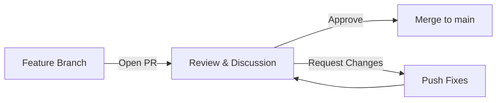

# Pull Requests & Code Review

## What Is a Pull Request (PR)?

A **Pull Request** (GitHub/Bitbucket) or **Merge Request** (GitLab) is a formal proposal to merge changes from one branch into another. It creates a discussion space where teammates can review code, leave comments, request changes, and approve before merging.

### Analogy

Think of a PR like submitting a draft essay to your editor. You hand it in (open the PR), the editor reads it and marks suggestions (code review), you revise (push new commits), and finally they approve publication (merge).



---

## Creating a Pull Request on GitHub

### Step 1: Push Your Feature Branch

```bash
git checkout -b feature/user-auth
# ... make changes, commit ...
git push -u origin feature/user-auth
```

### Step 2: Open the PR

1. Go to your repository on GitHub.
2. Click **"Compare & pull request"** (appears after pushing).
3. Set the **base branch** (e.g., `main`) and **compare branch** (e.g., `feature/user-auth`).
4. Fill in the title and description.
5. Click **"Create pull request"**.

### Via GitHub CLI

```bash
gh pr create --base main --head feature/user-auth \
  --title "Add user authentication" \
  --body "Implements JWT-based login and registration"
```

---

## PR Description Best Practices

A good PR description answers three questions: **What changed?** **Why?** **How to test?**

### Template Example

```markdown
## What does this PR do?

Adds JWT-based authentication with login and registration endpoints.

## Why?

Users need to create accounts and access protected routes (requirement from issue #42).

## Changes

- Added `POST /api/auth/register` endpoint
- Added `POST /api/auth/login` endpoint
- Created auth middleware for protected routes
- Added bcrypt password hashing

## How to test

1. Run `npm run dev`
2. POST to `/api/auth/register` with `{ email, password }`
3. POST to `/api/auth/login` with same credentials
4. Use returned token in Authorization header for protected routes

## Related issues

Closes #42
```

### Tips for Good PR Descriptions

- Keep the title short and imperative: `"Add user auth"` not `"I added the user authentication feature"`
- Include screenshots/GIFs for UI changes
- List any breaking changes or migration steps
- Mention if the PR depends on another PR

---

## Code Review Process

### Requesting Reviewers

- Assign reviewers when creating the PR (or after).
- GitHub can auto-assign reviewers via **CODEOWNERS** file:

```text
# .github/CODEOWNERS
*.js       @frontend-team
*.ts       @frontend-team
/backend/  @backend-team
/infra/    @devops-team
```

### Review Actions

| Action              | Meaning                                    |
| ------------------- | ------------------------------------------ |
| **Comment**         | General feedback, questions, or discussion |
| **Approve**         | Code looks good, ready to merge            |
| **Request Changes** | Must be fixed before merging               |

### Leaving Effective Review Comments

```markdown
# Good review comment:

"This query runs on every render. Consider memoizing with useMemo
or moving it outside the component to avoid re-computation."

# Bad review comment:

"Wrong."
```

**Guidelines for reviewers:**

- Be specific — point to the line and suggest a fix
- Explain _why_, not just _what_ to change
- Use GitHub's "Suggest changes" feature for small fixes
- Distinguish between blocking issues and nitpicks (prefix with `nit:`)
- Be kind — you are reviewing code, not judging the person

### GitHub Suggestion Feature

Reviewers can suggest exact code changes that authors can commit with one click:

````markdown
```suggestion
const users = await db.users.findMany({ where: { active: true } });
```
````

---

## Resolving Review Feedback

### Option 1: Push New Commits (Recommended During Review)

```bash
# Fix the issues raised in review
git add .
git commit -m "fix: address review feedback - add input validation"
git push origin feature/user-auth
```

The PR automatically updates. Reviewers can see what changed since their last review.

### Option 2: Amend and Force Push (Cleaner History)

```bash
git add .
git commit --amend --no-edit
git push --force-with-lease origin feature/user-auth
```

**Use `--force-with-lease`** instead of `--force` — it prevents overwriting commits someone else may have pushed.

### When to Use Each

| Approach           | Use When                                            |
| ------------------ | --------------------------------------------------- |
| New commits        | During active review (preserves review context)     |
| Amend + force push | After final approval, to clean history before merge |

---

## Merge Strategies

When a PR is approved, you choose how to integrate changes into the base branch:

### 1. Merge Commit (Default)

```
main: A---B---C---------M
               \       /
feature:        D---E---F
```

- Creates a merge commit `M` that joins both histories.
- **Preserves full history** of the feature branch.
- Good for: long-lived feature branches where history matters.

### 2. Squash and Merge

```
main: A---B---C---S
```

- All feature branch commits are squashed into **one commit** `S` on main.
- Feature branch commits are lost from main's history.
- Good for: small features or PRs with messy "WIP" commits.

### 3. Rebase and Merge

```
main: A---B---C---D'---E'---F'
```

- Feature commits are **replayed** on top of main (rebased).
- Creates a **linear history** — no merge commits.
- Good for: teams that prefer clean, linear git log.

### Comparison

| Strategy         | History                              | When to Use              |
| ---------------- | ------------------------------------ | ------------------------ |
| Merge commit     | Non-linear, preserves branch context | Default, large features  |
| Squash and merge | Linear, one commit per PR            | Small PRs, messy commits |
| Rebase and merge | Linear, preserves individual commits | Clean commit discipline  |

---

## Branch Protection Rules

Branch protection prevents direct pushes to important branches (like `main`) and enforces quality gates.

### Common Protection Rules

```yaml
# Settings → Branches → Branch protection rules
Branch name pattern: main

✅ Require pull request reviews before merging
   - Required approving reviews: 1 (or 2 for critical repos)
   - Dismiss stale reviews when new commits are pushed

✅ Require status checks to pass before merging
   - Required checks: "test", "lint", "build"

✅ Require branches to be up to date before merging

✅ Do not allow bypassing the above settings

❌ Allow force pushes (keep disabled!)
❌ Allow deletions (keep disabled!)
```

### Why This Matters

- No one can push directly to `main` — all changes go through PRs.
- Tests must pass before merging — broken code cannot reach production.
- At least one reviewer must approve — catches bugs and shares knowledge.

---

## GitHub Actions Integration with PRs

GitHub Actions can automatically run tests, linting, and builds on every PR.

### Basic CI Workflow for PRs

```yaml
# .github/workflows/ci.yml
name: CI

on:
  pull_request:
    branches: [main]

jobs:
  test:
    runs-on: ubuntu-latest
    steps:
      - uses: actions/checkout@v4
      - uses: actions/setup-node@v4
        with:
          node-version: 20
      - run: npm ci
      - run: npm run lint
      - run: npm test
      - run: npm run build
```

### How It Looks on a PR

- A "Checks" section appears on the PR page.
- ✅ Green check = all CI passed.
- ❌ Red X = something failed (click to see logs).
- Branch protection can require these checks to pass before merge is allowed.

### Adding Test Coverage Comments

```yaml
- name: Run tests with coverage
  run: npm test -- --coverage
- name: Comment coverage on PR
  uses: marocchino/sticky-pull-request-comment@v2
  with:
    path: coverage/coverage-summary.md
```

---

## Draft Pull Requests

Draft PRs signal "work in progress — not ready for review."

### Creating a Draft PR

```bash
gh pr create --draft --title "WIP: Add payment integration"
```

Or on the GitHub UI: click the dropdown on "Create pull request" → "Create draft pull request."

### When to Use Draft PRs

- You want early feedback on approach before finishing
- CI should run but reviewers should not formally review yet
- You want to track progress on a large feature

### Converting to Ready

```bash
gh pr ready
```

Or click "Ready for review" on the GitHub UI.

---

## Closing Issues via PR

GitHub can automatically close issues when a PR is merged using keywords in the PR description or commit messages:

### Keywords That Close Issues

```markdown
# In PR description or commit message:

Fixes #123
Closes #123
Resolves #123

# Multiple issues:

Fixes #123, closes #456

# Issues in other repos:

Fixes org/other-repo#789
```

### How It Works

1. PR description contains `Fixes #42`.
2. PR is merged into the default branch (`main`).
3. Issue #42 is automatically closed.
4. The issue links back to the PR that closed it.

---

## Handling Merge Conflicts in PRs

Conflicts happen when two branches modify the same lines.

### When GitHub Shows "This branch has conflicts"

**Option 1: Resolve in GitHub UI** (for simple conflicts)

- Click "Resolve conflicts" button on the PR page.
- Edit the conflicting files directly in the browser.
- Mark as resolved and commit.

**Option 2: Resolve locally** (recommended for complex conflicts)

```bash
# Update your local main
git checkout main
git pull origin main

# Switch to your feature branch
git checkout feature/user-auth

# Merge main into your branch (brings in the conflicting changes)
git merge main

# Git marks conflicts in files:
# <<<<<<< HEAD (your changes)
# =======
# >>>>>>> main (their changes)

# Manually resolve, then:
git add .
git commit -m "resolve merge conflicts with main"
git push origin feature/user-auth
```

**Option 3: Rebase onto main** (linear history)

```bash
git checkout feature/user-auth
git rebase main
# Resolve conflicts file by file
git add .
git rebase --continue
git push --force-with-lease origin feature/user-auth
```

### Preventing Merge Conflicts

- Keep feature branches short-lived (merge within 1-3 days).
- Regularly pull/rebase from main.
- Communicate with teammates about shared files.
- Use branch protection rule "Require branches to be up to date."

---

## Best Practices

1. **Keep PRs small and focused** — one feature or fix per PR (under 400 lines ideally).
2. **Write descriptive PR titles** — future you will search git log.
3. **Link related issues** — use `Fixes #N` to auto-close.
4. **Respond to all review comments** — even if it is just "Done" or "Good point, fixed."
5. **Do not merge your own PRs** (in team settings) — get at least one review.
6. **Use draft PRs** for early feedback on approach.
7. **Run CI on every PR** — never merge broken code.
8. **Delete feature branches after merge** — keeps the repo clean.
9. **Review PRs promptly** — do not let PRs sit for days; it blocks teammates.
10. **Be a kind reviewer** — critique code, not people.

---

## Common Mistakes

| Mistake                            | Why It Is a Problem                   | Fix                                |
| ---------------------------------- | ------------------------------------- | ---------------------------------- |
| Massive PRs (1000+ lines)          | Impossible to review thoroughly       | Split into smaller, logical PRs    |
| No PR description                  | Reviewer has no context               | Always explain what/why/how        |
| Force pushing during active review | Loses review comment context          | Push new commits instead           |
| Merging without CI passing         | Broken code reaches main              | Enable branch protection rules     |
| Not resolving conversations        | Feedback is ignored                   | Address every comment before merge |
| Approving without reading          | Defeats the purpose of review         | Take time to understand changes    |
| Letting PRs go stale               | Merge conflicts grow, context is lost | Review and merge within 1-2 days   |

---

## Summary

- A **Pull Request** is a proposal to merge code — it enables discussion, review, and quality gates.
- Write **clear PR descriptions** that explain what changed, why, and how to test.
- **Code review** is collaborative — be specific, kind, and use suggestions.
- Choose the right **merge strategy**: merge commit (preserve history), squash (clean main), or rebase (linear).
- **Branch protection rules** enforce quality — require reviews, CI passing, and up-to-date branches.
- **GitHub Actions** integrate with PRs to automatically run tests and linting.
- Use **Draft PRs** for early feedback on work in progress.
- Link PRs to issues with `Fixes #N` to auto-close them on merge.
- Keep PRs small, review promptly, and delete merged branches.
