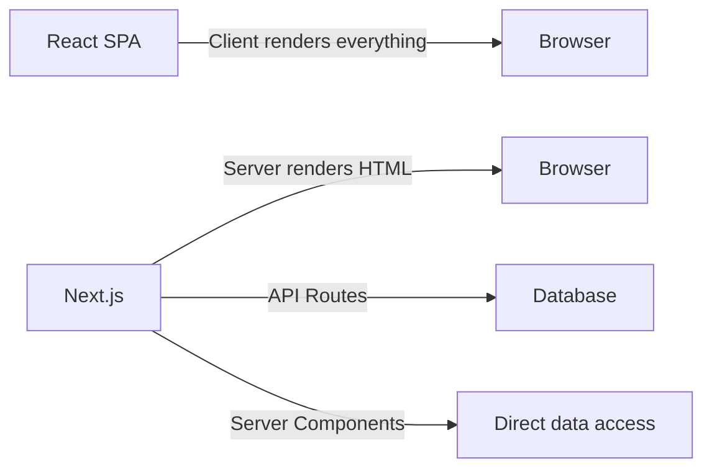
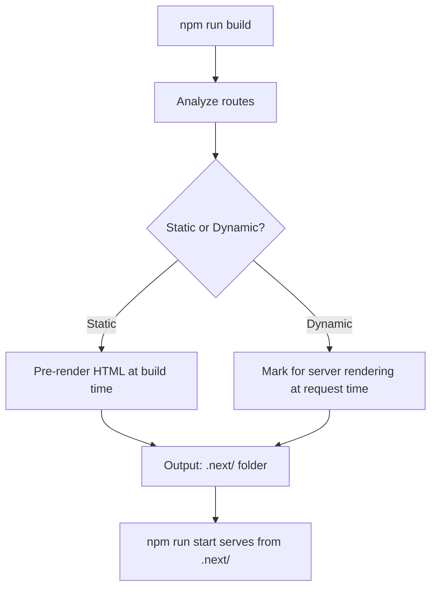

# Introduction to Next.js

## What Is Next.js?

Next.js is a **React meta-framework** built by Vercel. While React is a UI library for building component trees, Next.js wraps React with production-ready features — routing, server-side rendering, API routes, and optimizations — out of the box.

**Analogy:** If React is the engine, Next.js is the entire car — engine, chassis, transmission, and GPS built together so you can just drive.

---

## Why Next.js Over Plain React?

| Feature            | Plain React (CRA / Vite)         | Next.js                              |
| ------------------ | -------------------------------- | ------------------------------------ |
| Rendering          | Client-side only (SPA)           | SSR, SSG, ISR, Streaming             |
| Routing            | Requires react-router            | Built-in file-based routing          |
| API Backend        | Separate server needed           | Built-in API routes / Route Handlers |
| SEO                | Poor (empty HTML sent to client) | Excellent (server-rendered HTML)     |
| Code Splitting     | Manual with React.lazy           | Automatic per-route                  |
| Image Optimization | Manual or third-party            | Built-in `<Image>` component         |
| Font Optimization  | Manual                           | Built-in `next/font`                 |
| Deployment         | Configure server yourself        | One-click on Vercel, or self-host    |

---

## Next.js vs React: SPA vs Full-Stack Framework



| Aspect        | React SPA                                  | Next.js                                  |
| ------------- | ------------------------------------------ | ---------------------------------------- |
| Initial Load  | Blank page → JS downloads → renders        | Pre-rendered HTML arrives instantly      |
| SEO           | Search engines see empty `<div id="root">` | Full HTML content visible to crawlers    |
| Data Fetching | useEffect on client, loading spinners      | Fetch on server, stream HTML to client   |
| Backend       | Separate Express/Fastify server            | Co-located API routes and Server Actions |
| Architecture  | Frontend-only library                      | Full-stack framework                     |

---

## Key Features

### 1. File-Based Routing

No `react-router` configuration. Files inside the `app/` directory automatically become routes:

```
app/
├── page.tsx          → /
├── about/
│   └── page.tsx      → /about
├── blog/
│   ├── page.tsx      → /blog
│   └── [slug]/
│       └── page.tsx  → /blog/hello-world (dynamic)
```

### 2. Server Components (Default)

Components render on the server by default. No JavaScript is shipped to the client for these components — smaller bundles, faster loads.

```tsx
// This component runs on the server — no JS sent to browser
export default async function ProductPage() {
  const products = await db.query("SELECT * FROM products");
  return (
    <ul>
      {products.map((p) => (
        <li key={p.id}>{p.name}</li>
      ))}
    </ul>
  );
}
```

### 3. Image Optimization

The `<Image>` component automatically:

- Serves modern formats (WebP/AVIF)
- Lazy loads images below the fold
- Resizes to the correct dimensions
- Prevents Cumulative Layout Shift (CLS)

```tsx
import Image from "next/image";

<Image src="/hero.jpg" alt="Hero" width={1200} height={600} priority />;
```

### 4. Font Optimization

`next/font` downloads fonts at build time and self-hosts them — zero layout shift, no external requests.

```tsx
import { Inter } from "next/font/google";

const inter = Inter({ subsets: ["latin"] });

export default function RootLayout({ children }) {
  return (
    <html className={inter.className}>
      <body>{children}</body>
    </html>
  );
}
```

---

## Creating a Next.js Project

```bash
npx create-next-app@latest my-app
```

The CLI asks:

```
✔ Would you like to use TypeScript? → Yes
✔ Would you like to use ESLint? → Yes
✔ Would you like to use Tailwind CSS? → Yes
✔ Would you like to use `src/` directory? → No
✔ Would you like to use App Router? → Yes  ← Always choose this
✔ Would you like to customize the default import alias? → No
```

---

## Project Structure Overview

```
my-app/
├── app/                    # All routes, layouts, and pages
│   ├── layout.tsx          # Root layout (wraps entire app)
│   ├── page.tsx            # Home page (/)
│   ├── globals.css         # Global styles
│   └── favicon.ico
├── public/                 # Static assets (images, fonts, robots.txt)
├── next.config.js          # Next.js configuration
├── tailwind.config.ts      # Tailwind configuration
├── tsconfig.json           # TypeScript configuration
├── package.json
└── .eslintrc.json
```

| File/Folder      | Purpose                                                      |
| ---------------- | ------------------------------------------------------------ |
| `app/`           | Routes, layouts, loading/error states — the core of your app |
| `public/`        | Static files served at root URL (`/logo.png`)                |
| `next.config.js` | Redirects, rewrites, env vars, image domains, etc.           |
| `package.json`   | Dependencies and scripts                                     |
| `tsconfig.json`  | TypeScript paths and compiler options                        |

---

## Development Workflow

```bash
# Start development server (hot reload on port 3000)
npm run dev

# Create production build
npm run build

# Start production server (serves the build output)
npm run start

# Lint the project
npm run lint
```

### What Happens During Build



The build output shows which routes are static (○) and which are dynamic (λ):

```
Route (app)                    Size     First Load JS
┌ ○ /                          5.2 kB   89 kB
├ ○ /about                     1.8 kB   85 kB
├ λ /blog/[slug]               3.1 kB   87 kB
└ λ /api/users                 0 B      0 B

○ (Static)   prerendered as static content
λ (Dynamic)  server-rendered on demand
```

---

## Pages Router vs App Router

Next.js has two routing systems. The **App Router** (introduced in Next.js 13.4) is the modern standard.

| Feature        | Pages Router (`pages/`)                 | App Router (`app/`)                    |
| -------------- | --------------------------------------- | -------------------------------------- |
| Released       | Next.js 1 (2016)                        | Next.js 13.4 (2023)                    |
| Components     | All client by default                   | Server Components by default           |
| Data Fetching  | `getServerSideProps`, `getStaticProps`  | `async` components with direct `await` |
| Layouts        | Manual with `_app.tsx`, `_document.tsx` | Nested `layout.tsx` files              |
| Loading States | Manual                                  | Built-in `loading.tsx`                 |
| Error Handling | Manual                                  | Built-in `error.tsx`                   |
| Streaming      | Not supported                           | Built-in with Suspense                 |
| Server Actions | Not available                           | Built-in form mutations                |
| Status         | Maintenance mode                        | Actively developed                     |

**Rule:** Always use the App Router for new projects. The Pages Router is legacy.

---

## Best Practices

| Practice                                                      | Reason                                                                      |
| ------------------------------------------------------------- | --------------------------------------------------------------------------- |
| Always choose App Router for new projects                     | Modern features, better performance, active development                     |
| Use TypeScript                                                | Next.js has first-class TS support — catches routing errors at compile time |
| Keep components as Server Components by default               | Smaller client bundles, direct data access                                  |
| Use `<Image>` instead of ``                              | Automatic optimization, lazy loading, CLS prevention                        |
| Use `next/font` for fonts                                     | No layout shift, self-hosted, no external requests                          |
| Structure routes with route groups                            | Organize without affecting URL paths                                        |
| Use `next.config.js` for redirects over client-side redirects | Better SEO, faster redirects at the edge                                    |

---

## Common Mistakes

| Mistake                                                    | Why It's Wrong                                                            |
| ---------------------------------------------------------- | ------------------------------------------------------------------------- |
| Adding `"use client"` to every component                   | Defeats the purpose of Server Components — sends unnecessary JS to client |
| Using the Pages Router for new projects                    | Missing Server Components, streaming, nested layouts, Server Actions      |
| Putting images in `app/` instead of `public/`              | Only `public/` is served statically at the root URL                       |
| Not using the `<Image>` component                          | Miss out on automatic optimization, lazy loading, and format conversion   |
| Importing `next/font` inside components instead of layouts | Font loads multiple times, causes layout shift                            |
| Choosing `src/` directory then mixing with root `app/`     | Confuses the router — pick one structure and stick with it                |
| Skipping TypeScript                                        | Lose route type-safety and autocomplete for params, searchParams          |

---

## Summary

- **Next.js** is a React meta-framework that adds SSR, routing, API routes, and optimizations on top of React.
- It solves React SPA pain points: poor SEO, loading spinners, no built-in routing, manual optimization.
- The **App Router** (`app/` directory) is the modern standard — use it for all new projects.
- Key features include **file-based routing**, **Server Components**, **Image/Font optimization**, and **built-in API routes**.
- Create projects with `npx create-next-app@latest` and always choose TypeScript + App Router.
- Development uses `npm run dev`; production uses `npm run build` then `npm run start`.
