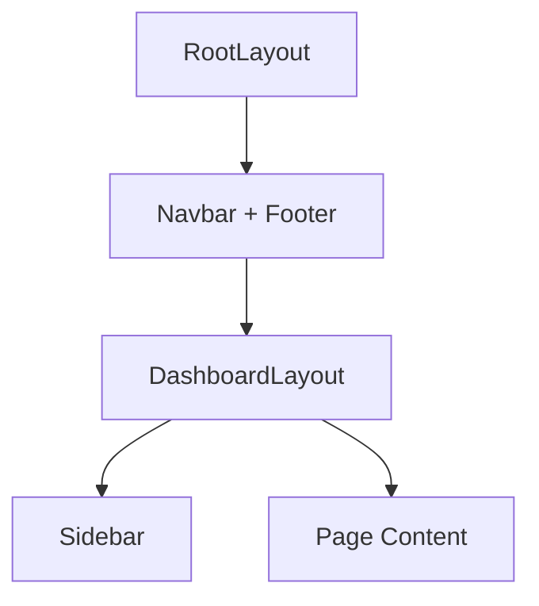
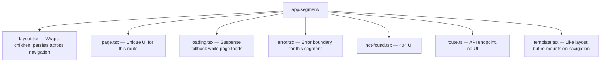

# App Router & File Conventions

## The app/ Directory Structure

The App Router uses a **file-system based router** where folders define routes and special files define UI for each route segment.

```
app/
├── layout.tsx           # Root layout (required)
├── page.tsx             # Home page (/)
├── loading.tsx          # Loading UI for /
├── error.tsx            # Error boundary for /
├── not-found.tsx        # 404 page
├── globals.css
├── about/
│   └── page.tsx         # /about
├── blog/
│   ├── layout.tsx       # Shared layout for all /blog/* routes
│   ├── page.tsx         # /blog
│   └── [slug]/
│       ├── page.tsx     # /blog/hello-world
│       └── loading.tsx  # Loading UI for individual posts
├── dashboard/
│   ├── layout.tsx
│   ├── page.tsx         # /dashboard
│   ├── settings/
│   │   └── page.tsx     # /dashboard/settings
│   └── analytics/
│       └── page.tsx     # /dashboard/analytics
└── api/
    └── users/
        └── route.ts     # API: GET/POST /api/users
```

**Key Rule:** A folder only becomes a route when it contains a `page.tsx` or `route.ts` file.

---

## page.tsx — Route Definition

Every accessible route needs a `page.tsx` (or `page.js`). This is the UI that renders for that URL.

```tsx
// app/page.tsx → renders at /
export default function HomePage() {
  return (
    <main>
      <h1>Welcome to My App</h1>
      <p>This is the home page.</p>
    </main>
  );
}
```

```tsx
// app/about/page.tsx → renders at /about
export default function AboutPage() {
  return <h1>About Us</h1>;
}
```

**Rules:**

- Must be a **default export**.
- Can be `async` (Server Component) for data fetching.
- Receives `params` and `searchParams` as props for dynamic routes.

```tsx
// app/blog/[slug]/page.tsx → renders at /blog/anything
interface Props {
  params: Promise<{ slug: string }>;
  searchParams: Promise<{ [key: string]: string | undefined }>;
}

export default async function BlogPost({ params, searchParams }: Props) {
  const { slug } = await params;
  const post = await getPost(slug);
  return <article>{post.content}</article>;
}
```

---

## layout.tsx — Shared UI Wrapper

Layouts wrap pages and **persist across navigations** — they don't re-render when you navigate between sibling routes.

```tsx
// app/layout.tsx — Root Layout (required, wraps entire app)
import { Inter } from "next/font/google";
import "./globals.css";

const inter = Inter({ subsets: ["latin"] });

export const metadata = {
  title: "My App",
  description: "A Next.js application",
};

export default function RootLayout({
  children,
}: {
  children: React.ReactNode;
}) {
  return (
    <html lang="en">
      <body className={inter.className}>
        <nav>/* Navbar here */</nav>
        {children}
        <footer>/* Footer here */</footer>
      </body>
    </html>
  );
}
```

### Nested Layouts

Each route segment can have its own layout. They nest automatically:

```tsx
// app/dashboard/layout.tsx — Only wraps /dashboard/* routes
export default function DashboardLayout({
  children,
}: {
  children: React.ReactNode;
}) {
  return (
    <div className="flex">
      <aside className="w-64">
        <DashboardSidebar />
      </aside>
      <main className="flex-1">{children}</main>
    </div>
  );
}
```



**Key behaviors:**

- Root layout is **required** and must include `<html>` and `<body>` tags.
- Layouts **do not re-render** when navigating between child pages.
- Layouts cannot access the current pathname (use `usePathname()` in a Client Component).

---

## loading.tsx — Automatic Loading UI

Drop a `loading.tsx` file and Next.js automatically wraps the page in a `<Suspense>` boundary:

```tsx
// app/dashboard/loading.tsx
export default function DashboardLoading() {
  return (
    <div className="animate-pulse">
      <div className="h-8 bg-gray-200 rounded w-1/3 mb-4"></div>
      <div className="h-64 bg-gray-200 rounded"></div>
    </div>
  );
}
```

This is equivalent to:

```tsx
<Suspense fallback={<DashboardLoading />}>
  <DashboardPage />
</Suspense>
```

The loading UI shows **instantly** while the async page component fetches data.

---

## error.tsx — Error Boundaries Per Route

Catches runtime errors in a route segment and shows a fallback UI instead of crashing the entire app.

```tsx
// app/dashboard/error.tsx
"use client"; // Error components MUST be Client Components

import { useEffect } from "react";

export default function DashboardError({
  error,
  reset,
}: {
  error: Error & { digest?: string };
  reset: () => void;
}) {
  useEffect(() => {
    console.error(error);
  }, [error]);

  return (
    <div className="p-4 border border-red-500 rounded">
      <h2>Something went wrong!</h2>
      <p>{error.message}</p>
      <button
        onClick={() => reset()}
        className="mt-2 px-4 py-2 bg-blue-500 text-white rounded"
      >
        Try Again
      </button>
    </div>
  );
}
```

**Rules:**

- Must use `"use client"` — error boundaries need client-side interactivity.
- `reset()` re-renders the route segment (retries the server render).
- Root layout errors need `app/global-error.tsx` (since `error.tsx` is wrapped by the layout).

---

## not-found.tsx — 404 Pages

Renders when `notFound()` is called or when no route matches.

```tsx
// app/not-found.tsx — Global 404 page
import Link from "next/link";

export default function NotFound() {
  return (
    <div className="text-center py-20">
      <h1 className="text-6xl font-bold">404</h1>
      <p className="text-xl mt-4">Page not found</p>
      <Link href="/" className="mt-8 inline-block text-blue-500 underline">
        Go back home
      </Link>
    </div>
  );
}
```

Trigger programmatically:

```tsx
import { notFound } from "next/navigation";

export default async function BlogPost({ params }: Props) {
  const { slug } = await params;
  const post = await getPost(slug);

  if (!post) {
    notFound(); // Renders the nearest not-found.tsx
  }

  return <article>{post.content}</article>;
}
```

---

## route.ts — API Routes (Route Handlers)

Create backend API endpoints using standard Web Request/Response APIs:

```tsx
// app/api/users/route.ts → GET /api/users, POST /api/users
import { NextRequest, NextResponse } from "next/server";

export async function GET(request: NextRequest) {
  const users = await db.user.findMany();
  return NextResponse.json(users);
}

export async function POST(request: NextRequest) {
  const body = await request.json();
  const user = await db.user.create({ data: body });
  return NextResponse.json(user, { status: 201 });
}
```

```tsx
// app/api/users/[id]/route.ts → GET/PUT/DELETE /api/users/123
export async function GET(
  request: NextRequest,
  { params }: { params: Promise<{ id: string }> },
) {
  const { id } = await params;
  const user = await db.user.findUnique({ where: { id } });

  if (!user) {
    return NextResponse.json({ error: "Not found" }, { status: 404 });
  }
  return NextResponse.json(user);
}

export async function DELETE(
  request: NextRequest,
  { params }: { params: Promise<{ id: string }> },
) {
  const { id } = await params;
  await db.user.delete({ where: { id } });
  return new NextResponse(null, { status: 204 });
}
```

**Supported HTTP methods:** `GET`, `POST`, `PUT`, `PATCH`, `DELETE`, `HEAD`, `OPTIONS`.

**Important:** A folder cannot have both `page.tsx` and `route.ts` — it's either a UI route or an API route.

---

## Dynamic Routes

### Single Dynamic Segment — `[id]`

```
app/products/[id]/page.tsx → /products/1, /products/abc
```

```tsx
export default async function ProductPage({
  params,
}: {
  params: Promise<{ id: string }>;
}) {
  const { id } = await params;
  return <h1>Product: {id}</h1>;
}
```

### Catch-All Segments — `[...slug]`

Matches one or more segments:

```
app/docs/[...slug]/page.tsx → /docs/a, /docs/a/b, /docs/a/b/c
```

```tsx
export default async function DocsPage({
  params,
}: {
  params: Promise<{ slug: string[] }>;
}) {
  const { slug } = await params;
  // /docs/react/hooks → slug = ["react", "hooks"]
  return <h1>Docs: {slug.join(" / ")}</h1>;
}
```

### Optional Catch-All — `[[...slug]]`

Also matches the root (no segments):

```
app/shop/[[...slug]]/page.tsx → /shop, /shop/clothes, /shop/clothes/shirts
```

| Pattern       | Matches                     | `params.slug`               |
| ------------- | --------------------------- | --------------------------- |
| `[id]`        | `/products/123`             | `"123"`                     |
| `[...slug]`   | `/docs/a/b/c` (NOT `/docs`) | `["a", "b", "c"]`           |
| `[[...slug]]` | `/shop`, `/shop/a/b`        | `undefined` or `["a", "b"]` |

---

## Route Groups — `(folderName)`

Organize routes **without affecting the URL**. Wrap folder names in parentheses:

```
app/
├── (marketing)/
│   ├── layout.tsx        # Marketing-specific layout
│   ├── page.tsx          # / (home page)
│   ├── about/
│   │   └── page.tsx      # /about
│   └── pricing/
│       └── page.tsx      # /pricing
├── (dashboard)/
│   ├── layout.tsx        # Dashboard-specific layout (sidebar, auth)
│   ├── overview/
│   │   └── page.tsx      # /overview
│   └── settings/
│       └── page.tsx      # /settings
```

**Use cases:**

- Different layouts for marketing pages vs app pages.
- Grouping routes by feature without nesting URLs.
- Multiple root layouts (each route group can have its own `layout.tsx`).

---

## Parallel Routes — `@slotName`

Render multiple pages simultaneously in the same layout:

```
app/
├── layout.tsx
├── page.tsx
├── @modal/
│   ├── default.tsx       # Fallback when no modal is active
│   └── login/
│       └── page.tsx      # Renders in the @modal slot at /login
├── @sidebar/
│   ├── default.tsx
│   └── page.tsx
```

```tsx
// app/layout.tsx — receives parallel routes as props
export default function Layout({
  children,
  modal,
  sidebar,
}: {
  children: React.ReactNode;
  modal: React.ReactNode;
  sidebar: React.ReactNode;
}) {
  return (
    <div className="flex">
      <aside>{sidebar}</aside>
      <main>{children}</main>
      {modal}
    </div>
  );
}
```

**Key points:**

- Each `@slot` folder is a parallel route passed as a prop to the parent layout.
- `default.tsx` is the fallback when the slot has no matching URL.
- Useful for modals, split views, and conditional rendering based on route.

---

## Intercepting Routes

Intercept a route and show it in the current layout (e.g., modal over a feed) while preserving the full page on direct navigation or refresh.

| Convention | Intercepts    |
| ---------- | ------------- |
| `(.)`      | Same level    |
| `(..)`     | One level up  |
| `(..)(..)` | Two levels up |
| `(...)`    | From root     |

### Example: Photo Modal

```
app/
├── feed/
│   ├── page.tsx                    # Photo feed grid
│   └── (..)photo/[id]/
│       └── page.tsx                # Intercepted: shows photo in modal
├── photo/
│   └── [id]/
│       └── page.tsx                # Direct: full photo page
```

- Clicking a photo from `/feed` → intercepts and shows modal overlay.
- Navigating directly to `/photo/123` or refreshing → shows the full page.
- Sharing the URL always works because the full page exists.

---

## Metadata API — SEO

### Static Metadata

```tsx
// app/about/page.tsx
import type { Metadata } from "next";

export const metadata: Metadata = {
  title: "About Us | My App",
  description: "Learn about our company and team.",
  openGraph: {
    title: "About Us",
    description: "Learn about our company.",
    images: ["/og-about.jpg"],
  },
};

export default function AboutPage() {
  return <h1>About Us</h1>;
}
```

### Dynamic Metadata

```tsx
// app/blog/[slug]/page.tsx
import type { Metadata } from "next";

export async function generateMetadata({
  params,
}: {
  params: Promise<{ slug: string }>;
}): Promise<Metadata> {
  const { slug } = await params;
  const post = await getPost(slug);

  return {
    title: `${post.title} | Blog`,
    description: post.excerpt,
    openGraph: {
      title: post.title,
      description: post.excerpt,
      images: [post.coverImage],
    },
  };
}

export default async function BlogPost({ params }: Props) {
  // ...
}
```

### Metadata in Layout (inherited by all children)

```tsx
// app/layout.tsx
export const metadata: Metadata = {
  title: {
    default: "My App",
    template: "%s | My App", // Child pages: "About | My App"
  },
  description: "A Next.js application",
  metadataBase: new URL("https://myapp.com"),
};
```

---

## File Conventions Summary



| File            | Purpose                      | Re-renders on navigation? |
| --------------- | ---------------------------- | ------------------------- |
| `layout.tsx`    | Shared wrapper UI            | No (persists)             |
| `template.tsx`  | Same as layout but re-mounts | Yes (re-creates)          |
| `page.tsx`      | Route's unique content       | Yes                       |
| `loading.tsx`   | Instant loading skeleton     | Shows during async        |
| `error.tsx`     | Catches errors in segment    | On error only             |
| `not-found.tsx` | 404 fallback                 | On notFound() call        |
| `route.ts`      | API endpoint (no UI)         | N/A                       |

---

## Best Practices

| Practice                                             | Reason                                                             |
| ---------------------------------------------------- | ------------------------------------------------------------------ |
| Add `loading.tsx` to every data-fetching route       | Users see instant feedback instead of blank screens                |
| Use route groups for layout separation               | Keep URLs clean while having different layouts per section         |
| Always include `default.tsx` in parallel route slots | Prevents 404 errors when the slot has no match                     |
| Use `generateMetadata` for dynamic pages             | SEO metadata matches actual page content                           |
| Keep API routes in `app/api/` by convention          | Clear separation between UI routes and data endpoints              |
| Use `error.tsx` at granular levels                   | Only the broken segment shows error, rest of app works             |
| Prefer `layout.tsx` over `template.tsx`              | Layouts persist state (inputs, scroll position) across navigations |

---

## Common Mistakes

| Mistake                                                             | Why It's Wrong                                                                   |
| ------------------------------------------------------------------- | -------------------------------------------------------------------------------- |
| Putting `page.tsx` and `route.ts` in the same folder                | They conflict — a route is either UI or API, not both                            |
| Forgetting `"use client"` on `error.tsx`                            | Error boundaries require client-side interactivity — Next.js will throw an error |
| Not awaiting `params` in dynamic routes                             | In Next.js 15+, params is a Promise and must be awaited                          |
| Creating folders without `page.tsx` and expecting them to be routes | Folders only become routes when they contain a `page.tsx`                        |
| Nesting layouts too deeply without reason                           | Over-nested layouts are hard to debug and add rendering overhead                 |
| Using `redirect()` at the top of a layout                           | Redirects in layouts affect all child routes — usually unintended                |
| Forgetting `default.tsx` in parallel routes                         | Causes 404 on hard refresh when the parallel slot has no match                   |

---

## Summary

- The **App Router** uses file-system conventions to define routes, layouts, loading states, and error boundaries.
- `page.tsx` defines a route, `layout.tsx` wraps it, `loading.tsx` shows a skeleton, `error.tsx` catches errors.
- **Dynamic routes** use `[param]`, `[...slug]`, and `[[...slug]]` for flexible URL patterns.
- **Route groups** `(name)` organize files without affecting URLs.
- **Parallel routes** `@slot` render multiple pages in the same layout simultaneously.
- **Intercepting routes** show a route in context (modal) while preserving the full page on direct access.
- The **Metadata API** provides static or dynamic SEO metadata per route via `export const metadata` or `generateMetadata()`.
