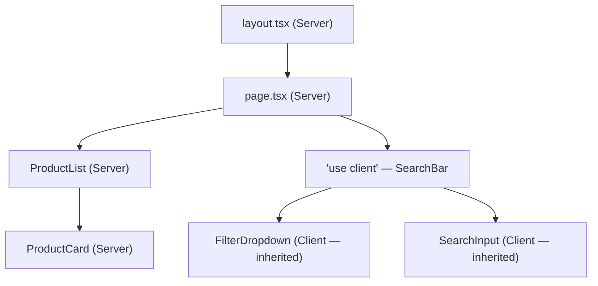
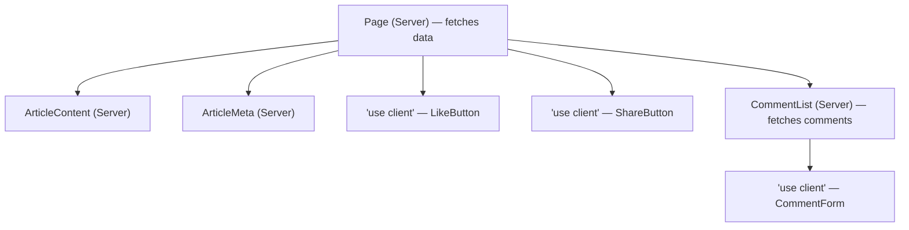
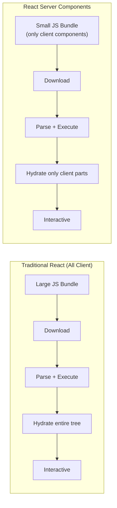

# Server Components vs Client Components

## What Are React Server Components (RSC)?

React Server Components are components that **execute entirely on the server**. Their code is never shipped to the client's browser — no JavaScript bundle, no hydration. The server renders them to HTML (or a special RSC payload) and sends the result to the client.

**Analogy:** Think of a restaurant. Server Components are the kitchen — all the heavy prep (data fetching, slicing, cooking) happens out of sight. Only the finished plate (HTML) reaches the customer (browser). Client Components are the tableside experience — interactive, responding to the customer's actions in real time.

---

## Server Components vs Client Components

| Aspect                 | Server Component                 | Client Component                            |
| ---------------------- | -------------------------------- | ------------------------------------------- |
| Runs on                | Server only                      | Client (and server during SSR)              |
| JS shipped to browser  | ❌ None                          | ✅ Yes (included in bundle)                 |
| Can use `useState`     | ❌ No                            | ✅ Yes                                      |
| Can use `useEffect`    | ❌ No                            | ✅ Yes                                      |
| Can use event handlers | ❌ No                            | ✅ Yes (`onClick`, `onChange`, etc.)        |
| Can access database    | ✅ Directly                      | ❌ Must go through API                      |
| Can read file system   | ✅ Yes                           | ❌ No                                       |
| Can use secrets/env    | ✅ Yes (server-only env vars)    | ❌ Only `NEXT_PUBLIC_*` vars                |
| Can `async/await`      | ✅ Component itself can be async | ❌ Need useEffect or data library           |
| Hydration cost         | None                             | Full hydration required                     |
| Directive needed       | None (default in App Router)     | `"use client"` at top of file               |
| Rendering              | Once on server per request       | Server (SSR) + client (hydration + updates) |

---

## Default Behavior in Next.js App Router

In the App Router, **every component is a Server Component by default**. You do not need any special annotation.

```tsx
// app/products/page.tsx
// This is a Server Component — no directive needed
export default async function ProductsPage() {
  const products = await fetch("https://api.example.com/products");
  const data = await products.json();

  return (
    <ul>
      {data.map((p) => (
        <li key={p.id}>
          {p.name} — ${p.price}
        </li>
      ))}
    </ul>
  );
}
```

A component becomes a Client Component **only** when you add the `"use client"` directive at the top of the file.

---

## The "use client" Directive

```tsx
"use client"; // ← This marks the file as a Client Component boundary

import { useState } from "react";

export default function Counter() {
  const [count, setCount] = useState(0);

  return <button onClick={() => setCount(count + 1)}>Count: {count}</button>;
}
```

### Rules for "use client"

- It must be the **first line** of the file (before imports).
- It marks a **boundary** — everything imported into that file also becomes part of the client bundle.
- You do NOT need to add it to every client file. Only the **entry point** of a client subtree needs it.



Everything below a `"use client"` boundary runs on the client. Everything above stays on the server.

---

## What You CAN Do in Server Components

Server Components have direct access to server-side resources:

```tsx
// ✅ Fetch data with async/await
export default async function Dashboard() {
  const stats = await fetch("https://api.internal.com/stats", {
    headers: { Authorization: `Bearer ${process.env.API_SECRET}` },
  });
  const data = await stats.json();
  return <StatsDisplay data={data} />;
}
```

```tsx
// ✅ Access the database directly
import { db } from "@/lib/database";

export default async function UsersPage() {
  const users = await db.query("SELECT * FROM users WHERE active = true");
  return <UserTable users={users} />;
}
```

```tsx
// ✅ Read files from the file system
import { readFile } from "fs/promises";
import path from "path";

export default async function DocsPage() {
  const content = await readFile(
    path.join(process.cwd(), "docs/intro.md"),
    "utf-8",
  );
  return <MarkdownRenderer content={content} />;
}
```

```tsx
// ✅ Use server-only secrets
// process.env.DATABASE_URL — available (no NEXT_PUBLIC_ prefix)
// process.env.STRIPE_SECRET_KEY — available
// process.env.NEXT_PUBLIC_APP_URL — also available (but this one is public)
```

---

## What You CANNOT Do in Server Components

```tsx
// ❌ No useState
export default function Broken() {
  const [value, setValue] = useState(""); // Error!
  return <input value={value} onChange={(e) => setValue(e.target.value)} />;
}

// ❌ No useEffect
export default function AlsoBroken() {
  useEffect(() => {
    document.title = "Hello"; // Error!
  }, []);
  return <div>Page</div>;
}

// ❌ No event handlers
export default function NoClicks() {
  return <button onClick={() => alert("hi")}>Click</button>; // Error!
}

// ❌ No browser APIs
export default function NoBrowser() {
  const width = window.innerWidth; // Error! window doesn't exist on server
  return <div>Width: {width}</div>;
}
```

If you need any of these, move that piece into a Client Component.

---

## When to Use Client Components

Use `"use client"` when you need:

| Need                     | Example                                           |
| ------------------------ | ------------------------------------------------- |
| State management         | `useState`, `useReducer`                          |
| Lifecycle / side effects | `useEffect`, `useLayoutEffect`                    |
| Event listeners          | `onClick`, `onChange`, `onSubmit`                 |
| Browser APIs             | `window`, `document`, `localStorage`, `navigator` |
| Custom hooks with state  | `useMediaQuery`, `useDebounce`                    |
| Third-party client libs  | Framer Motion, react-hook-form, chart.js          |
| Context providers        | Theme, auth, or toast context                     |
| Class components         | Legacy components with lifecycle methods          |

---

## Composition Patterns

### Pattern 1: Server Component Wraps Client Component

The most common pattern. Server fetches data, Client handles interactivity.

```tsx
// app/products/page.tsx (Server Component)
import { ProductFilter } from "./ProductFilter";

export default async function ProductsPage() {
  const products = await db.product.findMany();

  // Server fetches data → passes to Client for interactivity
  return (
    <div>
      <h1>Products</h1>
      <ProductFilter products={products} />
    </div>
  );
}
```

```tsx
// app/products/ProductFilter.tsx (Client Component)
"use client";

import { useState } from "react";

export function ProductFilter({ products }) {
  const [search, setSearch] = useState("");

  const filtered = products.filter((p) =>
    p.name.toLowerCase().includes(search.toLowerCase()),
  );

  return (
    <div>
      <input
        value={search}
        onChange={(e) => setSearch(e.target.value)}
        placeholder="Search products..."
      />
      <ul>
        {filtered.map((p) => (
          <li key={p.id}>{p.name}</li>
        ))}
      </ul>
    </div>
  );
}
```

---

### Pattern 2: Client Component Wraps Server Component via `children`

A Client Component can render Server Components passed as `children` or props. This is the **composition pattern** — the server component is already rendered before being passed.

```tsx
// app/layout.tsx (Server Component)
import { Sidebar } from "./Sidebar"; // Client Component (has "use client")
import { NavigationLinks } from "./NavigationLinks"; // Server Component

export default function Layout({ children }) {
  return (
    <div className="flex">
      <Sidebar>
        {/* Server Component passed as children to Client Component */}
        <NavigationLinks />
      </Sidebar>
      <main>{children}</main>
    </div>
  );
}
```

```tsx
// app/Sidebar.tsx (Client Component)
"use client";

import { useState } from "react";

export function Sidebar({ children }) {
  const [isOpen, setIsOpen] = useState(true);

  return (
    <aside className={isOpen ? "w-64" : "w-0"}>
      <button onClick={() => setIsOpen(!isOpen)}>Toggle</button>
      {isOpen && children} {/* Server Component renders here */}
    </aside>
  );
}
```

```tsx
// app/NavigationLinks.tsx (Server Component — no directive)
import { db } from "@/lib/database";

export async function NavigationLinks() {
  const links = await db.navLink.findMany();
  return (
    <nav>
      {links.map((link) => (
        <a key={link.id} href={link.url}>
          {link.label}
        </a>
      ))}
    </nav>
  );
}
```

---

### Pattern 3: Moving Client Code to the Leaves

Push `"use client"` boundaries as deep as possible. Keep the majority of your tree as Server Components.



---

## The Serialization Boundary

When passing props from a Server Component to a Client Component, the data crosses a **serialization boundary**. Only serializable values can be passed:

### ✅ Can Pass (Serializable)

- Strings, numbers, booleans, null, undefined
- Arrays and plain objects (containing serializable values)
- Dates (serialized as strings)
- FormData
- Server Actions (functions marked with `"use server"`)

### ❌ Cannot Pass (Non-Serializable)

- Functions (regular callbacks like `onClick`)
- Class instances
- Symbols
- DOM nodes
- Streams or iterators

```tsx
// ❌ This will error — cannot pass a function as prop
export default function Page() {
  const handleClick = () => console.log("clicked");
  return <ClientButton onClick={handleClick} />; // Error!
}

// ✅ Instead, define the handler inside the Client Component
// or pass a Server Action
```

```tsx
// ✅ Passing a Server Action across the boundary
import { likePost } from "./actions";

export default function Page() {
  return <LikeButton action={likePost} />; // Server Actions ARE serializable
}
```

---

## Performance Benefits



| Benefit                           | Explanation                                                            |
| --------------------------------- | ---------------------------------------------------------------------- |
| Smaller JS bundle                 | Server Component code (+ their dependencies) never reaches the browser |
| No hydration overhead             | Server Components are pre-rendered HTML — no JS to "wake up"           |
| Direct backend access             | No API round-trips for data — fetch from DB/filesystem directly        |
| Faster initial page load          | HTML arrives ready to display, no waiting for JS to render             |
| Reduced client memory             | Fewer components in memory, less garbage collection                    |
| Large dependencies stay on server | Libraries like `marked`, `prisma`, `sharp` never enter the bundle      |

---

## Common Pattern: Server Fetches → Client Interacts

This is the bread-and-butter pattern for Next.js App Router applications:

```tsx
// app/dashboard/page.tsx (Server Component)
import { getAnalytics } from "@/lib/analytics";
import { AnalyticsChart } from "./AnalyticsChart";
import { DateRangePicker } from "./DateRangePicker";

export default async function DashboardPage() {
  // Heavy data fetching on the server
  const analytics = await getAnalytics({ period: "30d" });

  return (
    <div>
      <h1>Dashboard</h1>
      {/* Client Component for interactivity */}
      <DateRangePicker />
      {/* Client Component receives server-fetched data */}
      <AnalyticsChart data={analytics} />
    </div>
  );
}
```

```tsx
// app/dashboard/AnalyticsChart.tsx (Client Component)
"use client";

import { useState } from "react";
import { BarChart, Bar, XAxis, YAxis } from "recharts";

export function AnalyticsChart({ data }) {
  const [metric, setMetric] = useState("pageViews");

  return (
    <div>
      <select value={metric} onChange={(e) => setMetric(e.target.value)}>
        <option value="pageViews">Page Views</option>
        <option value="visitors">Visitors</option>
        <option value="bounceRate">Bounce Rate</option>
      </select>

      <BarChart width={800} height={400} data={data[metric]}>
        <XAxis dataKey="date" />
        <YAxis />
        <Bar dataKey="value" fill="#3b82f6" />
      </BarChart>
    </div>
  );
}
```

---

## Third-Party Library Compatibility

Many React libraries use hooks or browser APIs internally — they require `"use client"`. Some libraries have not added the directive yet, so you may need a **wrapper pattern**:

```tsx
// components/motion-div.tsx
"use client";

// Re-export with "use client" so you can use it in Server Component files
export { motion } from "framer-motion";
```

```tsx
// components/providers.tsx
"use client";

import { ThemeProvider } from "next-themes";
import { QueryClient, QueryClientProvider } from "@tanstack/react-query";

const queryClient = new QueryClient();

export function Providers({ children }: { children: React.ReactNode }) {
  return (
    <QueryClientProvider client={queryClient}>
      <ThemeProvider attribute="class" defaultTheme="system">
        {children}
      </ThemeProvider>
    </QueryClientProvider>
  );
}
```

```tsx
// app/layout.tsx (Server Component)
import { Providers } from "@/components/providers";

export default function RootLayout({ children }) {
  return (
    <html>
      <body>
        <Providers>{children}</Providers>
      </body>
    </html>
  );
}
```

**Tip:** Wrap all context providers in a single `Providers` Client Component used at the layout level. This keeps your layout as a Server Component while still providing client-side context to the tree.

---

## Best Practices

| Practice                                                   | Reason                                                                |
| ---------------------------------------------------------- | --------------------------------------------------------------------- |
| Keep components as Server Components by default            | Smaller bundles, faster loads, direct backend access                  |
| Push `"use client"` to the leaf nodes                      | Maximize the server-rendered portion of your tree                     |
| Pass data down, not interactivity up                       | Server fetches data → passes to Client for display + interaction      |
| Use the `children` pattern for composition                 | Lets Server Components render inside Client Component wrappers        |
| Create a single `Providers` wrapper for context            | One `"use client"` boundary for all providers, clean layout           |
| Separate data-fetching from presentation                   | Server Component fetches, Client Component renders with interactivity |
| Use `server-only` package to prevent accidental client use | `import 'server-only'` at top of files that must never run on client  |

```tsx
// lib/database.ts
import "server-only"; // Throws build error if imported in Client Component

import { PrismaClient } from "@prisma/client";
export const db = new PrismaClient();
```

---

## Common Mistakes

| Mistake                                                        | Why It's Wrong                                                                |
| -------------------------------------------------------------- | ----------------------------------------------------------------------------- |
| Adding `"use client"` to every component                       | Ships unnecessary JS — defeats the entire RSC model                           |
| Trying to use `useState` / `useEffect` in Server Components    | Server Components cannot use hooks that require client state or lifecycle     |
| Passing functions as props from Server to Client               | Functions are not serializable across the boundary (use Server Actions)       |
| Importing a Server Component inside a `"use client"` file      | It becomes a Client Component — the boundary pulls everything below it client |
| Not using the `children` pattern for mixed composition         | Leads to unnecessary `"use client"` boundaries higher in the tree             |
| Fetching data in Client Components when Server Components work | Adds loading states, API routes, and bundle size unnecessarily                |
| Using `NEXT_PUBLIC_` prefix for secrets                        | Exposes secrets to the browser — use regular env vars in Server Components    |

---

## Summary

- **Server Components** run on the server, produce HTML, and ship zero JavaScript to the browser.
- **Client Components** run on both server (SSR) and client — they handle interactivity, hooks, and browser APIs.
- In Next.js App Router, **everything is a Server Component by default**. Add `"use client"` only where you need interactivity.
- The `"use client"` directive marks a **boundary** — everything it imports becomes part of the client bundle.
- Only **serializable data** can cross from Server to Client as props (no functions, class instances, or DOM nodes).
- **Composition patterns**: Server wraps Client (pass data down), Client wraps Server (via `children`), push `"use client"` to leaves.
- **Performance wins**: smaller bundles, no hydration for server parts, direct database access, large deps stay server-side.
- Use the `server-only` package to guard server code and a `Providers` wrapper pattern for third-party client libraries.
