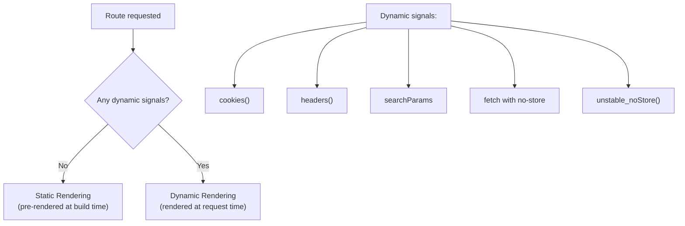
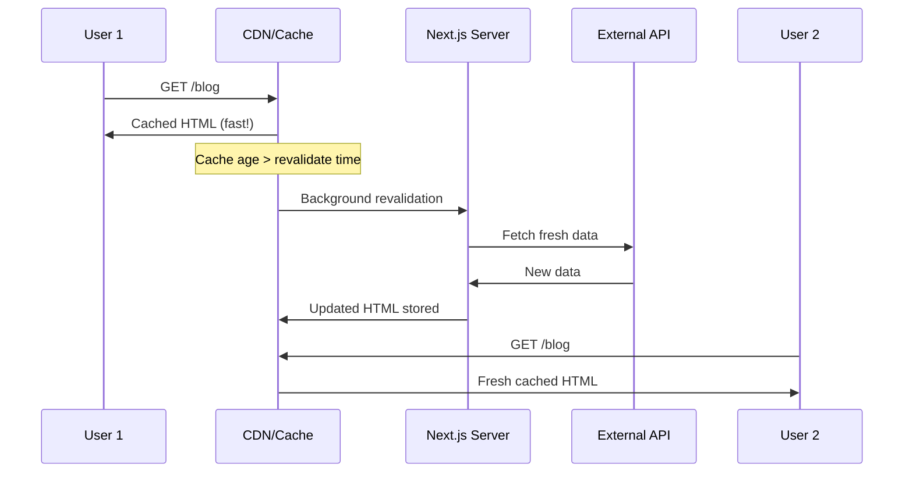
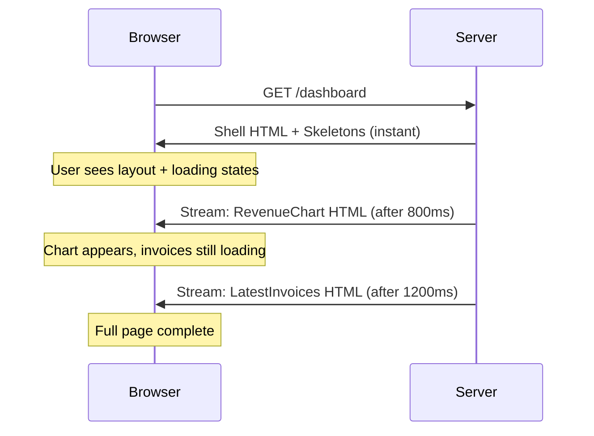
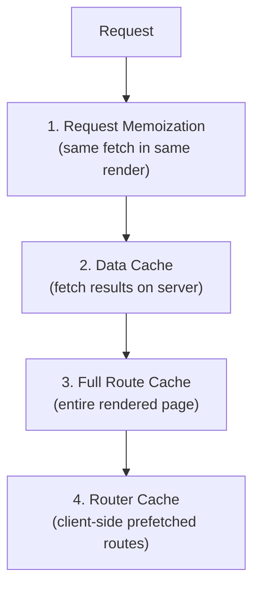
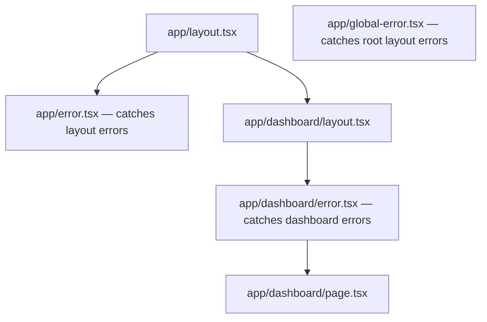

# Data Fetching Patterns in Next.js

## Fetching Data in Server Components

In the App Router, Server Components can be `async` — you fetch data directly inside the component with `await`. No `useEffect`, no loading state management, no client-side fetching libraries needed.

```tsx
// app/posts/page.tsx — Server Component (default)
export default async function PostsPage() {
  const res = await fetch("https://jsonplaceholder.typicode.com/posts");
  const posts = await res.json();

  return (
    <ul>
      {posts.map((post) => (
        <li key={post.id}>
          <h2>{post.title}</h2>
          <p>{post.body}</p>
        </li>
      ))}
    </ul>
  );
}
```

You can also call databases, ORMs, or any async function directly:

```tsx
import { db } from "@/lib/database";

export default async function UsersPage() {
  const users = await db.user.findMany({
    where: { active: true },
    orderBy: { createdAt: "desc" },
  });

  return <UserTable users={users} />;
}
```

---

## fetch() in Next.js — Extended Caching Options

Next.js extends the native `fetch` API with caching and revalidation options:

```tsx
// ✅ Cached indefinitely (default in production) — Static Rendering
const res = await fetch("https://api.example.com/data");

// ✅ Explicit: cache forever (same as default)
const res = await fetch("https://api.example.com/data", {
  cache: "force-cache",
});

// ✅ Never cache — always fetch fresh data — Dynamic Rendering
const res = await fetch("https://api.example.com/data", {
  cache: "no-store",
});

// ✅ Cache but revalidate every 60 seconds (ISR)
const res = await fetch("https://api.example.com/data", {
  next: { revalidate: 60 },
});

// ✅ Tag-based revalidation (invalidate by name)
const res = await fetch("https://api.example.com/posts", {
  next: { tags: ["posts"] },
});
```

| Option                      | Behavior                                      | Rendering Type  |
| --------------------------- | --------------------------------------------- | --------------- |
| `cache: 'force-cache'`      | Cache indefinitely until manually revalidated | Static          |
| `cache: 'no-store'`         | Fetch fresh data on every request             | Dynamic         |
| `next: { revalidate: 60 }`  | Cache for 60s, then refresh in background     | ISR             |
| `next: { tags: ['posts'] }` | Cache until tag is invalidated                | ISR (on-demand) |

---

## Static vs Dynamic Rendering

Next.js automatically decides whether a route is static or dynamic based on how you fetch data.



| Signal                                   | Result                          |
| ---------------------------------------- | ------------------------------- |
| All fetches cached (default)             | Static — pre-rendered at build  |
| `cache: 'no-store'` on any fetch         | Dynamic — rendered per request  |
| Using `cookies()` or `headers()`         | Dynamic — depends on request    |
| Using `searchParams` prop                | Dynamic — depends on URL params |
| `export const dynamic = 'force-dynamic'` | Dynamic — forced                |
| `export const dynamic = 'force-static'`  | Static — forced                 |

```tsx
// Force a page to be dynamic regardless of data fetching
export const dynamic = "force-dynamic";

export default async function Page() {
  // Even if fetch is cached, page renders per-request
  const data = await fetch("https://api.example.com/data");
  return <div>{/* ... */}</div>;
}
```

---

## Incremental Static Regeneration (ISR)

ISR gives you the best of both worlds: static performance with fresh data. The page is served from cache but revalidated in the background after the specified interval.

```tsx
// app/blog/page.tsx
export const revalidate = 3600; // Revalidate every hour (in seconds)

export default async function BlogPage() {
  const res = await fetch("https://api.example.com/posts");
  const posts = await res.json();

  return (
    <div>
      <h1>Blog</h1>
      {posts.map((post) => (
        <article key={post.id}>
          <h2>{post.title}</h2>
          <p>{post.excerpt}</p>
        </article>
      ))}
    </div>
  );
}
```

### How ISR Works



### Per-Fetch Revalidation

You can set different revalidation times for different fetches in the same page:

```tsx
export default async function Dashboard() {
  // Revalidate every 60 seconds
  const stats = await fetch("https://api.example.com/stats", {
    next: { revalidate: 60 },
  });

  // Revalidate every hour
  const announcements = await fetch("https://api.example.com/announcements", {
    next: { revalidate: 3600 },
  });

  // The page uses the SHORTEST revalidation time (60s)
  return <DashboardView stats={stats} announcements={announcements} />;
}
```

---

## Parallel Data Fetching

When multiple requests are **independent**, fetch them in parallel with `Promise.all` to avoid sequential waterfalls:

```tsx
// ❌ Sequential — total time = request1 + request2 + request3
export default async function Dashboard() {
  const user = await fetchUser(); // 200ms
  const posts = await fetchPosts(); // 300ms
  const analytics = await fetchAnalytics(); // 250ms
  // Total: ~750ms

  return <DashboardView user={user} posts={posts} analytics={analytics} />;
}

// ✅ Parallel — total time = max(request1, request2, request3)
export default async function Dashboard() {
  const [user, posts, analytics] = await Promise.all([
    fetchUser(), // 200ms
    fetchPosts(), // 300ms ← longest
    fetchAnalytics(), // 250ms
  ]);
  // Total: ~300ms

  return <DashboardView user={user} posts={posts} analytics={analytics} />;
}
```

---

## Sequential Data Fetching (Waterfalls)

Sometimes one request **depends** on another's result. Waterfalls are intentional here:

```tsx
export default async function UserPostsPage({ params }) {
  // First: get user (need their ID for next query)
  const user = await fetchUser(params.id);

  // Second: get posts for that specific user
  const posts = await fetchPostsByAuthor(user.id);

  // Third: get comments for those posts
  const comments = await fetchCommentsForPosts(posts.map((p) => p.id));

  return (
    <div>
      <UserProfile user={user} />
      <PostList posts={posts} comments={comments} />
    </div>
  );
}
```

When waterfalls are unintentional, restructure with `Promise.all` or split into separate components with Suspense (each component fetches independently).

---

## Streaming with loading.js and Suspense

Streaming lets you send parts of a page to the client **as they become ready**, instead of waiting for all data before showing anything.

### Route-Level Loading with `loading.js`

```
app/
├── dashboard/
│   ├── page.tsx       ← The actual page (might be slow)
│   ├── loading.tsx    ← Shown instantly while page loads
│   └── layout.tsx
```

```tsx
// app/dashboard/loading.tsx
export default function DashboardLoading() {
  return (
    <div className="animate-pulse">
      <div className="h-8 bg-gray-200 rounded w-1/4 mb-4" />
      <div className="h-64 bg-gray-200 rounded" />
    </div>
  );
}
```

Under the hood, Next.js wraps `page.tsx` in a `<Suspense>` boundary with `loading.tsx` as the fallback.

### Component-Level Streaming with Suspense

For more granular control, wrap individual components:

```tsx
import { Suspense } from "react";
import { RevenueChart } from "./RevenueChart";
import { LatestInvoices } from "./LatestInvoices";
import { CardsSkeleton, ChartSkeleton, InvoicesSkeleton } from "./skeletons";

export default function DashboardPage() {
  return (
    <div>
      <h1>Dashboard</h1>

      {/* These stream in independently */}
      <Suspense fallback={<ChartSkeleton />}>
        <RevenueChart />
      </Suspense>

      <Suspense fallback={<InvoicesSkeleton />}>
        <LatestInvoices />
      </Suspense>
    </div>
  );
}
```

```tsx
// Each component fetches its own data — they load in parallel
async function RevenueChart() {
  const revenue = await fetchRevenue(); // Slow API call
  return <Chart data={revenue} />;
}

async function LatestInvoices() {
  const invoices = await fetchLatestInvoices(); // Another slow call
  return <InvoiceList invoices={invoices} />;
}
```



---

## Route Handlers (API Routes in App Router)

Route Handlers replace the old `pages/api` pattern. They live in `app/api/` as `route.ts` files.

```
app/
├── api/
│   ├── users/
│   │   └── route.ts       → GET/POST /api/users
│   ├── users/
│   │   └── [id]/
│   │       └── route.ts   → GET/PUT/DELETE /api/users/:id
│   └── webhooks/
│       └── stripe/
│           └── route.ts   → POST /api/webhooks/stripe
```

```tsx
// app/api/users/route.ts
import { NextRequest, NextResponse } from "next/server";
import { db } from "@/lib/database";

// GET /api/users
export async function GET(request: NextRequest) {
  const searchParams = request.nextUrl.searchParams;
  const page = parseInt(searchParams.get("page") || "1");

  const users = await db.user.findMany({
    skip: (page - 1) * 10,
    take: 10,
  });

  return NextResponse.json(users);
}

// POST /api/users
export async function POST(request: NextRequest) {
  const body = await request.json();

  const user = await db.user.create({
    data: { name: body.name, email: body.email },
  });

  return NextResponse.json(user, { status: 201 });
}
```

```tsx
// app/api/users/[id]/route.ts
import { NextRequest, NextResponse } from "next/server";

export async function GET(
  request: NextRequest,
  { params }: { params: { id: string } },
) {
  const user = await db.user.findUnique({
    where: { id: params.id },
  });

  if (!user) {
    return NextResponse.json({ error: "Not found" }, { status: 404 });
  }

  return NextResponse.json(user);
}

export async function DELETE(
  request: NextRequest,
  { params }: { params: { id: string } },
) {
  await db.user.delete({ where: { id: params.id } });
  return new NextResponse(null, { status: 204 });
}
```

---

## Server-Side Data Mutations (Revalidation)

After mutating data, you need to tell Next.js to refresh its cache. Two approaches:

### Path-Based Revalidation

```tsx
import { revalidatePath } from "next/cache";

// Revalidate a specific page
revalidatePath("/dashboard");

// Revalidate a dynamic route
revalidatePath("/blog/my-post");

// Revalidate all pages under a layout
revalidatePath("/blog", "layout");
```

### Tag-Based Revalidation

```tsx
// When fetching, assign tags:
const posts = await fetch("https://api.example.com/posts", {
  next: { tags: ["posts"] },
});

const post = await fetch(`https://api.example.com/posts/${id}`, {
  next: { tags: ["posts", `post-${id}`] },
});

// When mutating, revalidate by tag:
import { revalidateTag } from "next/cache";

revalidateTag("posts"); // Invalidates all fetches tagged "posts"
revalidateTag(`post-${id}`); // Invalidates just this specific post
```

---

## Caching Strategies

Next.js has four layers of caching:



| Cache Layer         | What It Caches                      | Where  | Duration                       | How to Opt Out                      |
| ------------------- | ----------------------------------- | ------ | ------------------------------ | ----------------------------------- |
| Request Memoization | Duplicate fetch calls in one render | Server | Single request lifecycle       | Use `AbortController`               |
| Data Cache          | fetch() responses                   | Server | Persistent (until revalidated) | `cache: 'no-store'` or `revalidate` |
| Full Route Cache    | Pre-rendered HTML + RSC Payload     | Server | Persistent (until revalidated) | `dynamic = 'force-dynamic'`         |
| Router Cache        | Prefetched routes in browser        | Client | 30s (dynamic) / 5min (static)  | `router.refresh()`                  |

### Request Memoization Example

If the same fetch URL is called multiple times in one render tree, Next.js deduplicates it automatically:

```tsx
// This fetch is called in BOTH components during the same render
// Next.js memoizes it — only one actual HTTP request is made

async function Header() {
  const user = await fetchCurrentUser(); // request 1
  return <nav>{user.name}</nav>;
}

async function Sidebar() {
  const user = await fetchCurrentUser(); // same URL — deduplicated!
  return <div>{user.avatar}</div>;
}
```

---

## Fetching Data in Client Components

For Client Components, you cannot use `async/await` directly. Use these approaches:

### useEffect (simple cases)

```tsx
"use client";

import { useState, useEffect } from "react";

export function SearchResults({ query }) {
  const [results, setResults] = useState([]);
  const [loading, setLoading] = useState(false);

  useEffect(() => {
    if (!query) return;
    setLoading(true);

    fetch(`/api/search?q=${encodeURIComponent(query)}`)
      .then((res) => res.json())
      .then((data) => setResults(data))
      .finally(() => setLoading(false));
  }, [query]);

  if (loading) return <p>Loading...</p>;
  return (
    <ul>
      {results.map((r) => (
        <li key={r.id}>{r.title}</li>
      ))}
    </ul>
  );
}
```

### TanStack Query (recommended for complex cases)

```tsx
"use client";

import { useQuery, useMutation, useQueryClient } from "@tanstack/react-query";

export function TodoList() {
  const queryClient = useQueryClient();

  const {
    data: todos,
    isLoading,
    error,
  } = useQuery({
    queryKey: ["todos"],
    queryFn: () => fetch("/api/todos").then((res) => res.json()),
  });

  const mutation = useMutation({
    mutationFn: (newTodo) =>
      fetch("/api/todos", {
        method: "POST",
        body: JSON.stringify(newTodo),
      }),
    onSuccess: () => {
      queryClient.invalidateQueries({ queryKey: ["todos"] });
    },
  });

  if (isLoading) return <p>Loading...</p>;
  if (error) return <p>Error: {error.message}</p>;

  return (
    <div>
      <ul>
        {todos.map((t) => (
          <li key={t.id}>{t.title}</li>
        ))}
      </ul>
      <button onClick={() => mutation.mutate({ title: "New todo" })}>
        Add Todo
      </button>
    </div>
  );
}
```

### When to Fetch on Client vs Server

| Fetch on Server (Server Component)                 | Fetch on Client (Client Component)              |
| -------------------------------------------------- | ----------------------------------------------- |
| Initial page data (SEO-important)                  | User-triggered searches / filters               |
| Data that doesn't change based on user interaction | Real-time data (WebSocket, polling)             |
| Data requiring secrets or direct DB access         | Infinite scroll / pagination after initial load |
| Data needed before page is visible                 | Data that changes based on client state         |

---

## Error Handling with error.js

The `error.js` boundary catches errors in a route segment and shows a fallback UI.

```
app/
├── dashboard/
│   ├── page.tsx
│   ├── error.tsx      ← Catches errors in this segment
│   └── loading.tsx
```

```tsx
// app/dashboard/error.tsx
"use client"; // Error boundaries must be Client Components

import { useEffect } from "react";

export default function DashboardError({
  error,
  reset,
}: {
  error: Error & { digest?: string };
  reset: () => void;
}) {
  useEffect(() => {
    // Log error to monitoring service
    console.error("Dashboard error:", error);
  }, [error]);

  return (
    <div className="p-8 text-center">
      <h2 className="text-xl font-bold text-red-600">Something went wrong!</h2>
      <p className="mt-2 text-gray-600">{error.message}</p>
      <button
        onClick={reset}
        className="mt-4 px-4 py-2 bg-blue-600 text-white rounded"
      >
        Try again
      </button>
    </div>
  );
}
```

### Error Boundary Hierarchy



**Note:** `error.tsx` catches errors in `page.tsx` and child components, but NOT in the `layout.tsx` at the same level. For root layout errors, use `global-error.tsx`.

---

## Best Practices

| Practice                                                  | Reason                                                                      |
| --------------------------------------------------------- | --------------------------------------------------------------------------- |
| Fetch data in Server Components by default                | No loading states, no client bundle cost, direct backend access             |
| Use `Promise.all` for independent requests                | Avoids unnecessary waterfalls — total time = slowest request                |
| Add `<Suspense>` boundaries around slow components        | Shows the rest of the page immediately while slow parts load                |
| Use tag-based revalidation for fine-grained cache control | Invalidate exactly what changed without revalidating everything             |
| Set `revalidate` at the fetch level, not route level      | Different data freshness needs within the same page                         |
| Use TanStack Query for complex client fetching            | Handles caching, deduplication, retry, optimistic updates automatically     |
| Keep Route Handlers for webhooks and external consumers   | Server Actions are better for internal mutations; APIs for external clients |
| Wrap slow sections in Suspense, not the whole page        | More granular streaming = better perceived performance                      |

---

## Common Mistakes

| Mistake                                                      | Why It's Wrong                                                             |
| ------------------------------------------------------------ | -------------------------------------------------------------------------- |
| Using `useEffect` to fetch in a Server Component             | Server Components can `await` directly — no need for client-side fetching  |
| Forgetting `cache: 'no-store'` for frequently changing data  | Default is cached — you'll serve stale data                                |
| Sequential fetches when data is independent                  | Creates unnecessary waterfalls — use `Promise.all` instead                 |
| Not handling errors (missing `error.tsx`)                    | Unhandled errors crash the entire page instead of showing a recoverable UI |
| Using Route Handlers for form submissions                    | Server Actions are simpler and more integrated for mutations               |
| Setting `revalidate: 0` thinking it means "never revalidate" | `0` means "revalidate every request" (dynamic). Omit it for static caching |
| Fetching the same data in multiple components manually       | Next.js memoizes `fetch` — call the same URL freely, it deduplicates       |
| Using `no-store` on everything "to be safe"                  | Disables all caching — negates Next.js performance benefits                |

---

## Summary

- **Server Components** can `async/await` data directly — no `useEffect` or loading state needed.
- Next.js extends `fetch` with `cache` and `next.revalidate` options to control caching per request.
- **Static rendering** (cached) is the default. **Dynamic rendering** kicks in when you use `cookies()`, `headers()`, `searchParams`, or `cache: 'no-store'`.
- **ISR** (`revalidate: N`) gives static speed with periodic background refreshes.
- Use **`Promise.all`** for parallel fetches and **Suspense** for streaming independent UI sections.
- **Route Handlers** (`app/api/route.ts`) handle external API consumers, webhooks, and non-form interactions.
- **Revalidation** uses `revalidatePath` or `revalidateTag` to invalidate cached data after mutations.
- Next.js has **four cache layers**: request memoization, data cache, full route cache, and router cache.
- Client-side fetching (useEffect or TanStack Query) is for user-triggered, real-time, or interactive data needs.
- **`error.tsx`** provides error boundaries per route segment with a `reset` function for recovery.
