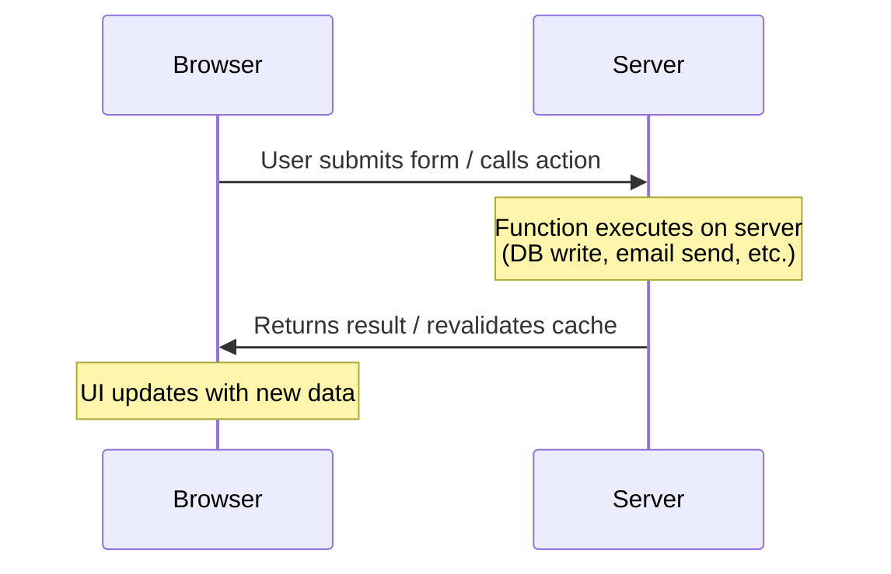
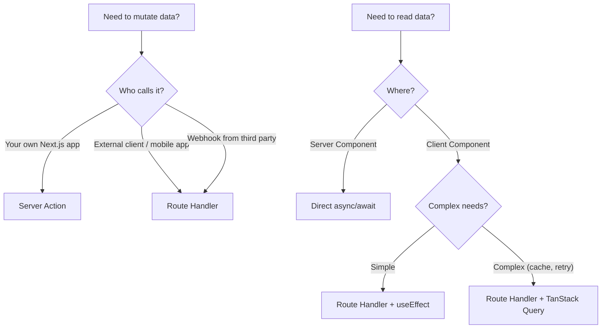

# Server Actions

## What Are Server Actions?

Server Actions are **async functions that execute on the server** but can be called directly from the client. They are the Next.js way to handle form submissions, data mutations, and any server-side logic triggered by user interactions — without writing API routes.

**Analogy:** Server Actions are like a TV remote control. You press a button (client), and the TV (server) does the work. You don't see the wiring — you just invoke a function and the server handles everything behind the scenes.

---

## How They Work



Under the hood:

1. Next.js generates a unique HTTP `POST` endpoint for each Server Action.
2. The client sends a POST request with the function arguments (serialized).
3. The server executes the function and returns the result.
4. Next.js automatically revalidates affected cached data.

---

## Creating Server Actions

### Inline in a Server Component

Define the function inside a Server Component with `"use server"` at the top of the function body:

```tsx
// app/posts/page.tsx (Server Component)
import { db } from "@/lib/database";
import { revalidatePath } from "next/cache";

export default function PostsPage() {
  async function createPost(formData: FormData) {
    "use server"; // ← marks this function as a Server Action

    const title = formData.get("title") as string;
    const content = formData.get("content") as string;

    await db.post.create({
      data: { title, content },
    });

    revalidatePath("/posts");
  }

  return (
    <form action={createPost}>
      <input name="title" placeholder="Title" required />
      <textarea name="content" placeholder="Content" required />
      <button type="submit">Create Post</button>
    </form>
  );
}
```

### In a Separate File (Recommended for Reuse)

Create a dedicated file with `"use server"` at the top — all exports become Server Actions:

```tsx
// app/actions/posts.ts
"use server";

import { db } from "@/lib/database";
import { revalidatePath } from "next/cache";

export async function createPost(formData: FormData) {
  const title = formData.get("title") as string;
  const content = formData.get("content") as string;

  await db.post.create({ data: { title, content } });
  revalidatePath("/posts");
}

export async function deletePost(id: string) {
  await db.post.delete({ where: { id } });
  revalidatePath("/posts");
}

export async function togglePublish(id: string) {
  const post = await db.post.findUnique({ where: { id } });
  await db.post.update({
    where: { id },
    data: { published: !post.published },
  });
  revalidatePath("/posts");
}
```

---

## Using Server Actions in Forms

The most natural way to use Server Actions — pass them to the `action` prop of a `<form>`:

```tsx
// app/contact/page.tsx
import { submitContact } from "@/app/actions/contact";

export default function ContactPage() {
  return (
    <form action={submitContact}>
      <label htmlFor="name">Name</label>
      <input id="name" name="name" required />

      <label htmlFor="email">Email</label>
      <input id="email" name="email" type="email" required />

      <label htmlFor="message">Message</label>
      <textarea id="message" name="message" required />

      <button type="submit">Send Message</button>
    </form>
  );
}
```

```tsx
// app/actions/contact.ts
"use server";

import { db } from "@/lib/database";
import { redirect } from "next/navigation";

export async function submitContact(formData: FormData) {
  const name = formData.get("name") as string;
  const email = formData.get("email") as string;
  const message = formData.get("message") as string;

  await db.contactSubmission.create({
    data: { name, email, message },
  });

  redirect("/contact/thank-you");
}
```

### Passing Extra Arguments with `.bind()`

```tsx
// Pass additional data that isn't in the form
import { updatePost } from "@/app/actions/posts";

export default function EditPostButton({ postId }: { postId: string }) {
  const updatePostWithId = updatePost.bind(null, postId);

  return (
    <form action={updatePostWithId}>
      <input name="title" />
      <button type="submit">Update</button>
    </form>
  );
}
```

```tsx
// app/actions/posts.ts
"use server";

export async function updatePost(postId: string, formData: FormData) {
  const title = formData.get("title") as string;
  await db.post.update({ where: { id: postId }, data: { title } });
  revalidatePath("/posts");
}
```

---

## Using Server Actions in Client Components

Client Components cannot define Server Actions inline. Import them from a `"use server"` file:

```tsx
// app/components/DeleteButton.tsx
"use client";

import { deletePost } from "@/app/actions/posts";
import { useState } from "react";

export function DeleteButton({ postId }: { postId: string }) {
  const [isDeleting, setIsDeleting] = useState(false);

  async function handleDelete() {
    setIsDeleting(true);
    await deletePost(postId);
    setIsDeleting(false);
  }

  return (
    <button onClick={handleDelete} disabled={isDeleting}>
      {isDeleting ? "Deleting..." : "Delete"}
    </button>
  );
}
```

You can also call Server Actions outside of forms — they're just async functions:

```tsx
"use client";

import { toggleFavorite } from "@/app/actions/favorites";

export function FavoriteButton({ itemId, isFavorited }) {
  return (
    <button onClick={() => toggleFavorite(itemId)}>
      {isFavorited ? "❤️" : "🤍"}
    </button>
  );
}
```

---

## useActionState for Form State Management

`useActionState` (React 19) manages the form state including success messages, errors, and pending status:

```tsx
// app/components/SignupForm.tsx
"use client";

import { useActionState } from "react";
import { signup } from "@/app/actions/auth";

export function SignupForm() {
  const [state, formAction, isPending] = useActionState(signup, {
    errors: {},
    message: "",
  });

  return (
    <form action={formAction}>
      <div>
        <label htmlFor="email">Email</label>
        <input id="email" name="email" type="email" />
        {state.errors?.email && (
          <p className="text-red-500">{state.errors.email}</p>
        )}
      </div>

      <div>
        <label htmlFor="password">Password</label>
        <input id="password" name="password" type="password" />
        {state.errors?.password && (
          <p className="text-red-500">{state.errors.password}</p>
        )}
      </div>

      {state.message && <p className="text-green-600">{state.message}</p>}

      <button type="submit" disabled={isPending}>
        {isPending ? "Creating account..." : "Sign Up"}
      </button>
    </form>
  );
}
```

```tsx
// app/actions/auth.ts
"use server";

import { z } from "zod";

const signupSchema = z.object({
  email: z.string().email("Invalid email address"),
  password: z.string().min(8, "Password must be at least 8 characters"),
});

export async function signup(prevState: any, formData: FormData) {
  const parsed = signupSchema.safeParse({
    email: formData.get("email"),
    password: formData.get("password"),
  });

  if (!parsed.success) {
    return {
      errors: parsed.error.flatten().fieldErrors,
      message: "",
    };
  }

  // Create user in database...
  await db.user.create({
    data: { email: parsed.data.email, password: hash(parsed.data.password) },
  });

  return { errors: {}, message: "Account created successfully!" };
}
```

---

## useFormStatus for Pending State

`useFormStatus` gives you the pending state of the parent `<form>`. It must be used inside a component that is a child of the form:

```tsx
// app/components/SubmitButton.tsx
"use client";

import { useFormStatus } from "react-dom";

export function SubmitButton({ label = "Submit" }: { label?: string }) {
  const { pending } = useFormStatus();

  return (
    <button type="submit" disabled={pending} className="btn-primary">
      {pending ? (
        <span className="flex items-center gap-2">
          <Spinner /> Processing...
        </span>
      ) : (
        label
      )}
    </button>
  );
}
```

```tsx
// Usage in a form
import { SubmitButton } from "@/app/components/SubmitButton";
import { createInvoice } from "@/app/actions/invoices";

export default function InvoiceForm() {
  return (
    <form action={createInvoice}>
      <input name="amount" type="number" required />
      <input name="description" required />
      {/* SubmitButton reads pending state from the parent <form> */}
      <SubmitButton label="Create Invoice" />
    </form>
  );
}
```

**Important:** `useFormStatus` must be inside a component that is rendered WITHIN the `<form>`, not in the same component where `<form>` is defined.

---

## Validation with Zod in Server Actions

Always validate input server-side. Never trust client data:

```tsx
// app/actions/products.ts
"use server";

import { z } from "zod";
import { db } from "@/lib/database";
import { revalidatePath } from "next/cache";

const productSchema = z.object({
  name: z.string().min(1, "Name is required").max(100),
  price: z.coerce.number().positive("Price must be positive"),
  description: z.string().max(500).optional(),
  category: z.enum(["electronics", "clothing", "food", "other"]),
  inStock: z.coerce.boolean(),
});

export type ProductState = {
  errors?: {
    name?: string[];
    price?: string[];
    description?: string[];
    category?: string[];
  };
  message?: string;
};

export async function createProduct(
  prevState: ProductState,
  formData: FormData,
): Promise<ProductState> {
  const parsed = productSchema.safeParse({
    name: formData.get("name"),
    price: formData.get("price"),
    description: formData.get("description"),
    category: formData.get("category"),
    inStock: formData.get("inStock"),
  });

  if (!parsed.success) {
    return {
      errors: parsed.error.flatten().fieldErrors,
      message: "Validation failed. Please check the form.",
    };
  }

  try {
    await db.product.create({ data: parsed.data });
    revalidatePath("/products");
    return { message: "Product created successfully!" };
  } catch (error) {
    return { message: "Database error: Failed to create product." };
  }
}
```

---

## Revalidating Data After Mutation

After a Server Action modifies data, tell Next.js to refresh its cache:

```tsx
"use server";

import { revalidatePath } from "next/cache";
import { revalidateTag } from "next/cache";
import { redirect } from "next/navigation";

export async function updateProfile(formData: FormData) {
  const name = formData.get("name") as string;

  await db.user.update({
    where: { id: currentUser.id },
    data: { name },
  });

  // Option 1: Revalidate a specific path
  revalidatePath("/profile");

  // Option 2: Revalidate all pages using a cached tag
  revalidateTag("user-profile");

  // Option 3: Redirect to another page (also revalidates)
  redirect("/profile");
}
```

| Method           | Use When                                                 |
| ---------------- | -------------------------------------------------------- |
| `revalidatePath` | You know which page(s) display the mutated data          |
| `revalidateTag`  | Multiple pages share the same cached fetch with a tag    |
| `redirect`       | You want to navigate the user after the action completes |

---

## Error Handling in Server Actions

### Returning Error Objects (Recommended for Forms)

```tsx
"use server";

export async function createOrder(prevState: any, formData: FormData) {
  try {
    const items = JSON.parse(formData.get("items") as string);

    if (items.length === 0) {
      return { success: false, error: "Cart is empty" };
    }

    const order = await db.order.create({
      data: { items, userId: currentUser.id },
    });

    await sendOrderConfirmation(order.id);
    revalidatePath("/orders");

    return { success: true, orderId: order.id };
  } catch (error) {
    // Log for monitoring, return user-friendly message
    console.error("Order creation failed:", error);
    return {
      success: false,
      error: "Failed to create order. Please try again.",
    };
  }
}
```

### Throwing Errors (Caught by error.tsx)

```tsx
"use server";

export async function riskyAction() {
  const result = await externalService.call();

  if (!result.ok) {
    // This will be caught by the nearest error.tsx boundary
    throw new Error("External service unavailable");
  }

  return result.data;
}
```

### Pattern: Discriminated Return Types

```tsx
"use server";

type ActionResult =
  | { status: "success"; data: any }
  | { status: "error"; error: string }
  | { status: "validation_error"; errors: Record<string, string[]> };

export async function submitForm(formData: FormData): Promise<ActionResult> {
  const parsed = schema.safeParse(Object.fromEntries(formData));

  if (!parsed.success) {
    return {
      status: "validation_error",
      errors: parsed.error.flatten().fieldErrors,
    };
  }

  try {
    const result = await db.record.create({ data: parsed.data });
    return { status: "success", data: result };
  } catch (e) {
    return { status: "error", error: "Something went wrong" };
  }
}
```

---

## Optimistic Updates with useOptimistic

Show the expected result immediately, before the server confirms:

```tsx
"use client";

import { useOptimistic } from "react";
import { toggleLike } from "@/app/actions/likes";

export function LikeButton({ postId, initialLikes, isLiked }) {
  const [optimisticLikes, setOptimisticLikes] = useOptimistic(
    { count: initialLikes, isLiked },
    (current, newIsLiked: boolean) => ({
      count: newIsLiked ? current.count + 1 : current.count - 1,
      isLiked: newIsLiked,
    }),
  );

  async function handleLike() {
    const newState = !optimisticLikes.isLiked;
    setOptimisticLikes(newState); // Instant UI update
    await toggleLike(postId); // Server catches up
  }

  return (
    <button onClick={handleLike}>
      {optimisticLikes.isLiked ? "❤️" : "🤍"} {optimisticLikes.count}
    </button>
  );
}
```

```tsx
// More complex example: optimistic todo list
"use client";

import { useOptimistic } from "react";
import { addTodo } from "@/app/actions/todos";

export function TodoList({ todos }) {
  const [optimisticTodos, addOptimisticTodo] = useOptimistic(
    todos,
    (currentTodos, newTodo: string) => [
      ...currentTodos,
      { id: `temp-${Date.now()}`, title: newTodo, pending: true },
    ],
  );

  async function handleSubmit(formData: FormData) {
    const title = formData.get("title") as string;
    addOptimisticTodo(title); // Show immediately with pending state
    await addTodo(formData); // Actually create on server
  }

  return (
    <div>
      <form action={handleSubmit}>
        <input name="title" required />
        <button type="submit">Add</button>
      </form>

      <ul>
        {optimisticTodos.map((todo) => (
          <li key={todo.id} className={todo.pending ? "opacity-50" : ""}>
            {todo.title} {todo.pending && "(saving...)"}
          </li>
        ))}
      </ul>
    </div>
  );
}
```

---

## Security: Server Actions as POST Endpoints

Server Actions are **exposed as HTTP POST endpoints**. Anyone can call them. Always validate and authorize:

```tsx
"use server";

import { auth } from "@/lib/auth";
import { z } from "zod";

export async function deleteComment(commentId: string) {
  // 1. Authenticate — who is making this request?
  const session = await auth();
  if (!session?.user) {
    throw new Error("Unauthorized");
  }

  // 2. Validate input
  const parsed = z.string().uuid().safeParse(commentId);
  if (!parsed.success) {
    throw new Error("Invalid comment ID");
  }

  // 3. Authorize — does this user own the comment?
  const comment = await db.comment.findUnique({
    where: { id: parsed.data },
  });

  if (comment?.authorId !== session.user.id) {
    throw new Error("Forbidden: You can only delete your own comments");
  }

  // 4. Execute the mutation
  await db.comment.delete({ where: { id: parsed.data } });
  revalidatePath("/posts");
}
```

### Security Checklist

| Check            | Why                                                   |
| ---------------- | ----------------------------------------------------- |
| Authentication   | Verify the user is logged in                          |
| Authorization    | Verify the user has permission for this action        |
| Input Validation | Never trust client data — validate shape and types    |
| Rate Limiting    | Prevent abuse (use middleware or external service)    |
| CSRF Protection  | Next.js handles this automatically for Server Actions |

---

## Server Actions vs API Routes

| Aspect              | Server Actions                    | Route Handlers (API Routes)                  |
| ------------------- | --------------------------------- | -------------------------------------------- |
| Syntax              | `"use server"` function           | `export async function GET/POST` in route.ts |
| Invocation          | Call like a regular function      | HTTP request (fetch)                         |
| Form integration    | Native `<form action={...}>`      | Manual `fetch` in onSubmit handler           |
| Progressive enhance | ✅ Works without JavaScript       | ❌ Requires JS for fetch                     |
| Return value        | Any serializable data             | HTTP Response (JSON, stream, etc.)           |
| Use case            | Internal mutations, form handling | External APIs, webhooks, third-party clients |
| Caching             | Not cached (mutations)            | GET routes can be cached                     |
| Revalidation        | Built-in (revalidatePath/Tag)     | Manual (call revalidate functions)           |

### When to Use Each



---

## Best Practices

| Practice                                                     | Reason                                                                |
| ------------------------------------------------------------ | --------------------------------------------------------------------- |
| Keep Server Actions in separate `"use server"` files         | Reusable across Server and Client Components, easier to test          |
| Always validate with Zod before touching the database        | Never trust client-provided FormData — validate shape and types       |
| Always check authentication AND authorization                | Server Actions are public endpoints — treat them like API routes      |
| Return error objects instead of throwing for form validation | Lets you display field-level errors without crashing the page         |
| Use `useActionState` for form state management               | Clean pattern for handling pending, success, and error states         |
| Use `useFormStatus` in a child component for pending UI      | Only works inside a child of `<form>`, not the same component         |
| Revalidate after every mutation                              | Ensures the UI reflects the latest data state                         |
| Use optimistic updates for instant-feeling UI                | Like/unlike, adding to lists — show the result before server confirms |

---

## Common Mistakes

| Mistake                                                 | Why It's Wrong                                                             |
| ------------------------------------------------------- | -------------------------------------------------------------------------- |
| Not adding `"use server"` directive                     | Function runs on client instead of server — exposes secrets, DB logic      |
| Forgetting to validate input                            | Anyone can POST to the endpoint with arbitrary data                        |
| Not checking authorization                              | Users can call actions they shouldn't have access to                       |
| Using `useFormStatus` in the same component as `<form>` | It must be in a CHILD component of the form — won't work at the same level |
| Throwing errors for validation failures                 | Crashes the page — return error objects for recoverable form errors        |
| Calling `redirect` inside a try/catch                   | `redirect` throws internally — catch block swallows it. Call outside try.  |
| Not revalidating after mutation                         | Stale data shows on the page until a manual refresh                        |
| Passing sensitive data in hidden form fields            | Users can inspect and modify form fields — validate on server instead      |

### The redirect + try/catch Gotcha

```tsx
// ❌ Wrong — redirect gets caught
export async function createUser(formData: FormData) {
  try {
    await db.user.create({ data: { ... } });
    redirect("/users"); // throws NEXT_REDIRECT — caught by catch!
  } catch (error) {
    return { error: "Something went wrong" }; // Swallows the redirect
  }
}

// ✅ Correct — redirect outside try/catch
export async function createUser(formData: FormData) {
  let success = false;

  try {
    await db.user.create({ data: { ... } });
    success = true;
  } catch (error) {
    return { error: "Something went wrong" };
  }

  if (success) {
    redirect("/users"); // Called outside try/catch
  }
}
```

---

## Summary

- **Server Actions** are async functions marked with `"use server"` that execute on the server but are callable from the client.
- Define them **inline** in Server Components or in **separate `"use server"` files** for reuse across components.
- Use them with `<form action={...}>` for progressive enhancement (works without JS) or call directly via `onClick`.
- **`useActionState`** manages form state (errors, success, pending). **`useFormStatus`** shows pending state in child components.
- Always **validate** (Zod), **authenticate**, and **authorize** — Server Actions are public POST endpoints.
- **Revalidate** cached data after mutations with `revalidatePath` or `revalidateTag`.
- Use **`useOptimistic`** for instant-feeling UI updates while the server processes the action.
- Prefer Server Actions over API Routes for internal mutations. Use Route Handlers for external consumers and webhooks.
- Never call `redirect` inside a try/catch — it throws internally and will be swallowed.
