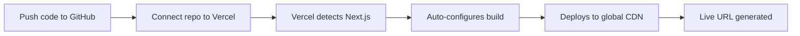
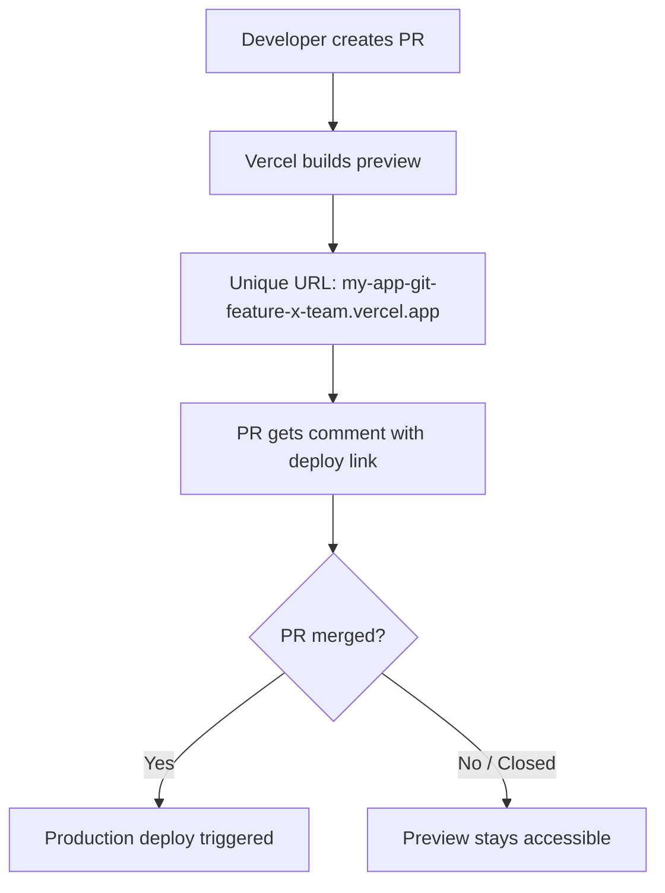
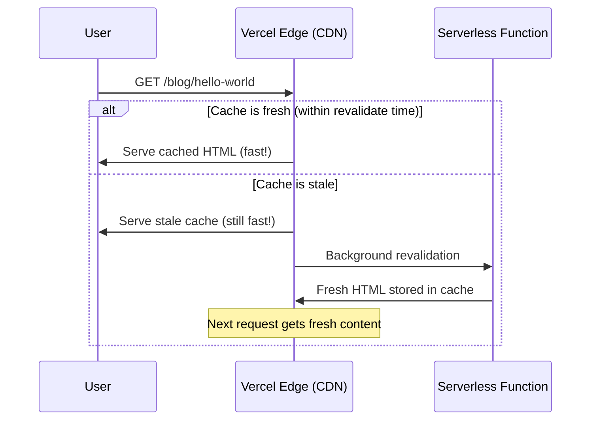
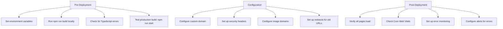

# Deploying Next.js

## What Is Vercel?

Vercel is the company that created and maintains Next.js. Their platform is purpose-built for deploying Next.js applications with zero configuration — Server Components, ISR, Edge Functions, and Middleware all work out of the box.

**Analogy:** Vercel is to Next.js what Apple is to the iPhone — they built the framework AND the ideal platform to run it. You can run Next.js elsewhere (Android equivalent), but Vercel offers the most seamless experience.

---

## Deploying to Vercel

### Step-by-Step



1. **Push your code** to GitHub, GitLab, or Bitbucket.
2. **Go to** [vercel.com](https://vercel.com) → "New Project" → Import repository.
3. **Vercel auto-detects** Next.js and configures build settings.
4. **Click Deploy** — that's it.

Every subsequent `git push` to the main branch triggers an automatic production deployment.

### Vercel CLI (Alternative)

```bash
# Install Vercel CLI
npm install -g vercel

# Deploy from local machine (for testing)
vercel

# Deploy to production
vercel --prod

# Link existing project
vercel link
```

---

## Environment Variables on Vercel

### Setting Environment Variables

Go to Project Settings → Environment Variables, or use the CLI:

```bash
# Add via CLI
vercel env add DATABASE_URL production
vercel env add NEXT_PUBLIC_API_URL production preview development
```

### Environment Scopes

| Scope       | When It's Used       | Example                 |
| ----------- | -------------------- | ----------------------- |
| Production  | Main branch deploys  | Production database URL |
| Preview     | PR/branch deploys    | Staging database URL    |
| Development | `vercel dev` locally | Local database URL      |

### Naming Convention

```bash
# Server-only (not exposed to browser)
DATABASE_URL=postgresql://...
STRIPE_SECRET_KEY=sk_live_...
API_SECRET=my-secret-key

# Client-accessible (exposed to browser bundle)
NEXT_PUBLIC_APP_URL=https://myapp.com
NEXT_PUBLIC_STRIPE_PUBLISHABLE_KEY=pk_live_...
NEXT_PUBLIC_GA_TRACKING_ID=G-XXXXXXXX
```

**Rule:** Only prefix with `NEXT_PUBLIC_` if the value MUST be accessible in the browser. Never expose secrets this way.

---

## Preview Deployments

Every pull request automatically gets its own deployment with a unique URL. This enables:

- **Team review** — designers, PMs, and QA can see changes without running code locally.
- **Integration testing** — test against preview databases/services.
- **Visual regression** — compare against production.



### Preview URL Patterns

```
# Production
https://my-app.vercel.app

# Preview (branch-based)
https://my-app-git-feature-login-username.vercel.app

# Preview (commit-based)
https://my-app-abc123def.vercel.app
```

---

## Custom Domains

```bash
# Add a custom domain via CLI
vercel domains add myapp.com

# Or configure in Project Settings → Domains
```

### DNS Configuration

| Record Type | Name | Value                |
| ----------- | ---- | -------------------- |
| A           | @    | 76.76.21.21          |
| CNAME       | www  | cname.vercel-dns.com |

Vercel automatically provisions SSL certificates via Let's Encrypt. HTTPS is enforced by default.

### Multiple Domains

```
myapp.com            → Production
staging.myapp.com    → Preview branch (staging)
docs.myapp.com       → Separate Vercel project
```

---

## Edge Functions and Middleware

### Middleware

Middleware runs **before** a request is processed. It executes at the Edge (close to the user) for ultra-low latency.

```tsx
// middleware.ts (root of your project)
import { NextResponse } from "next/server";
import type { NextRequest } from "next/server";

export function middleware(request: NextRequest) {
  // Example: Redirect non-authenticated users
  const token = request.cookies.get("auth-token");

  if (!token && request.nextUrl.pathname.startsWith("/dashboard")) {
    return NextResponse.redirect(new URL("/login", request.url));
  }

  // Example: Add custom headers
  const response = NextResponse.next();
  response.headers.set("x-custom-header", "my-value");
  return response;
}

// Only run middleware on specific paths
export const config = {
  matcher: ["/dashboard/:path*", "/api/:path*"],
};
```

### Edge Functions (Route Handlers at the Edge)

```tsx
// app/api/geo/route.ts
import { NextRequest } from "next/server";

export const runtime = "edge"; // Run at the Edge, not Node.js

export async function GET(request: NextRequest) {
  const country = request.geo?.country || "Unknown";
  const city = request.geo?.city || "Unknown";

  return Response.json({ country, city });
}
```

| Feature            | Node.js Runtime                | Edge Runtime                 |
| ------------------ | ------------------------------ | ---------------------------- |
| Cold start         | ~250ms                         | ~1ms                         |
| Location           | Single region                  | Globally distributed         |
| APIs available     | Full Node.js (fs, crypto, etc) | Web APIs subset (no fs)      |
| Max execution time | 60s (Vercel Hobby)             | 30s                          |
| Use cases          | DB queries, heavy computation  | Auth, redirects, geolocation |

---

## Vercel Analytics and Speed Insights

### Web Analytics

Track page views, unique visitors, top pages, referrers — privacy-friendly (no cookies).

```tsx
// app/layout.tsx
import { Analytics } from "@vercel/analytics/react";

export default function RootLayout({ children }) {
  return (
    <html>
      <body>
        {children}
        <Analytics />
      </body>
    </html>
  );
}
```

### Speed Insights (Core Web Vitals)

Monitor real-user performance: LCP, FID, CLS, TTFB, INP.

```tsx
// app/layout.tsx
import { SpeedInsights } from "@vercel/speed-insights/next";

export default function RootLayout({ children }) {
  return (
    <html>
      <body>
        {children}
        <SpeedInsights />
      </body>
    </html>
  );
}
```

```bash
# Install packages
npm install @vercel/analytics @vercel/speed-insights
```

---

## Deploying to Other Platforms

Next.js is not locked to Vercel. Here are alternative deployment targets:

### Self-Hosted (Node.js Server)

```bash
# Build the application
npm run build

# Start the production server
npm run start
# → Runs on port 3000 by default
```

### Docker (Standalone Output)

```js
// next.config.js
module.exports = {
  output: "standalone", // Produces minimal Node.js server
};
```

```dockerfile
# Dockerfile
FROM node:20-alpine AS builder
WORKDIR /app
COPY package*.json ./
RUN npm ci
COPY . .
RUN npm run build

FROM node:20-alpine AS runner
WORKDIR /app
ENV NODE_ENV=production

# Copy only what's needed to run
COPY --from=builder /app/.next/standalone ./
COPY --from=builder /app/.next/static ./.next/static
COPY --from=builder /app/public ./public

EXPOSE 3000
CMD ["node", "server.js"]
```

### Platform-Specific Notes

| Platform     | Setup                                       | Notes                                |
| ------------ | ------------------------------------------- | ------------------------------------ |
| Render       | Connect GitHub → auto-detects Next.js       | Good free tier, supports ISR         |
| Railway      | Connect GitHub → deploy                     | Easy PostgreSQL provisioning         |
| AWS Amplify  | Connect repo → configures SSR automatically | Full AWS integration, custom domains |
| DigitalOcean | App Platform → connect repo                 | Simple, predictable pricing          |
| Fly.io       | `fly launch` with Dockerfile                | Global distribution, low latency     |
| Coolify      | Self-hosted PaaS → deploy from Git          | Open-source Vercel alternative       |

### Static Export (No Server Needed)

For fully static sites (no SSR, no API routes, no ISR):

```js
// next.config.js
module.exports = {
  output: "export", // Generates static HTML in /out folder
};
```

```bash
npm run build
# Produces /out directory — deploy to any static host
# (Netlify, GitHub Pages, S3 + CloudFront, etc.)
```

**Limitations of static export:**

- No Server Components (all become static HTML)
- No API Routes / Route Handlers
- No ISR or dynamic rendering
- No Middleware
- No Image Optimization (use external loader)

---

## next.config.js Production Settings

```js
// next.config.js
/** @type {import('next').NextConfig} */
const nextConfig = {
  // Output mode
  output: "standalone", // For Docker deployments

  // Image optimization
  images: {
    remotePatterns: [
      {
        protocol: "https",
        hostname: "cdn.example.com",
        pathname: "/images/**",
      },
    ],
    formats: ["image/avif", "image/webp"],
  },

  // Security headers
  async headers() {
    return [
      {
        source: "/:path*",
        headers: [
          { key: "X-Frame-Options", value: "DENY" },
          { key: "X-Content-Type-Options", value: "nosniff" },
          { key: "Referrer-Policy", value: "strict-origin-when-cross-origin" },
          {
            key: "Content-Security-Policy",
            value:
              "default-src 'self'; script-src 'self' 'unsafe-inline' 'unsafe-eval';",
          },
        ],
      },
    ];
  },

  // Redirects
  async redirects() {
    return [
      {
        source: "/old-blog/:slug",
        destination: "/blog/:slug",
        permanent: true, // 308 status code
      },
    ];
  },

  // Rewrites (URL proxy)
  async rewrites() {
    return [
      {
        source: "/api/v1/:path*",
        destination: "https://api.backend.com/:path*",
      },
    ];
  },

  // Disable x-powered-by header
  poweredByHeader: false,

  // Enable React strict mode
  reactStrictMode: true,

  // Experimental features
  experimental: {
    serverActions: {
      bodySizeLimit: "2mb",
    },
  },
};

module.exports = nextConfig;
```

---

## Output Modes

| Mode       | Config                 | Produces               | Use Case                              |
| ---------- | ---------------------- | ---------------------- | ------------------------------------- |
| Default    | (none)                 | `.next/` folder        | Vercel, Node.js server                |
| Standalone | `output: 'standalone'` | Minimal Node.js server | Docker, self-hosted VPS               |
| Static     | `output: 'export'`     | `/out/` static HTML    | CDN-only hosting (no server features) |

### Standalone Mode Details

```
.next/standalone/
├── node_modules/        ← Only production deps (minimal)
├── .next/               ← Build output
├── server.js            ← Entry point (run with node server.js)
└── package.json
```

The standalone output includes only the Node.js dependencies needed to run — typically 50-80% smaller than a full `node_modules` install.

---

## ISR in Production (How Revalidation Works on Vercel)

On Vercel, ISR works seamlessly with their Edge Network:



### On-Demand Revalidation (Webhook Pattern)

```tsx
// app/api/revalidate/route.ts
import { revalidateTag } from "next/cache";
import { NextRequest } from "next/server";

export async function POST(request: NextRequest) {
  const secret = request.headers.get("x-revalidation-secret");

  if (secret !== process.env.REVALIDATION_SECRET) {
    return Response.json({ error: "Invalid secret" }, { status: 401 });
  }

  const { tag } = await request.json();
  revalidateTag(tag);

  return Response.json({ revalidated: true, tag });
}
```

Set up your CMS to call this endpoint when content changes — pages update within seconds without a full rebuild.

### ISR on Self-Hosted Platforms

| Platform      | ISR Support                                           |
| ------------- | ----------------------------------------------------- |
| Vercel        | ✅ Full support (built into Edge Network)             |
| Render        | ✅ Supported (uses filesystem cache)                  |
| Railway       | ✅ Supported                                          |
| AWS Amplify   | ✅ Supported                                          |
| Docker/VPS    | ✅ Works with filesystem cache (single instance only) |
| Static Export | ❌ Not supported                                      |

**Note:** On multi-instance deployments (horizontal scaling), use a shared cache (Redis or equivalent) to keep ISR consistent across instances.

---

## Monitoring and Logs

### Vercel Dashboard

- **Function logs** — real-time logs from Server Components, Server Actions, Route Handlers.
- **Build logs** — full output of `npm run build`.
- **Runtime logs** — errors, warnings, and console output from running functions.
- **Usage metrics** — function invocations, bandwidth, execution time.

### Structured Logging

```tsx
// Use structured logging for better monitoring
export async function createOrder(formData: FormData) {
  "use server";

  console.log(
    JSON.stringify({
      event: "order_created",
      userId: session.user.id,
      amount: formData.get("amount"),
      timestamp: new Date().toISOString(),
    }),
  );

  // ... create order
}
```

### External Monitoring Integration

```tsx
// app/layout.tsx — Error monitoring with Sentry
import * as Sentry from "@sentry/nextjs";

// instrumentation.ts (Next.js 14+)
export async function register() {
  if (process.env.NEXT_RUNTIME === "nodejs") {
    await import("./sentry.server.config");
  }

  if (process.env.NEXT_RUNTIME === "edge") {
    await import("./sentry.edge.config");
  }
}
```

### Health Check Endpoint

```tsx
// app/api/health/route.ts
import { db } from "@/lib/database";

export async function GET() {
  try {
    // Check database connectivity
    await db.$queryRaw`SELECT 1`;

    return Response.json({
      status: "healthy",
      timestamp: new Date().toISOString(),
      version: process.env.NEXT_PUBLIC_APP_VERSION || "unknown",
    });
  } catch (error) {
    return Response.json(
      { status: "unhealthy", error: "Database connection failed" },
      { status: 503 },
    );
  }
}
```

---

## Deployment Checklist



---

## Best Practices

| Practice                                               | Reason                                                             |
| ------------------------------------------------------ | ------------------------------------------------------------------ |
| Use Preview Deployments for every PR                   | Catch issues before they reach production                          |
| Set different env vars for Preview vs Production       | Use staging databases for previews, production DBs for main        |
| Add security headers in next.config.js                 | Protect against clickjacking, MIME sniffing, XSS                   |
| Use `output: 'standalone'` for Docker deployments      | Produces minimal bundle — 50-80% smaller than full node_modules    |
| Monitor Core Web Vitals with Speed Insights            | Real-user data reveals performance issues synthetic tests miss     |
| Set up on-demand revalidation for CMS content          | Pages update within seconds of content changes without rebuilds    |
| Use a health check endpoint for uptime monitoring      | Catch database or service failures before users report them        |
| Pin Node.js version in production                      | Avoid unexpected behavior from version differences                 |
| Keep build times fast — split large data at build time | Vercel has build time limits (45min hobby, customizable for teams) |

---

## Common Mistakes

| Mistake                                                  | Why It's Wrong                                                                |
| -------------------------------------------------------- | ----------------------------------------------------------------------------- |
| Hardcoding URLs instead of using environment variables   | Breaks when deploying to different environments (preview, staging, prod)      |
| Using `output: 'export'` when you need Server Components | Static export disables all server features — SSR, ISR, API routes, Middleware |
| Not setting up Preview environment variables             | Preview deploys use production secrets — potential data corruption            |
| Ignoring build errors and deploying anyway               | TypeScript errors that pass locally may fail on Vercel's stricter build       |
| Storing secrets in `NEXT_PUBLIC_*` variables             | Exposes secrets to every browser that loads your app                          |
| Not configuring `images.remotePatterns`                  | External images fail to load through next/image optimization                  |
| Skipping security headers                                | Leaves app vulnerable to clickjacking, XSS, and MIME-type attacks             |
| Using filesystem storage for uploads in serverless       | Serverless functions are stateless — files disappear between invocations      |

---

## Summary

- **Vercel** is the creators of Next.js and the easiest deployment target — connect a GitHub repo and it handles everything.
- **Preview deployments** give every PR its own URL for review, testing, and QA.
- **Environment variables** should be scoped (Production/Preview/Development) and secrets should NEVER use `NEXT_PUBLIC_`.
- **Edge Functions and Middleware** run globally with <1ms cold starts — ideal for auth checks, redirects, and geolocation.
- **Self-hosting** options include Docker (`output: 'standalone'`), Render, Railway, AWS Amplify, and any Node.js host.
- **Static export** (`output: 'export'`) produces CDN-ready HTML but disables all server features.
- **ISR** works seamlessly on Vercel's Edge Network. On self-hosted, it uses filesystem cache (single-instance only).
- **Production essentials**: security headers, custom domains, error monitoring, health checks, and Core Web Vitals tracking.
- Always use `next.config.js` for redirects, rewrites, security headers, and image domain allowlists.
